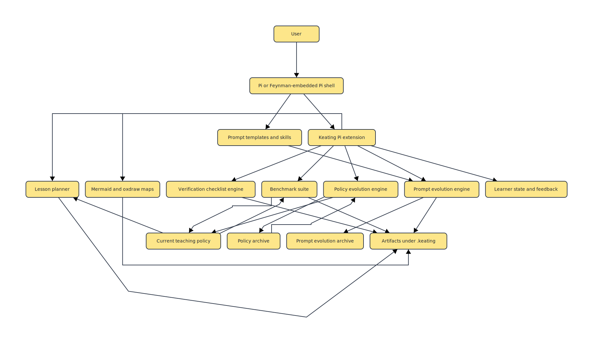

# Architecture

## Goal

Keating is not just "an AI tutor." It is an attempt to make tutoring behavior inspectable and self-improvable without tying the whole system to opaque prompt edits.

## Design Split

The project is intentionally divided into three layers:

1. Pi runtime layer
   - supplies the Feynman-like shell, prompt templates, skills, and extension commands
   - keeps the interactive teaching experience flexible

2. Deterministic pedagogy layer
   - builds lesson plans
   - generates richer concept and meaning maps through `oxdraw`
   - generates self-contained `manim-web` animation bundles
   - stores benchmark and evolution artifacts
   - gives the system a stable non-LLM substrate

3. Self-improvement layer
   - benchmarks a teaching policy against synthetic learners
   - mutates the policy
   - applies novelty and safety gates before accepting changes
   - persists an explicit decision ledger for every candidate

## Borrowed Ideas

### Feynman

- artifact-first workflows
- slash-command shell ergonomics
- a packageable prompt/skill/extension model

### Pi Mono

- minimal core, aggressive extensibility
- prompts, skills, and extensions rather than forking the runtime
- compatibility with embedded or standalone Pi

### Chrysalis Forge

- evaluation-gated evolution
- explicit archive of candidate strategies
- meta-level improvement rather than one-shot prompt tuning

### HyperAgent

- separate planning from execution and verification
- treat "teach", "benchmark", and "evolve" as distinct modes instead of one overloaded agent behavior

### Meta-Harness

- optimize the harness, not just the system prompt
- front-load environment and artifact context
- reward saved exploratory turns and sharper initial action selection

## Current Control Surface

- `/plan <topic>` creates a deterministic lesson plan.
- `/map <topic>` creates Mermaid and SVG lesson maps.
- `/animate <topic>` creates a browser-runnable animation bundle with storyboard and manifest.
- `/bench [topic]` evaluates the current policy on a benchmark suite.
- `/evolve [topic]` mutates and selects safer, stronger policies.
- `/policy` exposes the currently active policy.

## Visual Artifact Strategy

The visual layer has two distinct roles:

1. Meaning maps
   - static structure for prerequisites, misconceptions, practice, and transfer
   - cheap to diff, persist, and inspect

2. Animated scenes
   - dynamic explanation for graph motion, probability updates, and conceptual emphasis
   - generated as source bundles rather than opaque binaries so they can participate in testing and future evolution

## Visual Subsystem

The visual path has its own internal pipeline:

- `src/core/map.ts` generates semantic Mermaid graphs for teaching structure.
- `oxdraw` turns those Mermaid sources into SVG artifacts that are cheap to diff and inspect.
- `src/core/animation.ts` generates `manim-web` source bundles for animated explanation.
- `src/core/project.ts` makes both of those first-class outputs under `.keating/outputs/`.

See also:

- `docs/VISUAL-ARCHITECTURE.md`
- `docs/OXDRAW-TUTORIAL.md`

## Why Synthetic Learners

Real tutoring quality depends on human feedback, but synthetic learners are still useful for:

- regression detection
- fast offline comparisons
- gating clearly worse policies
- making properties and fuzz tests meaningful

They are not a substitute for human evaluation. They are an engineering harness.
