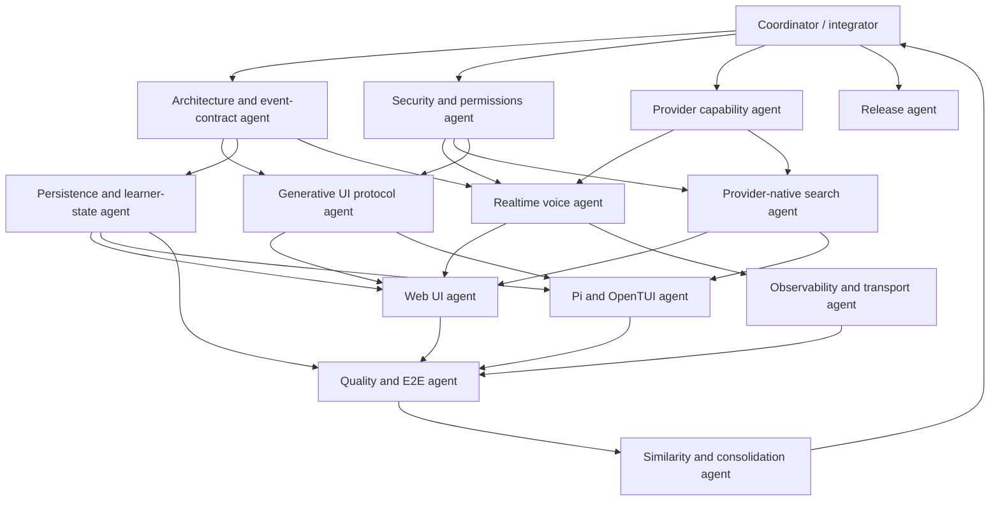

# Keating multimodal execution graph

This graph coordinates the work required for full-duplex voice, provider-native
search, generative UI parity, Pi plugin compatibility, and end-to-end validation.
Each subagent owns a bounded surface and publishes an explicit handoff artifact.
The coordinator owns integration, conflict resolution, and release decisions.

## Agent contracts

| Agent | Best capability | Owns | Publishes | Must not own |
|---|---|---|---|---|
| Coordinator / integrator | Cross-cutting architecture, sequencing, conflict resolution | Work allocation, shared interfaces, integration commits, go/no-go decisions | Accepted contracts, merged implementation, decision log | Large feature implementations that can be isolated |
| Architecture and event-contract agent | Multi-file synthesis and protocol design | Canonical conversation events, tool-call lifecycle, realtime/session state machine, versioning | Event schema, reducers, compatibility rules, migration plan | Provider SDK details or surface-specific rendering |
| Security and permissions agent | Threat modeling and policy enforcement | Tool risk classes, user confirmation, prompt-injection boundaries, secret/redaction rules | Permission matrix, enforcement API, adversarial cases | Search ranking or UI styling |
| Provider capability agent | Current provider/API research and adapter design | Capability registry for OpenAI, Google, Anthropic, MiniMax and fallbacks | Typed capability matrix and adapter contracts | Product UI or generic orchestration |
| Realtime voice agent | WebRTC/WebSocket media pipelines and interruption semantics | GPT Realtime 2.1 path, microphone/audio lifecycle, barge-in, transcript/tool synchronization | Realtime adapter and duplex conformance fixtures | LiveKit adoption unless transport evidence requires it |
| Provider-native search agent | Tool normalization across heterogeneous APIs | OpenAI web search, Google grounding, Anthropic server search, citations and fallback search | Provider-neutral `web_search` contract, normalized results and citations | General browsing UI or unrelated tools |
| Generative UI protocol agent | Serializable UI/document protocols | Shared quiz, question, goal, deck, image, scene and artifact documents; action/result loop | Versioned UI document schema, action schema, render conformance fixtures | React or terminal-specific presentation |
| Web UI agent | React interaction, accessibility, streaming UX | Browser renderers, voice controls, search citations, reconnect/error states | Working web surface consuming shared protocols | Duplicated business logic or provider-specific API calls |
| Pi and OpenTUI agent | Pi extension lifecycle, RPC and terminal interaction | Pi commands/tools, standard UI requests, OpenTUI cards/forms/actions, plugin compatibility | TUI renderer registry and Pi RPC bridge | Web-only custom-tag protocol forks |
| Persistence and learner-state agent | Event sourcing, resumability and data migration | Session/event storage, learner profile updates, pending interactive actions, crash recovery | Durable store API, migrations, replay tests | Surface-specific state caches |
| Observability and transport agent | Latency, reliability and architecture thresholds | Turn latency spans, interruption metrics, tool timing, reconnect telemetry, LiveKit decision criteria | Trace schema, dashboards/log summaries, transport ADR | Core feature behavior |
| Quality and E2E agent | Property tests, semantic harnesses and live-provider validation | Contract tests, replay tests, duplex/search/UI E2E, opt-in MiniMax smoke path via Skate | Evidence report with failures classified by owner | Broad implementation rewrites |
| Similarity and consolidation agent | Structural duplication analysis and safe extraction | Browser/core/TUI duplicate families and dead adapters | Similarity report, intentional-duplicate allowlist, extraction patches | Premature abstraction before contracts stabilize |
| Release agent | Version consistency, packaging and changelog discipline | Version bump, generated runtime files, release notes, bundle/install verification | Release commit/tag checklist and artifacts | Feature design or opportunistic refactors |

## Execution waves and gates

### Wave 0 — coordinator baseline

- Freeze the intended scope and inventory existing dirty work by file owner.
- Capture current event, tool, provider, Pi RPC, browser-tool, and persistence interfaces.
- Establish integration branches or disjoint file ownership before parallel edits.

**Gate 0:** every changed file has one owner; pre-existing user work is preserved.

### Wave 1 — contracts in parallel

- Architecture agent defines canonical events and state transitions.
- Security agent defines tool permissions and untrusted-content boundaries.
- Provider capability agent verifies current provider-native realtime/search behavior
  and defines capability negotiation rather than model-name conditionals.

**Gate 1:** coordinator accepts the event schema, permission API, and provider
capability registry. Downstream agents receive only these accepted contracts.

### Wave 2 — protocol foundations in parallel

- Generative UI agent defines serializable UI documents and action responses.
- Persistence agent implements durable event/action replay.
- Realtime voice agent implements the direct provider transport against canonical events.
- Search agent implements provider-native adapters against the normalized search tool.

**Gate 2:** protocol fixtures pass without either the web or TUI renderer. Voice
and search must be testable headlessly.

### Wave 3 — surfaces in parallel

- Web agent consumes voice, search, persistence, and UI protocols.
- Pi/OpenTUI agent consumes the same search and UI protocols and implements every
  supported interaction without silently cancelling it.
- Observability agent instruments both surfaces and records direct-transport data.

**Gate 3:** the same recorded conversation renders and accepts equivalent actions
in web, classic Pi shell, and OpenTUI. Unsupported rich media has an explicit,
useful fallback rather than disappearing.

### Wave 4 — adversarial validation

- Quality agent runs deterministic contract/property/replay tests first.
- Quality agent then runs opt-in live smoke tests using the Skate-provided key and
  `minimax-m2.7-highspeed` where that model is compatible with the tested path.
- Security agent adversarially reviews search content, tool confirmation, secret
  handling, and voice-triggered tool calls.
- Observability agent evaluates whether direct WebRTC is sufficient. LiveKit is
  introduced only if measured requirements include room orchestration, server-side
  media workers, telephony, recording, or multi-party routing.

**Gate 4:** evidence covers interruption, reconnect, tool calls during speech,
provider-native citations, pending UI action recovery, and cross-surface replay.

### Wave 5 — consolidation and release

- Similarity agent reruns the repository similarity check after behavior stabilizes.
- Extract only duplicates with shared semantics; allowlist intentional renderer and
  environment-boundary duplication.
- Coordinator reviews the final diff and generated browser-runtime files.
- Release agent performs version synchronization, packaging, changelog, commit and tag.

**Gate 5:** no unexplained high-similarity families, no generated-file drift, and
all release artifacts agree on the version.

## Critical-path ownership

The critical path is:

`event/security/provider contracts -> voice/search/UI protocols -> web and TUI -> E2E -> consolidation -> release`

Persistence runs alongside the protocol work but becomes a hard dependency before
surface E2E. Observability begins with voice and continues through validation.
Similarity work is deliberately late: consolidating before semantic contracts settle
would risk preserving the wrong abstraction.

## Coordinator rules

1. Subagents never edit the same file concurrently.
2. Handoffs are schemas, fixtures, or focused commits—not prose-only reports.
3. Provider agents expose capabilities; callers do not branch on marketing model names.
4. Surface agents consume shared protocols and may not fork business logic.
5. The quality agent is independent of feature implementers and reports evidence by owner.
6. Live-provider tests are opt-in and secrets are injected only into the command process;
   agents never print, persist, or copy secret values.
7. Failed gates route work back to the owning agent. The coordinator does not paper over
   contract violations during integration.
8. Release work starts only after the similarity report and integration evidence are accepted.

## Suggested concurrency

- Maximum initial parallelism: **3** agents in Wave 1.
- Maximum implementation parallelism: **4** agents in Wave 2, provided file ownership is disjoint.
- Maximum surface parallelism: **3** agents in Wave 3.
- Validation uses one quality captain with bounded specialist reviews to avoid competing test edits.

This arrangement uses specialist agents for bounded implementation and reserves the
coordinator for architecture, integration, and decisions that span multiple surfaces.
