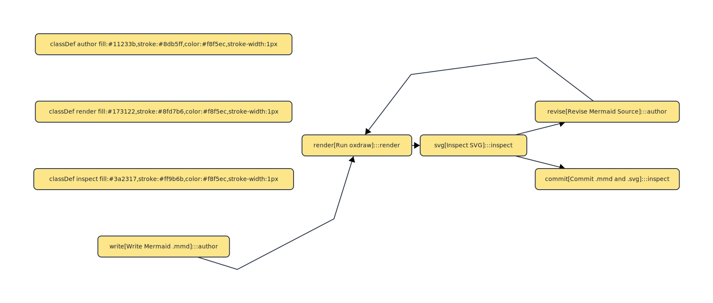
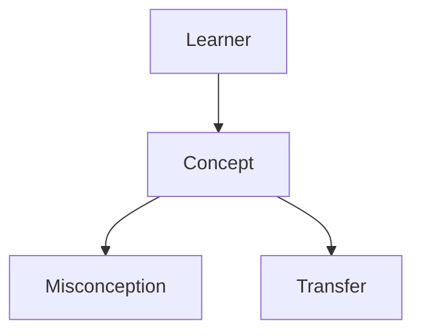

# Oxdraw Tutorial

This project uses `oxdraw` to turn Mermaid sources into readable SVGs for architecture diagrams and concept maps.



## What `oxdraw` Is Doing In Keating

`oxdraw` sits at the static-visual end of the teaching pipeline:

- Keating generates Mermaid text
- `oxdraw` renders that text into SVG
- the SVG becomes a durable teaching artifact under `.keating/outputs/maps/` or `docs/`

For Keating, this matters because a “map of meaning” should be:

- diffable
- inspectable
- cheap to regenerate
- simple enough to fuzz and acceptance-test

## Quick Commands

Render the built-in topic map flow:

```bash
npm run map -- derivative
```

Render all checked-in documentation diagrams:

```bash
npm run docs:diagrams
```

Render a documentation diagram manually:

```bash
oxdraw --input docs/visual-pipeline.mmd --output docs/visual-pipeline.svg
```

Check availability:

```bash
npm run doctor
```

## Minimal Example

Create a Mermaid file:



Render it:

```bash
oxdraw --input example.mmd --output example.svg
```

## How Keating Uses Mermaid

Keating’s maps are not generic flowcharts. They encode four teaching concerns:

1. Teaching loop
   - orientation
   - intuition
   - formal core
   - examples
   - practice
   - reflection

2. Meaning map
   - the core concept
   - named conceptual nodes
   - prerequisites

3. Friction
   - misconceptions
   - practice tasks

4. Transfer
   - interdisciplinary hooks

That structure is generated in `src/core/map.ts`.

## Authoring Tips

- Prefer short node labels. Long prose becomes unreadable in SVG quickly.
- Use subgraphs to separate pedagogy, concept structure, and transfer.
- Treat the Mermaid as source code. Keep it legible before rendering.
- Reserve animation for motion or transformation. Use `oxdraw` for structure.

## Recommended Documentation Workflow

1. Write or edit a `.mmd` file in `docs/`.
2. Render it with `oxdraw`.
3. Reference the SVG from the Markdown doc beside it.
4. Keep the `.mmd` checked in so the rendered asset stays reproducible.

## Keating-Specific Files

- `docs/hyperteacher-architecture.mmd`
- `docs/visual-pipeline.mmd`
- `docs/oxdraw-workflow.mmd`
- `.keating/outputs/maps/<topic>.mmd`

## When To Use `oxdraw` vs `manim-web`

Use `oxdraw` when you need:

- architecture diagrams
- maps of meaning
- dependency structure
- prerequisite graphs

Use `manim-web` when you need:

- slope becoming tangent
- posterior shifts
- entropy distributions
- any explanation that depends on motion or staged transformation
