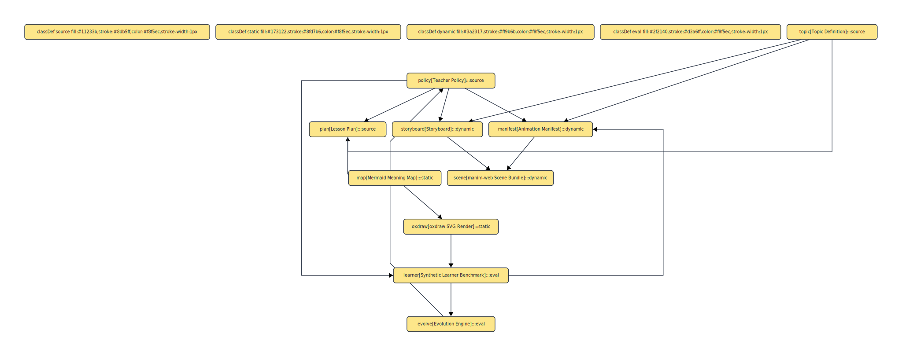

# Visual Architecture

Keating treats visual explanation as part of the teaching system, not as decoration added after the fact.

## Layers

1. Meaning maps
   - generated from lesson structure and topic semantics
   - rendered from Mermaid to SVG through `oxdraw`
   - used for static inspection, navigation, and “map of meaning” style teaching

2. Animated scenes
   - generated as `manim-web` source bundles
   - used for graph motion, probability updates, entropy distributions, and concept emphasis
   - stored as source so they can be versioned, tested, and evolved

3. Evaluation and traceability
   - benchmark and evolution traces explain why a policy is changing
   - prompt-evolution reports explain why a teaching prompt revision was selected
   - animation manifests explain why a scene grammar was selected
   - storyboards connect the visual artifact back to pedagogical intent

## Artifact Flow

- `plan` builds a deterministic teaching sequence.
- `map` turns that sequence into a structural knowledge graph.
- `animate` turns the topic and policy into an executable explanation bundle.
- `bench`, `evolve`, and `prompt-evolve` provide the feedback loop that should eventually tune visual choices too.

## Current Responsibilities

- `src/core/lesson-plan.ts`
  - chooses the pedagogical phase sequence
- `src/core/map.ts`
  - converts the plan into Mermaid meaning maps
- `src/core/animation.ts`
  - selects a scene grammar and emits `player.html`, `scene.mjs`, `storyboard.md`, and `manifest.json`
- `src/core/project.ts`
  - persists visual artifacts under `.keating/outputs/`
- `src/core/prompt-evolution.ts`
  - scores prompt templates across multiple teaching objectives and writes evolved prompt artifacts that can later inform visual teaching behavior

## Why `oxdraw`

`oxdraw` is the right fit for the static part of the pipeline because it keeps the diagram source legible:

- Mermaid remains easy to diff and hand-edit
- SVG output is deterministic enough for artifact workflows
- generated diagrams can sit beside benchmark and evolution reports as equal citizens
- visual artifacts can now sit beside prompt-evolution reports too, which makes prompt changes inspectable instead of hidden inside the runtime

## Near-Term Direction

- use benchmark traces to recommend scene grammars, not just topic-name heuristics
- add browser-level acceptance checks for animation playback
- connect meaning maps and animation manifests so each scene can cite the exact conceptual nodes it covers
