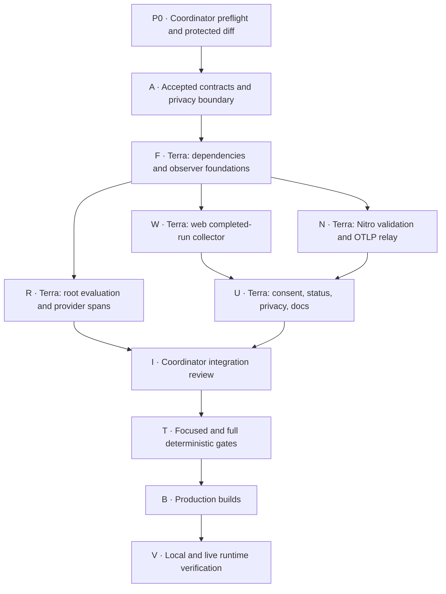

# Arize AX build execution graph

This document turns the decision-complete Arize plan into a single-worker build
contract. The implementation worker is Terra. The coordinator owns the plan,
protected-tree review, integration decisions, and final runtime claim.



The DAG shows logical independence, but one Terra worker executes F, R, W, N,
and U sequentially to avoid racing the already-dirty central files. Terra may
reorder R/W/N after F when it does not change ownership or acceptance gates.

## Waves

| Wave | Ready nodes | Concurrency | Gate |
| --- | --- | ---: | --- |
| 0 | P0, A | Coordinator | Dirty baseline, accepted scope, and protected files recorded |
| 1 | F | 1 Terra | Versioned contracts compile; disabled configuration is inert |
| 2 | R, W, N | 1 Terra, sequential | Root persistence invariants and web span mapping tests pass |
| 3 | U | 1 Terra | Consent defaults off; recovery and documentation are coherent |
| 4 | I | Coordinator | Diff respects ownership, contracts, and existing PostHog semantics |
| 5 | T, then B | Terra + coordinator review | Tests/typechecks pass before production builds |
| 6 | V | Coordinator | Actual Nitro path and, when credentials exist, Arize AX are inspected |

## Agent contracts

### P0 - Protected-tree preflight

- **Role:** coordinator
- **Depends on:** none
- **Owns:** inspection only
- **Produces:** git status, PostHog diff inventory, baseline focused tests and
  typecheck evidence
- **Must not edit:** any existing user/agent changes
- **Acceptance:** existing dirty files are treated as protected; focused
  analytics tests pass; live PostHog verification is reported separately

### A - Contract and privacy decision

- **Role:** coordinator
- **Depends on:** P0
- **Owns:** `docs/analytics/arize-integration-plan.md`, this execution document
- **Produces:** target backend, schemas, content gates, failure semantics,
  configuration, and verification boundary
- **Must not edit:** runtime code
- **Acceptance:** the plan is decision-complete enough that Terra does not need
  to invent whether content, credentials, persistence, or external resources are
  in scope

### F - Dependencies and observer foundations

- **Role:** Terra worker
- **Depends on:** A
- **Owns:** root/web package manifests and lockfiles; new
  `src/observability/**`; new web Arize contract/client/server utility files
- **Produces:** direct OTel/OpenInference dependencies, versioned allowlisted
  observation schemas, no-op/default-off configuration, pure span mapping seams
- **Must not edit:** feature UI, root orchestration, PostHog event call sites in
  this node
- **Acceptance:** configuration tests cover missing/invalid values; schemas
  reject unknown, content-bearing, oversized, and non-finite payloads; server-only
  dependencies are not imported by the browser bundle

### R - Root evaluation and provider observation

- **Role:** Terra worker
- **Depends on:** F
- **Owns:** `src/core/project.ts`, `src/core/pi-agent.ts`, focused root tests
- **Produces:** metadata-only EVALUATOR spans around benchmark/evolution/prompt
  operations and outer LLM spans around Pi completion calls
- **Must not edit:** `writeArtifactWithTrace` semantics, learner-state schemas,
  benchmark math, MAP-Elites selection, rollback policy, CLI command names
- **Acceptance:** disabled mode produces unchanged artifacts; a throwing exporter
  cannot change a result or prevent artifact persistence; short-lived commands
  force-flush; no prompt/output/topic/path/raw error is an attribute

### W - Web completed-run collector

- **Role:** Terra worker
- **Depends on:** F
- **Owns:** `web/src/lib/agent-analytics.ts`, its tests,
  `web/src/hooks/useKeatingAgent.tsx`, new browser Arize client tests
- **Produces:** one versioned `AgentTraceEnvelopeV1` per agent run while retaining
  all stable PostHog captures
- **Must not edit:** generation transport, provider selection, session storage,
  conversation-event persistence, PostHog event meanings
- **Acceptance:** one root contains every generation/tool child; failure/abort
  closes once; content extraction is visible text for the current turn only and
  occurs only after explicit preference; existing no-private-Payload assertions
  still pass when sharing is off

### N - Nitro validation and OTLP relay

- **Role:** Terra worker
- **Depends on:** F
- **Owns:** new `web/server/api/observability/v1/arize/**`,
  `web/server/utils/arize-observability.ts`, corresponding server tests, the
  minimal handler registrations in `web/nitro.config.ts`
- **Produces:** secret-free config endpoint, strict same-origin trace endpoint,
  bounded rate limiter, OpenInference span tree, force-flush/failure isolation
- **Must not edit:** arbitrary chat proxy, Not Organic proxy/session adapter,
  PostHog `/ingest` routes, unrelated Nitro handlers
- **Acceptance:** route never accepts a target/header from the caller; disabled
  response is inert; recording exporter proves AGENT/LLM/TOOL hierarchy and
  prohibited data absence; 4xx/429 behavior is deterministic

### U - Consent, recovery, privacy, and operator docs

- **Role:** Terra worker
- **Depends on:** W, N
- **Owns:** `web/src/lib/analytics-preferences.ts`,
  `web/src/components/KeatingUiSettingsTab.tsx`, `web/src/pages/Privacy.tsx`,
  preference/UI tests, `docs/DEVELOPMENT.md`, a cross-link in the PostHog
  operating plan
- **Produces:** independent default-off Arize preference, deployment availability
  state, safe retry/turn-off action, updated privacy disclosure, setup/smoke guide
- **Must not edit:** unrelated settings, legal sections unrelated to analytics,
  PostHog defaults/opt-out persistence
- **Acceptance:** old stored PostHog preferences migrate without losing opt-out;
  Arize content sharing remains false for missing/malformed/legacy storage;
  failed content envelopes are memory-only and recoverable; copy names Arize and
  describes exactly what is shared

### I - Coordinator integration gate

- **Role:** coordinator
- **Depends on:** R, U
- **Owns:** review and minimal conflict resolution only
- **Produces:** accepted integrated diff or focused rework request
- **Must not edit:** broad feature code or erase pre-existing changes
- **Acceptance:** no ownership violation, duplicated observer, client secret,
  local-persistence coupling, PostHog event drift, raw error, or silent enabled
  failure; generated lockfiles match manifests

### T - Deterministic verification

- **Role:** Terra worker, reviewed by coordinator
- **Depends on:** I
- **Owns:** tests/check execution and only directly caused fixes
- **Produces:** focused then full test/typecheck evidence
- **Acceptance:** every ordered command below passes, or the failure is
  classified as pre-existing with evidence and no false success claim

### B - Production build

- **Role:** Terra worker, reviewed by coordinator
- **Depends on:** T
- **Owns:** build execution and only directly caused fixes
- **Produces:** successful root and Nitro/Vite production bundles
- **Acceptance:** browser bundle contains no Arize secret/config header and no
  server OTel module; missing Arize variables still builds and runs

### V - Runtime verification

- **Role:** coordinator
- **Depends on:** B
- **Owns:** local production server and optional live Arize smoke only
- **Produces:** HTTP/config/consent/export evidence and explicit live-verification
  status
- **Acceptance:** disabled mode emits nothing; enabled recording path emits the
  intended hierarchy; a synthetic opted-in run works without affecting the
  chat; with credentials, AX shows the trace and evaluator mapping

## Terra execution instructions

Terra is not alone in the codebase. The worktree contains protected edits,
especially the PostHog analytics slice. Terra must:

1. Read `AGENTS.md`, the integration plan, and this execution graph completely.
2. Re-run `rtk git status --short` and inspect overlapping diffs before editing.
3. Never reset, restore, clean, reformat broadly, or revert another actor's
   changes. Adjust the implementation around the existing tree.
4. Use `apply_patch` for edits and `rtk` for every shell command.
5. Run `vet` immediately after each logical code unit, then focused tests. Vet
   findings outside this task's diff are classified, not "fixed" opportunistically.
6. Keep root persistence and web agent behavior authoritative. Telemetry is an
   observer and cannot become a required dependency of a teaching run.
7. Do not use real credentials or mutate Arize/PostHog cloud state. Hand live
   verification back to the coordinator.

## Ordered verification commands

Run the narrowest relevant tests after each node, then the gates in this order:

```bash
rtk bun test test/arize-observability.test.ts test/pipeline.test.ts test/feedback-benchmark.test.ts
cd web && rtk bun test src/test/agent-analytics.test.ts src/test/analytics-preferences.test.ts src/test/analytics-privacy.test.ts src/test/arize-observability.test.ts src/test/arize-server-observability.test.ts
rtk devenv tasks run keating:test
rtk devenv tasks run keating:test-web
rtk devenv tasks run keating:build
cd web && rtk bun run typecheck
rtk devenv tasks run keating:web-build
rtk devenv tasks run keating:build-all
```

Test filenames may differ if Terra keeps the same responsibility in a smaller
number of focused files. It must report the actual commands and evidence.

Run vet with the current Codex history when available. If credentials or the vet
harness are unavailable, report that boundary honestly and continue with the
deterministic gates; do not call vet or live Arize "passed" without evidence.

## Runtime scenarios

1. **Disabled production server:** start the Nitro output without Arize variables,
   read the config endpoint, confirm it is disabled and that no trace POST occurs.
2. **Configured recording exporter:** inject a local recording/in-memory exporter,
   send a valid metadata-only envelope, inspect one AGENT root and its LLM/TOOL
   children, then send invalid/oversized/cross-origin requests and inspect 4xx/429.
3. **Consent boundary:** enable server content permission but leave browser
   preference off; confirm no content request. Turn preference on, send a
   non-sensitive synthetic turn, inspect the exact request, turn it off, and
   confirm the next turn is not submitted.
4. **Failure recovery:** point the test exporter at a controlled failure, confirm
   the answer and local session remain, and use the visible retry/turn-off action.
5. **Live Arize AX:** only when operator credentials are available, send the same
   synthetic trace, inspect the project and span tree, configure/map one eval,
   and inspect its score. Keep API key and space ID out of command output.

## Completion report

The final handoff must separate:

- code/tests/typecheck/build evidence;
- disabled and local runtime evidence;
- PostHog browser/Live Events status;
- Arize AX live trace/evaluator status;
- any external configuration still required.

No source-level or build-level result may be described as deployed PostHog or
live Arize proof.

## Execution record - 2026-08-04

Terra completed F, R, W, N, U, T, and B. The coordinator then completed I and
the credentialless/local portions of V, including an adversarial review and
follow-up hardening. P0 and A were completed before Terra started.

| Node | Result | Evidence |
| --- | --- | --- |
| P0, A | Complete | Protected dirty tree inventoried; decision-complete plan and graph created |
| F, R | Complete | Default-off root observer, timed evaluator/provider spans, accurate JSON parse outcomes, and CLI/Pi/MCP evaluation surface attribution |
| W, U | Complete | Independent default-off consent, current-turn-only content, durable memory-only recovery status, consent-revocation epoch guard, rendered opt-in/off and recovery checks |
| N | Complete | Strict same-origin/size/schema checks, bounded rate limiter, timed parented spans, awaited batched OTLP export, safe 503 on collector failure |
| I | Complete | Adversarial findings resolved without resetting protected PostHog/user work |
| T | Complete with classified harness boundary | Focused root 12/12; focused analytics/Arize web 30/30; full web 677/677; final restricted root 262/263 with only the unrelated MCP bind test blocked by sandbox networking. Terra's earlier canonical network-enabled root run passed. Web typecheck passed. |
| B | Complete | Final root build and final Vite/Nitro production build passed; browser bundle scan found no Arize header names, secret variable names, or server OTel exporter modules |
| V local | Complete | Disabled config 200 and inert POST 204; enabled invalid origin 403, media type 415, schema 400, rate limit 429; local OTLP protobuf batch 202 with server headers; offline collector safe 503; rendered consent and Retry/Turn off recovery verified |
| V live | Not run | No PostHog Live Events or real Arize AX credentials/project were used; cloud trace/evaluator mapping remains an operator smoke gate |

Vet was invoked after every logical implementation unit but could not run
because neither `ANTHROPIC_API_KEY` nor `ANTHROPIC_AUTH_TOKEN` is available.
This is not recorded as a vet pass. No real analytics credentials or cloud
state were used during execution.
