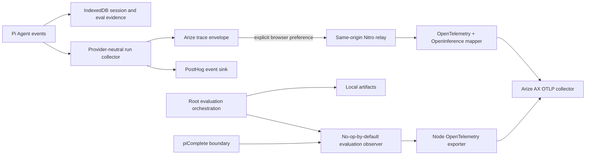

# Arize AX observability and evaluation integration plan

## Decision summary

Keating will add Arize AX as an optional OpenTelemetry/OpenInference backend. It
will not replace PostHog or Keating's local benchmark artifacts:

- PostHog remains the anonymous, content-free product analytics system.
- Local `.keating/` and IndexedDB evaluation artifacts remain authoritative and
  must be written even when every remote telemetry system is disabled or down.
- Root CLI/Pi/MCP evaluation runs may export metadata-only evaluator spans when
  an operator explicitly enables Arize with server-side environment variables.
- Web agent turns may export an OpenInference trace through a same-origin Nitro
  relay. Prompt and visible reply text are excluded unless the deployment and
  the learner independently enable evaluation-content sharing. That preference
  defaults off.
- Arize credentials never enter the browser bundle and are never prefixed with
  `VITE_`.

The initial target is Arize AX SaaS. The instrumentation uses standard OTLP and
OpenInference so the span model remains portable to Phoenix or another OTLP
collector later. Arize's current TypeScript guidance recommends manual
OpenTelemetry instrumentation for unsupported/custom agents and an OTLP HTTP
exporter with `arize-space-id` and `arize-api-key` headers. See the official
[manual instrumentation guide](https://arize.com/docs/ax/observe/tracing/how-to-tracing-manual),
[tracing concepts](https://arize.com/docs/ax/instrument/what-are-traces), and
[evaluation workflow](https://arize.com/docs/ax/evaluate/online-evals/log-evaluations-to-arize).

## Baseline and prerequisite gate

The PostHog work is currently a protected, uncommitted slice. It already adds a
transport-neutral `subscribeAgentAnalytics()` boundary, privacy sanitizers,
preferences, source-map support, and tests. The focused analytics suites pass
with 20 tests, and web typecheck passes. This confirms repository behavior, not
deployed PostHog ingestion, replay masking, dashboards, or Live Events.

Arize work must preserve every pre-existing edit. Before a production rollout,
the PostHog operating plan's browser and Live Events checks still need to pass.
Arize implementation may proceed in the same tree because its file ownership is
recorded in the execution graph, but it must not rewrite or discard that work.

## Outcomes

1. One web trace represents one learner-visible agent turn, with child spans for
   every provider generation and tool execution in a multi-step loop.
2. Root benchmark, policy evolution, prompt evaluation/evolution, and
   auto-improvement runs emit evaluator spans without changing their results,
   persistence, rollback, or deterministic test behavior.
3. Every exported record states its evidence engine: `deterministic`,
   `heuristic`, `llm`, or `learner-feedback`. Arize dashboards must not conflate
   these evidence sources.
4. Arize online evaluators can target explicitly shared web turns by mapping
   OpenInference `input.value` and `output.value` from the root AGENT span.
5. Disabled, misconfigured, rejected, rate-limited, or unavailable telemetry
   never interrupts teaching or artifact creation. An enabled client export
   failure is visible in Settings with a safe retry action.
6. No browser credential, provider key, raw error, thinking content, tool
   argument/result, uploaded file, path, share token, or learner identifier is
   exported.

## Non-goals for this execution

- Replacing the local benchmark/evolution system with Arize experiments.
- Uploading the existing local reward corpus, quiz answers, feedback comments,
  or `.keating/` trace files.
- Auto-creating Arize datasets, evaluator definitions, provider integrations,
  or continuous tasks. Those are external control-plane mutations and should
  follow a successful live-trace gate.
- Instrumenting the internals of the spawned Pi process. Keating can create an
  outer provider span in `piComplete()`; provider-internal spans require Pi-side
  context propagation and instrumentation.
- Depending on the beta `@arizeai/ax-client` in the runtime. The first slice only
  needs stable OTLP export. Task automation can be a later, isolated CLI tool.

## Architecture

The PostHog and Arize sinks consume the same lifecycle facts but not the same
wire format. PostHog keeps its stable product events. Arize receives a typed,
completed-run envelope and the server constructs a span tree; it does not infer
traces by replaying `$ai_*` PostHog payloads.

## Contracts

### Root evaluation observation

Add a versioned, vendor-neutral `EvaluationObservationV1` under
`src/observability/`. It contains only allowlisted scalar data:

| Field | Meaning |
| --- | --- |
| `operation` | `benchmark`, `policy_evolution`, `prompt_eval`, `prompt_evolution`, or `auto_improve` |
| `engine` | `deterministic`, `heuristic`, `llm`, or `learner-feedback` |
| `status` | `success`, `error`, `rejected`, or `rolled_back` |
| `suite` | Stable suite identifier, never learner-authored topic text |
| `duration_ms` | End-to-end duration |
| `score` / `before_score` / `after_score` | Bounded numeric results when the operation exposes them |
| `outcome_count` | Count only, not outcome records |
| `candidate_count` | Count only, not candidate policies/prompts |
| `provider` / `model` | Provider metadata for an actual LLM-backed operation |
| `error_category` | Stable classification, never a raw message |
| `app_version`, `surface` | Release and `cli`, `pi`, or `mcp` surface metadata |

Wrap orchestration at `src/core/project.ts`, outside persistence helpers. The
wrapped function owns behavior; the observer owns timing and best-effort export.
Exporter errors are caught after local persistence and cannot alter return
values or rollback decisions. `src/core/pi-agent.ts` adds outer LLM spans with
provider, model, duration, status, and parse outcome, without prompt/output text.

### Web agent trace envelope

Add `AgentTraceEnvelopeV1` with strict maximums and no open-ended metadata map:

- Root: schema version, client run ID, session correlation ID, turn index,
  provider/model/source, status, classified error, duration, generation/tool
  counts, app version, and surface.
- Generations: client span ID, provider/model, duration, time to first token,
  stop reason, status, and available token/cost numbers.
- Tools: client call ID, allowlisted tool name, duration, status, and whether it
  is an artifact tool. Arguments, progress, and results are never fields.
- Evaluation content: current-turn visible user text and final visible assistant
  text only. This optional object exists only when the deploy gate and the
  learner preference are both true. Thinking, tool calls, hidden alternatives,
  files, and previous conversation turns are excluded.

Limits: 64 KiB request body, 16,000 characters per input/output field, 32
generation spans, 32 tool spans, bounded IDs/names, finite non-negative numbers,
and unknown-key rejection. The server repeats validation and strips evaluation
content unless its own deploy gate is enabled.

### OpenInference mapping

- Root web span: `keating.agent.turn`, kind `AGENT`; add `input.value` and
  `output.value` only for explicitly shared evaluation content.
- Generation child: `keating.llm.generation`, kind `LLM`; add model/provider,
  token counts, stop reason, duration, TTFT, and classified failure attributes.
- Tool child: `keating.tool.<allowlisted-name>`, kind `TOOL`; add tool name,
  success, artifact flag, and duration only.
- Root evaluation span: `keating.evaluation.<operation>`, kind `EVALUATOR`.
- Root attributes include `keating.schema.version`, `keating.run.id`,
  `keating.turn.index`, `keating.eval.eligible`, evidence engine, app version,
  and surface. Use OpenInference session correlation without treating a Keating
  session ID as a person identity.
- Server-generated OpenTelemetry IDs remain backend identifiers. Client IDs are
  correlation attributes and are not forced into OTel's fixed-width ID format.

Failed turns produce one root outcome. Do not turn both
`agent_turn_completed` and `agent_turn_failed` into separate Arize traces.

## Privacy, consent, and failure behavior

| Path | Default | Content | Credential location | Failure effect |
| --- | --- | --- | --- | --- |
| PostHog product analytics | Existing preference | Never prompt/reply/tool content | Public ingest token in browser | No effect on teaching |
| Root Arize observation | Off | Metadata and numeric results only | Local/server environment | Artifact still written; safe warning |
| Web Arize evaluation trace | Off | Current input/output only after two gates | Nitro environment | Turn completes; Settings offers retry/disable |
| Local benchmark/session storage | On as product behavior | Existing local data | None | Existing recovery behavior |

Extend the existing browser preference object without changing its storage key,
so a prior PostHog opt-out is preserved. Add an independent
`arizeEvaluationEnabled` value with a default of `false`. Do not overload
`captureEnabled`, and do not enable Arize because PostHog is enabled.

The Nitro relay accepts only JSON from a same-origin request, enforces content
type and body size before mapping, applies a small per-IP rate limit, and has a
fixed operator-configured collector destination. It must never accept an
arbitrary target URL or caller-supplied headers.

The browser keeps at most one failed envelope in memory. A safe status event
drives a Settings message with **Retry** and **Turn off** actions. Do not persist
content-bearing retry payloads to localStorage, logs, PostHog, or IndexedDB.

## Configuration

All variables are runtime/server or local CLI variables; none use `VITE_`.

| Variable | Default | Purpose |
| --- | --- | --- |
| `ARIZE_ENABLED` | `false` | Explicit global kill/enable switch |
| `ARIZE_API_KEY` | none | Secret Arize API key |
| `ARIZE_SPACE_ID` | none | Target Arize space |
| `ARIZE_PROJECT_NAME` | `keating` | Project name; surface remains an attribute |
| `ARIZE_OTLP_ENDPOINT` | `https://otlp.arize.com/v1/traces` | Full HTTP/protobuf collector path; override for EU/CA/on-prem |
| `ARIZE_EVALUATION_CONTENT_ENABLED` | `false` | Deploy-side permission for web input/output sharing |
| `ARIZE_MAX_CONTENT_CHARS` | `16000` | Per-field content cap, clamped to a safe server maximum |
| `ARIZE_RATE_LIMIT_PER_MINUTE` | `30` | Anonymous relay abuse bound per source address |
| `ARIZE_TRUST_PROXY_IP` | `false` | Trust forwarded client IPs only when a deployment-controlled proxy strips caller-supplied forwarding headers |

Arize is considered configured only when `ARIZE_ENABLED=true`, the API key and
space ID are non-empty, the endpoint is valid, and the project name is bounded.
Return safe availability/reason codes from the browser config endpoint; never
return secrets or collector headers.

## Implementation scope and files

### Shared/root observability

- Add direct OpenTelemetry and OpenInference dependencies to root `package.json`
  and lockfile; do not rely on Ax's transitive OTel packages.
- Add `src/observability/types.ts`, `config.ts`, `arize.ts`, and focused tests.
- Instrument `src/core/project.ts` operations after preserving their local
  persistence order and rollback semantics.
- Instrument the outer provider boundary in `src/core/pi-agent.ts`.

### Web trace and relay

- Extend `web/src/lib/agent-analytics.ts` with a completed-run callback and a
  typed trace envelope while keeping all existing PostHog events stable.
- Add client submission/status helpers under `web/src/lib/arize-observability.ts`.
- Add server-only schema/config/tracer code under
  `web/server/utils/arize-observability.ts`.
- Add explicit Nitro config and trace handlers under
  `web/server/api/observability/v1/arize/` and register them in
  `web/nitro.config.ts`.
- Wire `web/src/hooks/useKeatingAgent.tsx` to the completed-run callback.
- Extend `web/src/lib/analytics-preferences.ts`,
  `web/src/components/KeatingUiSettingsTab.tsx`, and
  `web/src/pages/Privacy.tsx` for independent, default-off consent and recovery.
- Add direct OTel/OpenInference dependencies to `web/package.json` and its
  lockfile. Keep every OTel import out of the Vite client graph.

### Documentation

- Add an Arize operating section to `docs/DEVELOPMENT.md` with setup, local
  disabled-mode behavior, safe smoke tests, and live validation.
- Cross-link this plan from the PostHog operating plan and state that the two
  destinations have separate privacy contracts.

## Verification

1. Contract tests: strict parsing, bounds, unknown keys, non-finite values,
   content gating, and recursive secret fixtures.
2. Root invariants: disabled observer produces identical artifacts; exporter
   failure still writes reports/traces and preserves auto-improve rollback.
3. Agent lifecycle: multi-generation tool run becomes one completed envelope;
   error/abort close once; provider response model is preferred when available.
4. Client behavior: no request when unavailable or preference is off; content is
   absent unless both gates pass; one bounded retry is recoverable.
5. Server mapping: recording exporter sees one AGENT root with LLM/TOOL children,
   one outcome, correct timing/status, and no prohibited attributes.
6. HTTP behavior: config is secret-free; invalid origin/content type/body/schema
   gets a bounded 4xx; rate limit gets 429; disabled mode is an inert response.
7. Repository gates: focused tests, full root/web tests, root/web typecheck,
   production web build, and full build-all.
8. Runtime gate: run the production Nitro output, verify disabled config/no
   export, then use non-sensitive synthetic input with credentials to confirm the
   actual Arize trace tree and evaluator mapping. Source/build confidence alone
   is not live ingestion proof.

## Arize control-plane rollout

After live traces arrive:

1. Create a span- or trace-scoped evaluator named for one decision, such as
   `pedagogical_usefulness_v1`.
2. Filter to AGENT roots where `keating.eval.eligible = true`.
3. Map evaluator input to `attributes.input.value` and output to
   `attributes.output.value`.
4. Start on explicitly synthetic, non-sensitive sessions at 100% to validate the
   rubric. Then choose a documented production sample; do not silently evaluate
   every shared turn.
5. Compare automated labels to explicit learner feedback before trusting the
   evaluator as a release gate.
6. Record evaluator version, judge provider/model, sampling, cost, retention,
   and owner. Add task automation with `@arizeai/ax-client` only after this
   contract has stabilized.

## Definition of done

- PostHog event names and existing privacy tests remain stable.
- Arize is inert without explicit configuration; content sharing is separately
  off by default.
- No secret is present in client assets, request responses, logs, or git diff.
- Local artifacts are byte-for-byte unchanged in disabled mode and survive
  exporter failures.
- All focused/full tests, typechecks, and production builds pass.
- Disabled and recording-exporter runtime scenarios pass locally.
- If credentials are available, a real Arize trace and one evaluator result are
  inspected in AX. Otherwise the final report marks live Arize ingestion as not
  verified and supplies the exact remaining smoke step.
