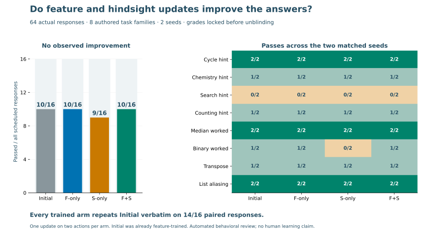

# Fresh checkpoint behavior comparison

**14 September 2026:** the actual F-only and F+S updates do not improve this
small frozen comparison. S-only loses one worked-answer pass. This is a
descriptive result, not a statistical or human-learning conclusion.

| Checkpoint | Hint requests | Worked answers | Other capabilities | Total |
| --- | --- | --- | --- | --- |
| Common Initial | 4/8 | 3/4 | 3/4 | 10/16 |
| F-only | 4/8 | 3/4 | 3/4 | 10/16 |
| S-only | 4/8 | 2/4 | 3/4 | 9/16 |
| F+S | 4/8 | 3/4 | 3/4 | 10/16 |

Open [the reactive notebook](../analysis/checkpoint_behavior.py) to filter by
task category and inspect every paired verdict. It reads the shipped
[numeric report](generated/feature-hindsight-evaluation.json), needs no private
cache, and cannot invoke a model or spend money.

## What ran

Eight fresh authored tasks, two seeds (101 and 202), and four distinct immutable
Tinker samplers produced all 64 scheduled responses. Each request used the same
system/user messages across arms, temperature 1, top-p 1, top-k -1 and a 512-token
completion ceiling. All responses stopped normally. No output-dependent retry,
replacement, best-of selection or rubric change occurred.

The initial checkpoint is an earlier feature-trained checkpoint. Each sibling
F-only, S-only and F+S checkpoint adds one acknowledged optimizer step on the
same two native actions described in [the update report](native-combined-results.md).
This does not compare against an untouched base or a quality-qualified SFT warm
start. The actual capture bridge rendered, sampled and journaled the compact chat
calls. No Pi tools, interactive artifact or learner simulator was involved here.

## Review and results

Task facts, references, criteria, scheduling and actor-visible fields were frozen
before generation. The task author and parent checked the independent answers;
the parent verified reference lengths with the actual tokenizer. Only the common
system prompt and learner question entered actor messages.

Two fresh automated reviewers graded shuffled opaque responses, without arm
labels, checkpoint paths, previous scores or the SAE reward. Each graded 36
responses, including eight overlapping responses. Their overall verdicts agreed
on all eight, and 23/24 overlapping criterion scores agreed. The remaining
hint-length disagreement was retained as unknown for all four identical replies
before unblinding. Those replies still fail an independent correctness criterion.
There are no unknown overall verdicts, invalid trials or missing responses.

Every trained arm reproduced Initial's text exactly on 14/16 matched task/seed
pairs. F-only and F+S changed two texts each without changing any pass/fail verdict.
S-only changed two texts and regressed on one worked-answer verdict. Across all
64 samples there were 21 distinct task/text pairs. Repeated responses and seeds
do not add independent task families.

Failures included giving away which binary-search side survives, omitting a
prohibited badge pairing, calling elemental H₂ a compound, failing to complete a
binary conversion, and adding formatting to a strictly formatted transpose.
No response invented learner mastery, saved progress or completed tool actions.

## Implication and limits

The update pipeline and frozen feature measurement are operational. The current
two-action training dose has not demonstrated useful behavioral change. Do not
promote a checkpoint or claim complementary supervision from these scores.
The next useful experiment needs a quality-qualified common starting policy,
more independently accepted native training actions, and the same external
behavior gate. SAE interventions test a separate question: whether perturbing a
direction changes generated behavior, including undesired collateral changes.

This is eight authored operational families, not a sealed external benchmark.
Broader actor-training-family and pretraining decontamination are unverified.
The “other capabilities” tasks are matrix transposition and list aliasing, not
delayed learner retention. Human transfer, the 180-episode native pilot, and full
interactive delivery/assessment remain separate open gates.

The evaluation reserved **$0.60** from the existing shared $100 cap. Its child
ledger reserved $0.35489760. At completion the shared ledger held **$58.30 reserved
and $41.70 unallocated**. Reservations are conservative allowances, not invoices;
unconsumed or failed reservations have not been refunded.

Evidence hashes: suite `d000d74d00a02b26181d23b246bb3f31c2e6a567c829f34046a6842dfc079e10`;
actual result `244ae4a055bee3ab9188579b069b2576355da10d0a0e81d5e231605446fbc369`;
locked grades `10d2e2697fac1c45b470aaa8b0c15f1bb99b87ca3f05dd73490004382b92b36b`.
Full traces, exact sampler identities, review packets and the private unblinding
map remain under `.keating/native-learning/feature-hindsight-evaluation-v1/`.
