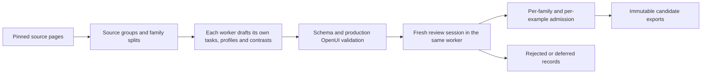

# A larger teaching corpus across domains

This expansion uses **MiniMax M3 and DeepSeek v4.1 Flash through Crush** to author
source-grounded teaching situations across **sixteen domains**. Each worker generates and reviews its own partition,
using a fresh session for each draft and review. Their folders and source groups
are separate; both cover the entire subject set, starting with music.
It carries the contextual-teaching rubric forward from the math revision: know
when to explain, when to diagnose and when to let productive work continue.

The expanded generation target is **32,000 contrasts**. This is a queued target,
not an accepted corpus count. The local queue's `status.json` and each immutable
export's `report.json` report what actually finished.

| Worker | Exact model route | Source groups | Contrast target |
| --- | --- | ---: | ---: |
| MiniMax | `minimax/MiniMax-M3` | 160 | 16,000 |
| DeepSeek | `hyper/deepseek-v4.1-flash` | 160 | 16,000 |

Each worker receives ten source groups per domain: eight training, one
calibration and one test group. The expanded catalog preserves all original 100
source groups and their family/profile/split assignments. Generation packets are
now one family apiece, so their packet hashes and job IDs are newly versioned. Each draft,
review, receipt and export records its actual model and execution engine.

| Unit | Planned total | Training | Calibration | Benchmark |
| --- | ---: | ---: | ---: | ---: |
| Pinned source groups | 320 | 256 | 32 | 32 |
| Authored task families | 1,600 | 1,280 | 160 | 160 |
| Synthetic learner profiles | 3,200 | 2,560 | 320 | 320 |
| Contextual response contrasts | 32,000 | 25,600 | 3,200 | 3,200 |

There are twenty source groups per domain. Each group has five task families,
two profiles per family and ten contrasts per profile. A profile variant is not
a new independent task or person. Two observer views of a contrast are not two
independent examples. Rejected/deferred items reduce accepted counts; the queue
does not duplicate records or move holdouts into training to meet its target.

## What changes between subjects

| Domain | Teaching decisions | Native activities |
| --- | --- | --- |
| History | Weigh sources, distinguish cause from sequence, compare interpretations | Choose which evidence supports a claim, then explain its limits |
| Biology | Trace a mechanism, predict a perturbation, distinguish observation from inference | Predict an outcome, explain the mechanism or choose a control |
| ML | Diagnose a data/model failure, interpret metrics, reason about tradeoffs | Select an evaluation design, work through a small supplied table, justify a decision |
| Geology | Infer processes from observations, order events, reason across timescales | Choose a supported inference and explain the evidence in a written response |
| Philosophy | Reconstruct premises, test validity, develop a counterexample, compare defensible positions | Identify an inference, write an objection or defend a distinction |
| Chemistry | Connect particles and bulk quantities, conservation, equilibrium and reaction rates | Compare explanations, balance supplied relationships and explain a prediction |
| Physics | Model systems, forces, energy, waves and electricity; check units and assumptions | Predict a change and justify the physical model |
| Computer science | Trace Python, diagnose loops/functions, reason about data structures and abstraction | Predict supplied code, explain a bug or propose a small correction |
| Statistics | Sampling, probability, uncertainty, study design and inference | Interpret a supplied dataset and distinguish supported conclusions |
| Economics | Opportunity costs, incentives, marginal reasoning, markets and externalities | Compare choices under stated assumptions and defend a tradeoff |
| Psychology | Operational definitions, experiments, perception, learning, memory and social evidence | Choose a study design or explain which inference the evidence supports |
| Literature | Close reading, narrative voice, form and competing critical interpretations | Compare interpretations of a supplied authored passage and cite textual evidence |
| Writing | Audience, purpose, organization, argument, revision and style | Revise a supplied passage while preserving the learner's voice |
| Civics | Institutions, powers, representation, rights and deliberation | Reason about an institutional scenario with an explicit jurisdiction |
| Environmental science | Ecology, cycles, populations, biodiversity, feedback and human impacts | Predict a system response and distinguish evidence from value judgments |
| Music | Pitch, rhythm, meter, harmony, counterpoint, form and composition | Analyze note/duration sequences, choose a harmonic interpretation or revise a motif |

These are generation instructions, not examples of completed model performance.
The first geology source set emphasizes plate tectonics, with additional rock,
fossil and dating material. Computer science begins with Python; civics begins
with US institutions; environmental science begins with ecology and conservation.
Music begins with Open Music Theory's Western tonal emphasis. These starting
collections do not exhaust their fields.

Music tasks supply explicit note names, octaves, durations and counting schemes.
They distinguish stylistic conventions from universal musical rules. The current
choice/text path supports written theory and composition decisions. It does not
establish listening or performance ability: tasks requiring sound or a score image
are deferred until real playable or rendered assets and observations are present.

OpenUI uses the existing native `question` contract: `choice` and `text` nodes,
including combinations where useful. Every public activity passes
`validateNativeSourceDocument`, the same validator used for native delivery.
No production UI or runtime validator was changed. A valid document establishes
schema compatibility; actual rendering, submission and persistence still require
native episodes through the application.

## Profiles and evidence

Each profile has an authored goal, concrete prior learner work/statements, an
opening message and labeled simulator assumptions. Evidence carries a visibility
field: disclosed to the actor, or known only to the learner simulator. Profiles
do not invent diagnoses, fixed learning styles or observed mastery outcomes.

Task facts and supported prior work shape the interaction. Learners can make
partial progress, persist with a misconception, ask a natural clarification or
try a transfer task. They do not instruct the tutor to satisfy an evaluation
rubric. The same explanation may be premature during a productive attempt and
appropriate after repeated failure. Brief acknowledgment can be a positive
teaching target even when it adds no substantive explanation.

Public activity and actor context are constructed from allowlisted fields.
Assessment criteria, acceptable answers, source grounding and teaching-strategy
notes stay in `evaluation_only`. Simulator assumptions never receive an answer
key. Automated structural separation is followed by model review for semantic leaks.

## Sources, attribution and splits

The expanded source catalog is [multidomain_sources_v2.json](../scripts/training/multidomain_sources_v2.json).
The original [100-source catalog](../scripts/training/multidomain_sources.json) is retained.
It records URLs, content hashes, extraction hashes, attribution and source terms.
OpenStax CNXML is pinned to exact Git revisions; HTML downloads are content-pinned.
A changed download fails verification rather than silently changing the experiment.
The raw text and extracted catalog live in ignored local research output.

The pinned OpenStax collections record their own licenses: Physics is **CC BY 4.0**;
the other selected OpenStax books use **CC BY-NC-SA 4.0**. The Saylor literature
text is **CC BY-NC-SA 3.0**, and Open Music Theory is **CC BY-SA 4.0**.
Their derived records retain the corresponding attribution, sharealike and
noncommercial lanes. Google ML Crash Course text is attributed under CC BY 4.0. USGS-authored
text is tagged separately; third-party illustrations/credits are not licensed by
that public-domain designation. These lanes remain attached to SFT, observer and
benchmark records. There is no blanket commercial-use approval for the combined
corpus. See the [Google site policy](https://developers.google.com/terms/site-policies)
and [USGS credits policy](https://www.usgs.gov/information-policies-and-instructions/copyrights-and-credits).
Music attribution and reuse terms are described by [Open Music Theory](https://openmusictheory.github.io/about.html);
the pinned literature [license notice](https://raw.githubusercontent.com/saylordotorg/text_writing-about-literature-through-theory/063e3a49b44339ee96a2f0a0ea134b6abfc9729c/s00-license.html)
records its separate terms. Prompts require newly authored passages and motifs,
not copies of third-party excerpts, lyrics, recordings or published exercises.

Source-group membership and family/profile IDs are fixed before generation.
Every descendant of one selected source page remains in the same split. Existing
v3/v4 case files are hash-pinned and are not drafting inputs. These partitions
prevent exact family reuse; related concepts can still occur across different
source pages. A semantic contamination audit is needed before claiming a sealed
release benchmark. The new pack does not replace or rename the frozen v4 suite.

## Admission and exports



Each job contains **one family, two profiles and twenty contrasts**. The initial
100-contrast jobs timed out or exhausted output tokens before writing a result;
those incomplete attempts remain in the v1 folders. Smaller jobs make review and
recovery practical. They do not reduce the overall family or example target.

Each queue first reviews one source group (five family jobs) in each domain.
Expansion proceeds only if each pilot group has at least three approved task families and fifty approved
contrasts. These are engineering acceptance gates, not statistical power or
human-review claims. Drafting and review use separate sessions of the **same
model**. The queue stops for failed gates or repeated structural failures.

Each job records its input, prompt, output and log hashes, process exit code and
validation result. A file left behind by a failed/quota-limited process is
preserved as `unaccepted.json`; it is not resumable accepted work. Quota errors
use the reported reset time. Unknown reset times stop the queue. The queue does
not change model, subscription or provider, and does not start policy training.

Exports include:

- `contrasts.json`: source-grounded positive, negative and unknown examples, with review provenance.
- `profiles.json`: new synthetic profiles, goals, evidence, assumptions and family/split membership.
- `native-scenarios.json`: public activities, learner contexts and private assessment packages.
- `benchmark-scenarios.json`: only the held-out test families, in the native scenario contract.
- `sft-candidates.json`: only correct, appropriate training-split replies, including appropriate restraint. Message weights target the final assistant message only. Actual actor tokenization is still required.
- `observer-records.json`: separate pre-action need and delivered-action views. Annotation spans carry their own move, appropriateness and correctness; the observer's pooling span remains independent of those private labels.
- `rejections.json` and `report.json`: failures, denominators, source terms, accepted counts and artifact hashes.

The contrasts contain authored text. They are not logged-policy RL trajectories,
tool-call demonstrations, verified learner outcomes or calibrated probe scores.
Runtime rollouts supply actual delivery receipts and actor sampling probabilities
when those later become available.

## Operating the queue

Two independent queue processes run concurrently. Each performs a draft, validates
the native documents, starts a fresh review session, and compiles admitted data
before advancing to its next job. Exports are saved after the first reviewed job
and then every five jobs, plus the final job. Current status and process/log receipts are
in each worker's folder:

```text
.keating/outputs/multidomain-minimax-m3-v2/
.keating/outputs/multidomain-deepseek-v4.1-v2/
  manifest.json
  worker-process.json
  status.json
  exports/
```

Each queue is bounded to 72 hours, with a 15-minute job timeout. Worker-local
Crush settings cap output at 32,768 tokens and use low reasoning effort for
DeepSeek; global credentials and model defaults remain unchanged. A `STOP` file in
one worker's directory stops that queue between jobs or during quota waiting.
It does not interrupt an already running model job. An exclusive directory lock
prevents duplicate queues in the same folder. After interruption, resume the
appropriate folder; its frozen manifest selects the model for both tasks:

```sh
rtk proxy env -u PYTHONHOME -u PYTHONPATH python3 scripts/training/agy_multidomain.py \
  .keating/outputs/multidomain-minimax-m3-v2 --max-hours 72

rtk proxy env -u PYTHONHOME -u PYTHONPATH python3 scripts/training/agy_multidomain.py \
  .keating/outputs/multidomain-deepseek-v4.1-v2 --max-hours 72
```

The older Gemini continuation now handles **only** the pending math reviews and
supplementary source adjudication, using
`.keating/outputs/agy-feedback-v2/resume_math_only.py`. Its provider-reported reset
remains 2026-09-15 04:50 UTC. The original multidomain folder records the delegation
and retains its source packets; it does not launch another full domain run.

For a fresh generation version, fetch the pinned catalog into a fresh directory,
then run `multidomain_corpus.py prepare CATALOG OUTPUT --execution-profile
crush-minimax --shard-index 0 --shard-count 2 --families-per-batch 1 --priority-domain music`
for MiniMax and use `crush-deepseek --shard-index 1 --shard-count 2 --families-per-batch 1 --priority-domain music`
for DeepSeek. The default `agy`
profile remains available for explicitly selected Gemini runs. Compile completed reviewed
batches into a new snapshot with `multidomain_corpus.py compile QUEUE OUTPUT`.
All snapshots are immutable; reruns preserve earlier drafts, reviews and exports.

## Curriculum and the next experiment

Inspect accepted examples per domain, profile, need, fit and source group before
training. Start with a small, balanced, licensed SFT subset covering diagnosis,
warranted explanation, useful feedback and restraint. Compare it against the
unchanged actor on held-out native scenarios and unrelated retention tasks.
Add sequential domain slices and replay only after that baseline is measured.
Keep the observer/probe checkpoint fixed within the experiment and report whether
the probes transfer across domains and from chat into native artifacts.

The generation pipeline makes scale possible. Same-model review, source aging,
semantic overlap, profile realism and real learner effectiveness remain the key
limitations to resolve before treating this as a trustworthy release benchmark
or evidence that a larger training run improves teaching.
