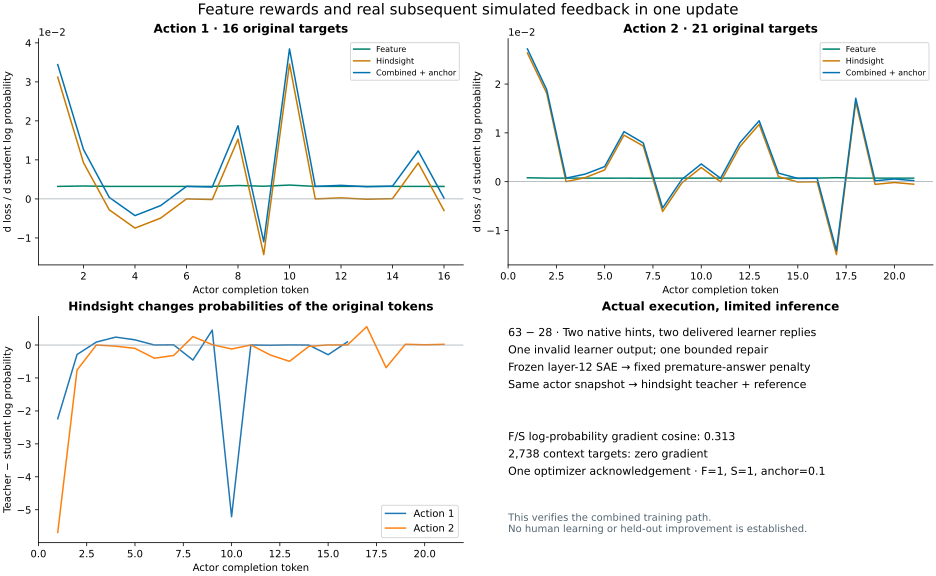

# Actual SAE feature rewards and hindsight updates

**The frozen SAE reward now reaches a real Tinker optimizer, both alone and with
subsequent learner feedback.** On 14 September 2026, F-only, S-only and F+S each
completed one update on the same two native teaching actions. This closes the
measurement-to-update integration check. Independent held-out teaching benefit,
causal steering and the full research plan remain unverified.

**Behavior follow-up:** the [fresh blinded comparison](checkpoint-behavior-results.md)
ran all 64 scheduled responses. Initial, F-only and F+S passed 10/16 each;
S-only passed 9/16. No improvement is established by this small experiment.

Open [`analysis/combined_reward_results.py`](../analysis/combined_reward_results.py)
with the existing `keating:notebooks` task. Its sliders change the feature and
hindsight weights on saved scores without making provider calls. The selected
[numerical results](generated/native-combined-update.json) ship with the notebook;
no private cache, credential, model download or training run is needed to view it.
The figure shows derivatives with respect to **target log probabilities**, not
gradients with respect to model parameters.

## The measurement instrument

The observer is `Qwen/Qwen3.5-9B-Base` at revision
`68c46c4b3498877f3ef123c856ecfde50c39f404`, paired with
`Qwen/SAE-Res-Qwen3.5-9B-Base-W64K-L0_50` at revision
`7bb2370d360e566b2d8acb8b3d15a0b2b88f52a8`. Extraction uses residual output from
`language_model.layers.12`, hidden width 4,096, dictionary width 65,536 and signed
Top-K 50. No extra ReLU or centering is inserted. The selected `layer12.sae.pt`
file SHA-256 is `2cea61ef74a4d33d59329f7e3d1ddfb4a8cdf3c24acdbc05fc26209679a262d8`.
The frozen probe averages unique selected token measurements.

The [premature-answer experiment](premature-answer-reward.md) fitted this readout
on 120 authored contrast records grouped into 30 task families: 18 training,
six calibration and six test families. On the 24 test records, the SAE probe had
Brier 0.0381 and AUC 1.0; the raw-residual probe had Brier 0.0762 and AUC 0.9722.
The primary text fit collapsed to an intercept-only classifier, so these results
do not establish superiority over a tuned text baseline. These are small authored
contrast tests, not source-teacher or human-learning validation.

The measurement and reward card were frozen before this native capture was
scored. Its `pa-02` source family belongs to training, not calibration or test.
The new GPU job completed two forwards totaling 211 input tokens and replayed
the existing coefficients; it did not refit or select a new feature.

## What actually happened in Keating

An independently authored learner asked for a starting hint on **63 − 28**,
without the difference. The actual Pi runtime and recorded actor sampler produced:

| Delivered tutor action | Subsequent delivered simulated learner event | SAE premature-answer score |
| --- | --- | ---: |
| “Start by breaking 28 into friendly chunks relative to 63.” | Asked whether 28 could be split into 3 and 25 or 20 and 8, then requested trying that approach. | 0.102627 |
| “Try subtracting 20 first, then 8. What do you get at each step?” | Computed 63 − 20 = 43 and 43 − 8 = 35, then asked whether 35 was the difference. | 0.030449 |

The learner used separate instruction `Qwen/Qwen3.5-9B`, rather than the actor's
Base checkpoint. Its first malformed structured response was rejected, then one
allowed repair produced the first delivered message. There were three learner
samples and two delivered decisions. That invalid output remains in the ledger
and did not enter the tutor conversation. A third tutor response had no subsequent
learner event and was excluded from hindsight training.

Independent model-assisted review checked role, arithmetic and actual delivery
links. It is not a blind human review. The episode reached its declared decision
horizon (`budget_exhausted` in the controller vocabulary), without an interactive
artifact, transfer check or human outcome. One usable chat trace does not establish
reliable adaptive simulation across the benchmark.

## The three updates

All arms started separately from the same saved earlier F-updated actor weights,
with optimizer state reset. They were not chained. This starting point is neither
an untouched Base model nor a validated SFT warm start. Each arm trained the same
**16 + 21 = 37 original completion tokens**, at learning rate `1e-5`, with equal
weight per action. Context, tool-result and learner tokens are not policy targets.

| Arm | Feature weight | Hindsight weight | Anchor weight | Acknowledged updates | Maximum analytic gradient replay error |
| --- | ---: | ---: | ---: | ---: | ---: |
| F-only | 1 | 0 | 0.1 | 1 | 2.06e-10 |
| S-only | 0 | 1 | 0.1 | 1 | 3.43e-9 |
| F+S | 1 | 1 | 0.1 | 1 | 2.73e-9 |

F uses the frozen negative premature-answer score as a one-action advantage:
−0.102627 and −0.030449. Even an appropriate hint can receive a small negative
penalty because the classifier is uncertain. This is an explicit proxy objective,
not a correctness label, positive learning reward or calibrated probability of
learning. The action's scalar is normalized over its completion tokens, not counted
as a new reward at every token.

S uses detached teacher-minus-current-student log probabilities. The frozen teacher
gets the actual subsequent learner event before replaying the original completion;
the student keeps its original prefix. Original target IDs match in teacher,
reference and student records. A correct learner response does not force all tutor
tokens to have positive hindsight advantage.

PPO ratio clipping is 0.8–1.2, with separate fixed feature/hindsight caps of one.
The 0.1 anchor is a sampled-target squared-log-probability term, not full-vocabulary
KL. All **2,738 context targets per arm** have exactly zero recorded gradient.
Independent numerical replay matched the transported derivatives within 3.43e-9.
Every arm had one callback, one optimizer acknowledgement, saved training/sampler
checkpoints and verified local process cleanup.
All three sampler adapters were also downloaded and SHA-256 checked locally
before their hosted checkpoints expire. These archives omit optimizer state;
downloading them does not demonstrate inference after restoring an archive.

The combined F/S derivative cosine was **0.312903** in token log-probability
coordinates. This describes partially aligned update signals on this batch; it
does not establish complementary improvements in behavior. The S-only and combined
runs also returned slightly different numerical scores despite the same initial
weights. Preserve each run's actual scores; do not subtract their losses as a
causal ablation or assert bit-identical provider computation.

## Evidence, cost and remaining experiment

Private source evidence is under
`.keating/native-learning/model-stage-zero/feature-hindsight-capture-v1/`.
Measurement, exact plans, raw target-score receipts and all three update results
are under `.keating/native-learning/feature-hindsight-measurement-v1/`.
Only selected numerical summaries from this wholly authored scenario are exposed
in the notebook. The common protocol hash is
`16c4593e587bc03bb0fa78ebb9e6f8a694b65be6a2ea41e035cd0cbb34fd1916`;
the verified three-arm analysis hash is
`9f033f7e3f5ddbadc5f2a550ed10c00ca6bc1c051e7d2768f930dcbd4b6415bd`.

The independent artifact audit reproduced both probabilities exactly and confirmed
all three arms' targets, masks, callbacks and saves. It caught a serialization
defect: the native ledger writer changed 16 integral floating feature values to
JSON integers, so the saved object could not reproduce the observer's type-sensitive
hash. The faulty `features.local.json` is preserved. Use
`features.float-preserved.json` for replay; `feature-type-recovery.json` records
the recovery. Numeric values, both bound row hashes, the original artifact hash
and the entire reloaded reward audit now match exactly, without repeating any
provider operation. The measurement writer now uses observer canonical JSON and
checks the digest after saving and reloading. Native ledger hashing is unchanged.

The SDK emitted pending-poller shutdown warnings after completed saves. Local
supervision confirmed empty descendant sets and terminated processes. These
warnings do not invalidate recorded acknowledgements; no remote-cancellation
attestation is inferred from local process cleanup.

The first GPU attempt failed during package installation on the mounted volume.
The replacement used local container storage for package writes, retained the
same model/SAE/probe pins, completed extraction and was deleted. Both termination
receipts are preserved, including the failed allocation. See the
[Runpod execution notes](observer-runpod.md).

After the three updates, the shared ledger records **$57.70 reserved and $42.30
unallocated from the approved $100 cap**, including all earlier and failed grants.
These are conservative reservations, not invoices or remaining provider-account
balances. This capture/measurement/update sequence reserved $5.80: $1 for the
native capture, two $1.50 GPU attempts and three $0.60 update grants.

The next decisive experiment is a blinded behavior comparison of the common
starting checkpoint and all three saved arms on fresh task families, checking
appropriate hints, legitimate worked answers, correctness and unrelated retention.
Judge the delivered outputs independently of this reward probe. Causal feature
interventions, chat-to-artifact transfer, the 180-episode paired pilot and human
learning evidence remain separate gates. No checkpoint is promoted by this report.
