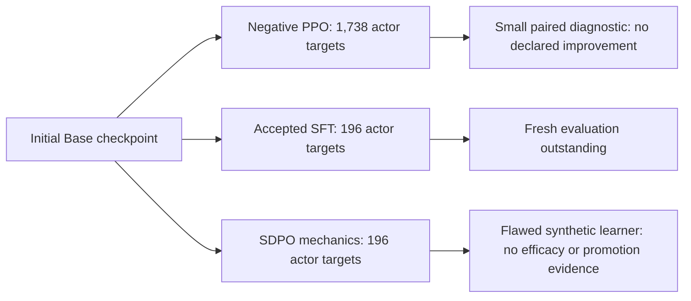

# Checkpoint lineage, replay and retention

`scripts/training/native_continual.py` connects the existing updater's sealed
plans and acknowledged results to an offline lineage and measurement contract.
It never invokes a model, repeats an optimizer, restores hosted state, or changes
the active serving checkpoint. Notebook imports require no credentials.

## Actual checkpoint branches

As verified from the saved plans/results on 13 September 2026, the research has
three mechanically acknowledged updates from the same initial Base weights:



Those branches are sibling ablations, not a three-stage continual-learning
sequence. The new SDPO result at
`.keating/native-learning/model-stage-zero/chat-canary-v3/sdpo-canary-v1/executed-v1/`
records `status: complete`, `optimizer_acknowledged: true`, and `save_sampler` as
the last dispatch. Its plan has 196 original actor completion targets and the
same initial training URI as SFT and PPO. This is local acknowledgment evidence,
not an independent provider restoration check.

The SDPO `usage-restrictions.json` still records
`purpose: sdpo_mechanics_canary_only`, `learner_role_fidelity: failed`, and an
actually delivered **synthetic** model consequence. It marks qualifying warmstart,
efficacy, promotion, retention and transfer evidence false; learning outcome stays
unknown. The consequence was not repaired or replaced. These restrictions remain
in force after mechanical acknowledgment. They are parent-enforced metadata;
lineage membership does not grant eligibility or upgrade their scientific status.

The persisted `model-stage-zero/checkpoint-lineage-v1.json` predates this addition
and contains the earlier initial/PPO/SFT tree. The stricter validator has checked
all three actual plan/result pairs together **in memory**, producing four nodes
with three depth-one children. No private registry was rewritten by this change.
The parent can rebuild its registry from the saved acknowledgments; existing
derived protocols must be rebound to the resulting lineage hash. The updater resets optimizer state from
pinned weights for each of these runs. A downloaded sampling adapter does not
prove that optimizer state or a remote checkpoint has been restored successfully.

## Runnable interfaces

```sh
rtk proxy env -u PYTHONHOME -u PYTHONPATH python3 scripts/training/native_continual.py lineage INPUT.json
rtk proxy env -u PYTHONHOME -u PYTHONPATH python3 scripts/training/native_continual.py retention INPUT.json
rtk proxy env -u PYTHONHOME -u PYTHONPATH python3 scripts/training/native_continual.py promotion INPUT.json
rtk proxy env -u PYTHONHOME -u PYTHONPATH python3 -m unittest discover -s scripts/training -p test_native_continual.py
```

The CLI reads a local input and prints JSON; it performs no writes or dispatch.
`lineage` accepts `root` and `updates`. The root has `id`, `model`,
`training_checkpoint` and `sampler_checkpoint`. Each update has `id`, `parent`,
and the unmodified updater `plan` and `result` objects. Parents precede children.
Both outer `plan_hash`/`result_hash` seals and the nested `config_hash` are checked.
The config must also pass the existing updater's configuration validator: resealing
an invalid config or changing the declared method cannot bypass its settings and
checkpoint requirements. Duplicate plan acknowledgments, incomplete saves, wrong
parent weights and reused checkpoint identities are rejected.

Results must include the updater's recorded `training_client_id`. For the pinned
`native-tinker-update/v1` producer, both saved URIs must use that exact client and
the save name `native-<first 24 characters of plan_hash>-updated`, respectively
under `weights/` and `sampler_weights/`. A different client's sampler, a different
save, or the `-teacher` snapshot is rejected. Nodes retain the nested config hash
and training client identity as well as the plan/result/checkpoint pins. The root
remains an external declaration; remote restoration is still unverified.

These checks validate acknowledgment structure and the known producer's save
convention; they do not rerun the updater or independently reconstruct every
training input. Result hashes establish content
consistency, not independent proof that a caller-supplied result is authentic.

`retention` accepts `lineage`, `schedule`, and `observations`. Seal the schedule
with `native_training.seal(value, 'schedule_hash')`; it binds the lineage hash,
measurement kind, ordered checkpoints and ordered evaluation slices. There is
one initial checkpoint plus one checkpoint per curriculum slice. Each successor
must actually descend from the preceding checkpoint; sibling ablations fail.

An observation names its checkpoint and exact sampler URI, slice, score in
`[0,1]` or `null`, assessment count, measurement kind, assessment hash and schedule
hash. Duplicate cells and scores with no assessments are rejected. The report
constructs `R[k,j]`, new-slice plasticity and average previous-slice forgetting.
Any missing required cell leaves that contrast unknown. Counts describe supplied
assessments, not independent humans. Point estimates alone carry no uncertainty
or promotion claim. No actual continual-learning matrix has been measured yet.

## Replay contract

`select_replay` consumes a sealed native export, its admitted source-family split
manifest, the checkpoint lineage and a current checkpoint. Supply an explicit
assignment of capture hashes to `recent`, `reservoir`, or `hard`, with a rationale
and evidence hash for each assignment. Quotas are integer counts; for example,
`{recent: 6, reservoir: 3, hard: 1}` declares a ten-action experimental batch.

Selection uses a seeded hash order without replacement. A shortage fails rather
than silently changing the mixture. Protected/non-training families, revoked
family aliases, nonancestor behavior checkpoints and excessive update distance
cannot enter a batch. Related reformulations must already be represented by the
source-family registry; the selector does not discover aliases from text.

The output is a capture selection, not a training authorization or prepared loss.
Pass the selected original captures through `native_tinker_update.prepare_update`
again. That path still validates review, delivery, original token masks, behavior
probabilities and the actual student/behavior log-ratio freshness bound. Distance
in updates is not an importance correction and does not make stale data safe.
The caller must refresh its revocation input before preparing each new batch.
`revoked_aliases` must be a list or tuple of unique nonempty strings with no
leading/trailing whitespace. The default empty tuple and an empty list mean no
revocations. A bare string, bytes, mapping, set, iterator, null, nonstring member,
blank member or duplicate is rejected before selection. Alias IDs remain exact
and case-sensitive; the selector neither splits strings into characters nor
silently trims invalid IDs.

## Scoped promotion decision

`promotion` accepts a sealed protocol, independent evidence and the lineage. The
protocol names candidate, rollback, development authors, measurement scope,
minimum gain and maximum forgetting. It must also pin `lineage_hash` and these
exact checkpoint pairs from that lineage:

```json
{
  "checkpoint_pins": {
    "candidate": {"training_checkpoint": "<exact URI>", "sampler_checkpoint": "<exact URI>"},
    "rollback": {"training_checkpoint": "<exact URI>", "sampler_checkpoint": "<exact URI>"}
  }
}
```

Every evidence row must bind the resulting `protocol_hash`, the same
`lineage_hash`, the same complete `checkpoint_pins`, candidate/rollback names,
measurement, independent reviewer and artifact hash. An old approval cannot be
reused with different weights under the same names, or by rebinding only a
lineage hash. Older protocols/attestations without these fields fail closed;
there is no implicit migration or inherited approval.

All five gates—`quality`, `retention`, `safety_format`, `calibration`, and
`restore`—require explicit boolean `passed: true`. False or missing `passed`
denies eligibility, including when a quality/retention interval is favorable.
Strings, numeric stand-ins and unexpected row fields are rejected. Quality and
retention additionally accept only `interval_95` and `unit: source_family` beyond
the common fields. Missing intervals deny; a quality lower bound must exceed
`minimum_gain`, and the retention upper bound must not exceed
`maximum_forgetting`. Boolean gates do not accept unused interval fields.

The decision includes both exact checkpoint pairs and the lineage hash. Missing,
failed, uncertain or contradictory evidence cannot yield eligibility.

This is a decision over supplied attestations. It does not fetch or independently
review their referenced artifacts, consume a release holdout, change a serving
pointer, or certify human benefit from model evaluations. A deployment integration
must independently verify the artifacts and enforce the existing release-holdout
consumption and authorization rules. The current actual checkpoints remain
unpromoted. Offline repro tests cover changed valid lineages, each replaced
checkpoint URI, nested-config tampering, sampler/client/save mismatch, explicit
failed quality despite a favorable interval, malformed revocations, stale/sibling
replay exclusion, and unknown retention cells. They use authored acknowledgments;
the actual PPO/SFT/SDPO records were separately checked read-only in memory.
