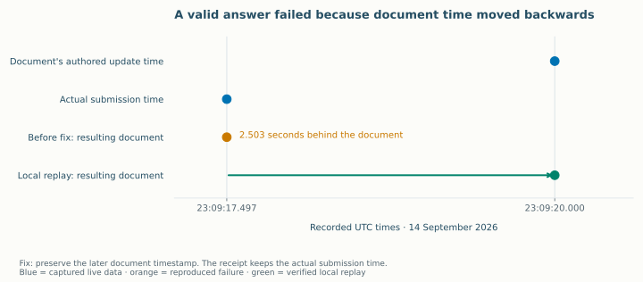

# Interactive canaries: from a question to a submitted answer

Three live tutor–learner runs tested the interactive path on 14 September 2026.
The first delivered two questions and accepted two model-selected answers. The
second exposed a timestamp bug, now fixed through an exact local replay. The
third stopped on invalid activity/action formats. All three retained their actual
events and shut down their local workers.

## The task and the changes

The learner starts with `1/3 + 1/4 = 2/7`, asks for one interactive question about
equal-size pieces, and wants to attempt it before seeing the final sum. This is
an independently authored fractions task. All three runs share the same opening,
learner profile and family, `authored-fraction-unit-size-v7`.

Both roles use the hosted `Qwen/Qwen3.5-9B` instruction model. The learner sees
delivered text and available controls. The tutor receives the production Pi
prompt and canonical question schema. Each run has a three-decision horizon,
six-call tutor cap, one learner repair and a $1 allocation: $0.60 tutor, $0.40 learner.

| Run | Tutor condition | Learner contract | Tutor / learner calls | Accepted submissions | Recorded end |
| --- | --- | --- | ---: | ---: | --- |
| Interactive JSON v7 | Strong prompt v1 | JSON v4 | 4 / 4 | 2 | Three-decision horizon |
| Interactive JSON v8 | Strong prompt v2 | JSON v5 | 2 / 2 | 0 | Delivery failure |
| Interactive JSON v9 | Strong prompt v2 | JSON v5 | 1 / 2 | 0 | Invalid learner action |

The JSON v4 contract gives valid, double-quoted intent examples. Version 5 also
directs the learner to send a message or stop when no controls exist. Tutor prompt
v2 asks for one short question at a time, precise claims and feedback grounded in
the submitted answer. Every change creates a new condition pin.

## What the first run established

The tutor delivered two canonical questions. The learner selected `no` when asked
whether thirds and fourths have equal-sized pieces, then `identical` on a second
question about equal parts. The production handler accepted both choices and
advanced each document from revision 0 to revision 1. Each receipt says the answer
was recorded and requires tutor review.

On its third decision, the learner produced a malformed, unavailable action. The
controller recorded the invalid attempt and used its single repair. The repaired
message described converting thirds and fourths into twelfths. The tutor then
responded before the configured horizon ended the episode.

The trace demonstrates model-selected submissions through the real application
handler. Its teaching review identified a separate problem: the tutor invented
an origin story for the misconception and briefly told the learner to add
denominators. Those responses are visible alongside the accepted receipts.

The independent review confirms both persisted submissions and passes structural
validation. Its whole-episode quality gate fails on the mathematical explanations,
premature explanation and unsupported learner-state claims. Its exact criteria,
quotes and event references are in v7's `independent-review-v1.json`.

## What the second run caught

The first activity placed `allowText` and `hint` inside a choice object instead
of the question. The runtime rejected that document, leaving no available actions.
The learner reported that the activity had not appeared and requested a repair.

The replacement supplied valid controls. The learner selected the larger piece
from a three-part chocolate bar. This time the submission returned `retryable`:
“The action response could not be verified. Your entered work is preserved for
retry.” The episode stopped at that failure, preserving the entered answer.

The replacement carried a generated timestamp of `23:09:20.000Z`; its submission
arrived at `23:09:17.497Z`. The receiver replaced the document's update time with
its own earlier clock time. That made the resulting document invalid, so strict
receipt validation returned the retryable failure.

The fix preserves the later of the receiver time and the source document's update
time. Regression tests use the exact saved document, selected option and failed
filesystem journal. A fresh submission and a retry of the saved failure now
complete; replay after receiver restart sends no duplicate learner answer. The
tests also retain rejection of the malformed first question and of changed work
under a reused idempotency key. The original failed episode remains unchanged.

The focused receiver, journal and contract suite passes **38 tests**. Root
TypeScript checking also passes. The runtime change has one indexed direct
caller and LOW graph risk; capped process coverage leaves broader process
enumeration incomplete.

## The post-fix run: another useful failure

V9 uses the timestamp fix with the same v8 task, tutor/learner instructions and
limits. Its tutor puts an unsupported question structure inside a `json` fence
instead of a canonical `keating-ui` document. No action becomes available. The
learner nevertheless selects `verify-size`, then repeats that unavailable action
after the single repair request. The controller ends with zero accepted decisions.

This result moves the next investigation to format reliability. The recorded
question and both rejected intents are in `report-v2/index.html`; the parent
assessment is `parent-review-v1.json`. The run never reached the submission handler,
so it adds no live exercise of the timestamp fix.

The equivalent document-update rule now also applies in the web and mobile
submission paths. Focused regression suites passed for all three clients; web and
mobile type checks passed. The browser sandbox's generated source bundle contains
the exact updated web files. This extends the code and test coverage, not the live
model evidence from v9.

## Inspect the evidence

Under `.keating/native-learning/model-stage-zero/`, each of
`interactive-json-v7/`, `interactive-json-v8/` and `interactive-json-v9/` contains:

- `execution/episode/episode.json`: causal event ledger, delivered observations,
  actual learner intents, receipts and final outcome.
- `report-v2/index.html`: chronological inspection with event links, payload
  hashes, available controls, and the timeline in `events.svg` and `events.png`.
- `execution/actor/actor-journal.jsonl` and `execution/learner/learner-journal.jsonl`:
  actual model requests and responses.
- `execution/run-status.json` and `parent-status.json`: source consistency,
  process cleanup and shared budget observations.

| Evidence | SHA-256 |
| --- | --- |
| v7 episode bytes | `b55aa00d60e2a248513ca9fc6bae86e0c577f8a178ce7957049e3076d615a56e` |
| v8 episode bytes | `5e3ee6ea6281cddbfe71a93654fd15a3479739cb38fca4be0db441df31de130c` |
| v9 episode bytes | `616a584d019a1a6ef87fa1787688582ee47243894f3c9fff8ed7110ff0fd3511` |
| v7 execution plan | `3f10b651a72f4854926eb5e29fec053da689655ae5245dcb0bc890ecc3e694fb` |
| v8 execution plan | `74f4f56c6ef66775a8065f16fa364085f3c4dbcee7f21dd769100fddb2109a2a` |
| v9 execution plan | `79c9f75f9b480113f03983583bc11e13fd23e1b7271842b086f23606fa805fb2` |

## Limitations and next gate

These are three runs from one authored family. They are development diagnostics,
not independent students, source-dataset adaptations or a controlled estimate of
the prompt revision's effect. Both tutor and learner instructions changed, and
sampling used no fixed seed. None clears the full Stage 0 teaching gate. The v7 review is a separate model-assisted
assessment, not a human or blinded review. No independent task assessment or human
learning result is recorded. The timestamp fix is verified through the registered
receiver and filesystem journal locally; v9 stopped before exercising it. Web and
mobile have matching tested repairs, but no new browser or device session was run
for those changes.

Hosted catalog weight revisions remain unattested; these instruction-model
journals stay evaluation-only. The earlier checkpointed feature/hindsight updates
are separate experiments. Semantic terminal receipts do not prove browser rendering.
`budget_exhausted` in v7 means its decision horizon, not a depleted dollar budget.

After all three runs, the shared $100 ledger holds **$64.30 reserved and $35.70
unallocated**. Reservations include conservative allocations and retained failed
attempts; they are not provider invoices. The earlier $37.80 full-pilot estimate
exceeds this remaining allocation. Before the next paid batch, establish reliable
activity and learner-action formats on a separate fixture set, then obtain one
sound reviewed model episode. Keep delivery and teaching-quality checks separate.
