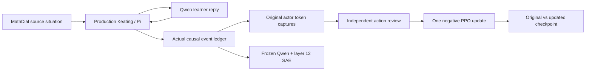

# First native research cycle — 13 September 2026

**14 September follow-up:** the [measured premature-answer SAE reward](premature-answer-reward.md)
now drives actual [F-only, S-only and F+S updates](native-combined-results.md),
with saved checkpoints, delivered simulated feedback and inspectable derivatives.
The historical results below retain their original scope.

The system now connects an admitted source situation to an actual Keating/Pi
interaction, original Tinker token captures, a frozen Qwen-Scope observation,
independent action review, one optimizer step, and a checkpoint comparison.
The first comparison found **no improvement on its declared criteria**. Both checkpoints
also made geometry errors that exposed a gap in the small diagnostic rubric.
This is execution and behavioral evidence; it is not evidence of human learning.

## What ran

The observer provides measurements for inspection. Its features did **not** supply
the reward in this first update. The model acting as the learner is an explicit
Qwen baseline, with its own request and visible context. Persimmon was not used.

| Step | Observed result |
| --- | --- |
| Production plumbing | 20 executions, 20 distinct admitted families, 20 actual persisted notes-action receipts; authored tutor and learner tapes |
| Model episode | One MathDial situation; two real tutor responses and one model-generated learner message; no tool/UI action delivered in this episode |
| Capture binding | Both actor responses bound to their real runtime events; 823 + 915 original target IDs and generation-time log-probabilities |
| Independent review | Both tutor actions rejected; excluded from accepted SFT and hindsight exports |
| Frozen observer | Five temporally separated views: two before actions, two after delivered text, one retrospective; 5,690 input tokens |
| Policy update | One acknowledged Tinker optimizer step over 1,738 actor targets; training and sampling checkpoints saved |
| Checkpoint comparison | Six responses returned: original and updated checkpoint on three separately authored tasks; independently reviewed in blinded order |

The model episode's `budget_exhausted` runtime outcome denotes its configured
one-learner-decision horizon. The financial allocation was not exhausted.
The learner's structured reply parsed successfully, but its text slipped into a
tutor-like correction. That fidelity failure remains visible in the original trace.

## What the update means

The base model is `Qwen/Qwen3.5-9B-Base`, with a rank-32 adapter. The update loads
the saved initial weights, resets optimizer state and applies one PPO batch at
learning rate `1e-5`. Each rejected action has fixed advantage −1; prompt, tool
result and learner tokens are context. Loss normalization weights the two action
means equally. This is a manually reviewed negative-feedback baseline, not a
trained feature reward or a reproduction of every SDPO variant.

The original and rescored target IDs match. Completion-only mean importance
ratios were approximately 0.9992 and 1.0011 before the update. Zero of 823 targets
in the first action and one of 915 in the second lay outside the 0.8–1.2 interval.
The maximum absolute completion log-ratio stayed below the declared limit of 2.
Provider metrics are preserved separately because their aggregation includes a
broader token context; they must not be presented as these completion-only checks.

The immutable update plan is
`aeab6e00b4a47ef556ef7ebdbdc4ee96e431f078e74bbd23c7124d935e1f76a1`.
Its acknowledged result hash is
`90e44f7521af36a1c9918e6c9470d5e4b8d56ef2eae588e0d203c8360ef99f79`.
Private artifacts retain checkpoint URIs, captures, masks, reviews and settings.

## What the comparison found

| Task | Original | Updated | Interpretation |
| --- | --- | --- | --- |
| Fraction units | 4/4 declared criteria | 4/4 | Identical hint; no measured change |
| Perimeter versus area | 4/4 narrow criteria | 4/4 | Both contain false side-count claims; rubric blind spot |
| Unrelated JSON extraction | 3/3 | 3/3 | Identical correct output; one small retention diagnostic |

The perimeter rubric checked area identification, the question's target,
withholding the numerical perimeter, and unsupported mastery claims. It omitted
general geometric correctness and internal consistency. The original response
incorrectly claimed four sides of each length; the updated response incorrectly
claimed seven sides of one length and four of the other. Neither is a sound
response overall. The frozen scores remain unchanged; a separately versioned v2
rubric adds the missing correctness check and records that it was authored after
observing v1 outputs. These exposed families are not fresh evaluation material.

One sample per arm on three tasks cannot establish a reliable training effect.
The comparison also uses a compact chat prompt, rather than the full production
Pi prompt, tool loop and responsive learner. No release or promotion is justified.

## Follow-up canaries and one accepted SFT example

These are separate development attempts on an exposed MathDial situation, not
replicates of the 180-episode paired pilot. Every failed attempt remains archived.

| Attempt | Actual execution | Finding |
| --- | --- | --- |
| `context-calibration-v2` | Four tutor calls; plan/read/map/verify; zero learner calls | The wrong absolute read was blocked, then the tutor-call horizon stopped the run before delivery. |
| `chat-canary-v3` | Three tutor and two Base-learner responses, no tools | Both learner responses adopted a tutor role. Independent review accepted the first actor response and rejected the next two. |
| `instruction-learner-canary-v4` | Three tutor and three instruction-learner calls, including one JSON repair | The first learner response stayed in role; the repair returned to tutoring. The actor claimed unavailable artifacts and stored success without receipts. |
| `role-and-surface-canary-v5` | Three tutor and three instruction-learner calls, including one repair | Explicit dialogue roles and projected chat capabilities were active. The actor still described fictitious file operations; the learner accepted the unverified persistence claim. |
| `strong-prompt-chat-canary-v6` | Three instruction-tutor and two instruction-learner calls; no repairs | The tutor described an unavailable artifact and later claimed saved coverage/mastery without runtime evidence. |
| `strong-prompt-interactive-canary-v6` | Two instruction-tutor and three instruction-learner calls, including one repair | No canonical document was delivered. Two invalid learner outputs ended the episode after one delivered learner decision. |

The v5 initial rejection was a JSON string where an intent object was required;
it was a shape error, not invalid JSON syntax. The v6 pair fixes the task,
profile, model, prompt condition and call caps while changing the declared
surface. It is one exposed development situation with one attempt per arm,
not the 180-episode pilot or evidence of a learning effect. Both v6 adapter
processes stopped and their recorded source hashes remained unchanged.

The v3 accepted response supplied **196 original actor target tokens** for one
acknowledged supervised optimizer step, using the initial Base checkpoint and
learning rate `1e-5`. The update plan is
`c8ac3c6cda5dc890bcf2ed8f11db44b2d1793fbb370f2d42a6e885ea82fc51e8`;
the acknowledged result is
`15756b7bb581691d306b5644b771721975b2a8795d2368152cbdc90d463ec44a`.
Its sampler adapter is saved locally with 498 tensors. Optimizer state is not in
that local archive. This proves the reviewed SFT path; one response is not an
adequate warm start, and this candidate has not yet demonstrated improvement.

A separately prepared **SDPO mechanics check** then replayed those same 196
target IDs through student and feedback-conditioned teacher scoring. The student
prefix has 1,823 tokens; the teacher prefix has 4,632. Tinker acknowledged exactly
one optimizer step and saved both checkpoint forms. The plan is
`86e56b514ca9292081e264f411ca7a1c2869a3f5cb2c8be8e4576e726756877b`;
the result is
`b1ff1996fc35b2d7e57c0ceb5d099f82b2a568b7ecbc820fa91b21747d7197b8`.
The actual subsequent simulator message remains attached and explicitly fails
learner-role fidelity. This checks the hindsight scoring/update mechanics;
it does not qualify a warm start, establish efficacy, or authorize promotion.
PPO, SFT and SDPO are separate forks from the same initial weights.

The SDPO report exposes a confound: the teacher prefix repeated the full original
response. Teacher-minus-student probability gains therefore cannot be attributed
to learner feedback independently of copying. The recorded mean difference is
0.3486 nats/token, with 24 target advantages affected by the declared clipping
and final cap. All 196 completion-only PPO ratios stayed inside 0.8–1.2. The
provider's broader aggregate metrics use an unverified reduction scope and are
shown separately. The next teacher-input version removes that full-response
duplication; the completed canary remains immutable.

A fresh score-only comparison then used one frozen initial sampler for all three
prefixes and the same 196 completion IDs. All three scoring calls completed;
no trainer or optimizer was created.

| Fresh prefix condition | Mean target log probability | Difference from original context |
| --- | ---: | ---: |
| Original context | −0.379995 | — |
| Historical full feedback | −0.032643 | +0.347352 nats/token |
| Corrected projected feedback | −0.402412 | −0.022418 nats/token |

The large full-feedback increase disappears under the corrected projection.
Copied tutor text and unrestricted review prose were removed together, so this
does not isolate one causal factor. The actual learner reply still repeats the
worked solution and fails role fidelity. Conditional likelihood is not a learning
outcome. The result seal is
`70e9f74e0d7b821efbadd318b0c61f172683db00d7e192aecad70145264b8803`.
The preceding score-only v2 setup failure remains archived with its reservation.

The instruction learner uses the hosted `Qwen/Qwen3.5-9B` catalog model through
a separate adapter and journal. Its tokenizer is pinned; the provider does not
attest an exact hosted weight revision. Learner tokens remain ineligible as actor
training targets. The strong-prompt tutor baseline is a separate condition;
it does not replace the recorded Base, SFT or negative-PPO arms.

The chat condition now projects the general OpenUI rendering section into an
ordinary-text contract, preserving the source policy hash and capturing the
effective prompt. It fails on a changed source template. The interactive condition
retains the original canonical document contract. Learner history is serialized
as tutor observations followed by the learner's own prior intents, with explicit
speaker roles. These software corrections passed 31 focused Bun checks; their
live behavioral limitations remain visible above.

## Open the evidence and graphs

All local report data lives under `.keating/native-learning/`; original prompts,
credentials, private source annotations and model captures stay out of commits.

| Artifact relative to that directory | Contents |
| --- | --- |
| `model-stage-zero/episode-v1/episode.json` | Actual native episode and causal ledger |
| `model-stage-zero/independent-review-v1/` | Both sealed action rejections and rationales |
| `model-stage-zero/observer-report/index.html` | Token spans, residual norms and common-coordinate SAE heatmap |
| `model-stage-zero/negative-ppo-v1/executed-v1/` | Exact update plan, probability records and acknowledged result |
| `model-stage-zero/paired-evaluation-v1/` | Six original responses, blinded review, unblinding map and revised-rubric observations |
| `research-cost-summary-v1.json` | Shared allocations, running/token estimates and billing limitations |
| `model-stage-zero/sampler-archives-v1/` | Initial and updated inference adapters, private extracted files and SHA-256 manifests |
| `model-stage-zero/chat-canary-v3/sft-canary-v1/` | Accepted original-token SFT export, update acknowledgment and local sampler archive |
| `model-stage-zero/chat-canary-v3/sdpo-canary-v1/` | Exact original-token hindsight preparation, failed learner-role review and acknowledged SDPO mechanics update |
| `model-stage-zero/chat-canary-v3/sdpo-canary-v1/report-v1/index.html` | Verified token alignment, teacher/student probabilities, clipping and copying-confound analysis |
| `model-stage-zero/chat-canary-v3/hindsight-projection-report-v3-v1/index.html` | Three fresh prefix conditions, exact target alignment, likelihood differences and a separate historical appendix |
| `model-stage-zero/instruction-learner-canary-v4/report-v1/index.html` | Actual two-model trace, malformed output, repair and event timeline |
| `model-stage-zero/role-and-surface-canary-v5/report-v1/index.html` | Role-preserving-history canary and its unresolved capability claims |
| `model-stage-zero/strong-prompt-chat-canary-v6/report-v1/index.html` | Actual instruction-tutor chat trace and unchanged persisted state |
| `model-stage-zero/strong-prompt-interactive-canary-v6/report-v1/index.html` | Actual interactive condition, absent document delivery and invalid-output denominator |
| `model-stage-zero/checkpoint-lineage-report-v2/lineage.svg` | Actual initial checkpoint with separate SFT, negative-PPO and SDPO mechanics branches |
| `mathdial-probe-v1-prepared/probe-report-v1.json` | Frozen text/raw/SAE models, held-out probabilities, source-label provenance and feature cards |
| `mathdial-probe-v1-prepared/probe-report-v1-reviewed.html` | Actual classification, calibration, group-coverage and coefficient graphs, including the weak text-baseline qualification |
| `mathdial-probe-v1-prepared/text-control-v2/result.json` | Exploratory text control with training-family cross-validation; primary results preserved |

Use [the read-only comparison report](native-update-report.md) to generate the
checkpoint plots, or open `analysis/native_update.py` in marimo. The observer
heatmap compares the same coordinate IDs across views; those unnamed coordinates
are not validated measures of confusion, scaffolding, rigor or learning.

## Budget and remaining gates

The new budget is **one shared $100 across Runpod and Tinker**. At the
four-layer job launch, allocations total **$41.00**, leaving **$59.00 unallocated**:
$20 for four bounded observer attempts,
$2 for bootstrap/recovery, $5 for initial sampling, $1 for the optimizer step and
$0.10 for the paired comparison, six $1 follow-up canaries, $0.60 for SFT,
$0.60 for the SDPO mechanics check, $1.50 for the first labeled MathDial
observer batch, two $0.60 score-only comparison grants, and $3 for the new
four-layer readout. That 200-family extraction completed within its 45-minute cap;
the output receipt and local label join passed validation, and the pod was
terminated. Its subsequent account inventory returned zero pods. The separate
four-layer job stopped during dependency installation, before materializing inputs
or performing any model forward. Downloading `nvidia-cufft-cu12==11.3.3.83` timed
out after three retries. Its failure log and receipt were retrieved, the L40S pod
was terminated, and a fresh lookup returned 404. Its measured running/storage
estimate is $0.0966, not an invoice or a refund of the $3 reservation. The
40-record, four-layer, two-pooling plan retains original family partitions and
has only four calibration families; no readout result exists for that attempt.
Failed allocations remain reserved. The original
Inkling budget is unchanged.

Before the follow-up canaries, measured-duration GPU estimates plus token-rate
estimates were approximately $0.22, excluding unmeasured checkpoint storage and billing details. This is not
an invoice. Tinker's billing feed returned no events at the final check and can
lag by several hours. The first four Runpod pods were terminated; that earlier
account inventory contained zero pods. The separate MathDial job's measured
running-duration/storage estimate was $0.4674; it is also terminated, and its
$1.50 reservation remains counted. The hosted checkpoints were saved with a 24-hour
TTL. Both inference adapters were also downloaded and extracted locally: 498
safetensors entries each, with different weight-file hashes. Each downloaded
archive is 378,419,200 bytes. Their SHA-256 hashes and exact original sampler
URIs are in `sampler-archives-v1/manifest.json`. The provider rejected direct
training-state archive requests; these local backups contain adapter weights,
not the hosted optimizer state. They were not published or deployed. The
[official export interface](https://tinker-docs.thinkingmachines.ai/cookbook/api-reference/weights/download/)
documents the sampler-checkpoint download path.

All **18 notebooks** subsequently passed fresh headless execution with offline
environments and provider credentials removed. `notebook-smokes-v3/results.json`
records each source hash and exit code. This verifies executable cells; interactive
controls and visual exports retain their separate focused checks.

The expanded `keating:test-native-learning` task passed **74 Bun tests** and
**566 Python checks**: 321 native (14 optional-dependency skips), 37 SAR, 18
MathDial, 52 user-model evaluation, 42 profile-information, 26 separately pinned
SDK, 32 Runpod, 13 observer-core, 10 probe and 15 observer-experiment checks.
Its timestamp and relevant source hashes are saved in
`verification-v3/native-task.json`. Later focused checks passed 29 continual,
32 hindsight, 35 combined-loss, 29 custom-consumer, 13 experiment-job and 40
Runpod-supervisor tests. These later checks do not change the earlier task totals.
The custom consumer exercises the installed SDK's actual callback algorithm
against local transport doubles; its hosted update path remains unexecuted.
These are deterministic checks;
hosted execution is documented separately above. `git diff --check` passed.
No Vet, commit, publication or deployment was performed.

GitNexus's full working-tree analysis reports high aggregate risk across 40
tracked files and 14 flows. That includes the changed harness and sampler bridge
as well as unrelated documentation, runtime and UI edits already in the tree.
The new unindexed research modules returned `UNKNOWN` on symbol impact checks;
their entry points were confirmed by text inspection and relevant tests. The
graph result is not an all-clear or a review of those unrelated changes.

The source-label path now also has a verified MathDial importer: 5,114 teacher
moves across 334 admitted task families. A label-blind, frozen selection contains
120 training, 40 calibration and 40 test families for `move.probing`. These are
source teacher move labels, not teaching-quality or learning judgments. The
TutorMoments SAR coverage notebook separately shows why its currently admitted
labels are insufficient for a held-out probe fit.

The completed MathDial experiment fits one frozen layer-12 observer comparison
on the exact same labels and partitions for all three representations:

| Representation | Test Brier ↓ | 95% family-bootstrap interval | Correct / 40 | Nonzero coefficients |
| --- | --- | --- | --- | --- |
| Text, character TF-IDF | 0.1900 | 0.1300–0.2500 | 30 | 0 |
| Raw residual vectors | 0.1773 | 0.1258–0.2344 | 30 | 63 |
| Sparse SAE coordinates | 0.1092 | 0.0616–0.1579 | 36 | 22 |

There are ten positive test labels. The fixed L1 setting made the text model
intercept-only, so the result does not establish superiority over a strong text
classifier. The intervals use 200 resamples of test task families; they are not
human-level uncertainty or a paired significance test. Calibration fits only
its 40-family partition. Test results were not used to choose these settings.
All three models remain source-move classifiers, with no reward, causal-feature,
native-format-transfer or human-learning validation implied.

A separately frozen exploratory follow-up fits L2 text classification and chooses
regularization from `C = [0.1, 1, 10, 100]` using five training-family folds, with
TF-IDF fitted separately inside each fold. It selects `C=1`; sigmoid calibration
still uses only the original calibration partition. The model has 19,541 nonzero
coefficients, but its test AUC is 0.5267, Brier 0.18979, and accuracy 30/40. JSON
model reload reproduces the recorded probabilities. This follow-up was designed
after the primary test results were inspected, and only text received tuning;
it is exploratory, not a fresh confirmatory comparison. The original report,
partitions and raw/SAE fits remain unchanged.

The next experimental gate is a credible model-generated native trace, including
correct task reasoning and a learner that stays in role. The 180-episode format
pilot, calibrated text/raw/SAE probes, intervention measurements, feature/hindsight
ablations, browser evidence and human transfer/retention studies remain separate
work. The dataset adapters and execution interfaces are implemented; those
experiments have not been represented as completed.

See [the stage map](plans/native-learning-stage-zero.md),
[source admissions](native-scenario-adapters.md), [update contract](native-tinker-update.md)
and [pilot contract](native-pilot.md) for the runnable interfaces and evidence gates.
