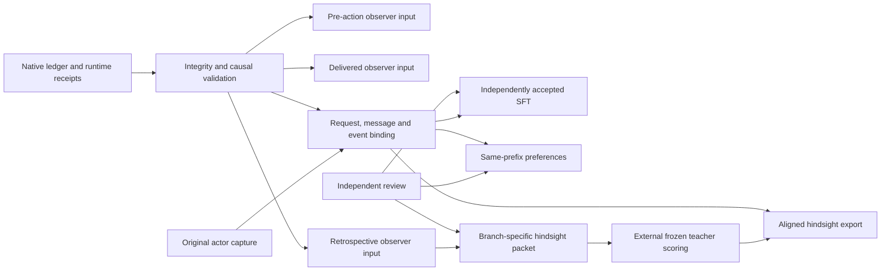

# Native training exports

`scripts/training/native_training.py` is an offline Python sidecar for the run
results emitted by `native_episode.ts`. It validates actual runtime evidence and
builds observer inputs, supervised segments, preference comparisons, and
hindsight/SDPO records. It uses the standard library and never calls a model,
tokenizes text, trains an adapter, changes the episode, or reserves pilot funds.

The current Pi ledger supplies messages and receipts, **not original actor token
IDs or behavior probabilities**. Its observer projection works immediately.
Token projections require a separate generation-time capture supplied by a
trusted recorder. Missing evidence produces explicit unavailable rows; invalid
evidence rejects the entire export.

The pinned Qwen/Tinker bridge now supplies that separate capture. The first real
MathDial native episode bound both actor responses to their actual Pi requests,
messages, delivery events and original generation arrays: 1,738 actor tokens.
Its two actions were independently rejected as demonstrations; no SFT examples
were accepted. Evidence lives under ignored `model-stage-zero/bound-v1/` and
`model-stage-zero/independent-review-v1/`, inside `.keating/native-learning/`.

## Commands

From the repository root:

```sh
rtk proxy env -u PYTHONHOME -u PYTHONPATH python3 scripts/training/native_training.py inspect --episode .keating/native-learning/authored-golden-episode.json
rtk proxy env -u PYTHONHOME -u PYTHONPATH python3 scripts/training/native_training.py export --episode episode.json --captures captures.json --reviews reviews.json --output exports.json
rtk proxy env -u PYTHONHOME -u PYTHONPATH python3 -m unittest discover -s scripts/training -p test_native_training.py
```

Repeat `--episode` for branches being compared. `--captures` and `--reviews` are
optional, including for `inspect`. `inspect --output NEW_FILE` saves the compact
summary. `export --output NEW_FILE` writes the full bundle with mode `0600`.
Validation completes before output creation; existing files are never overwritten.
The parent directory must exist. Exit 0 means structurally valid evidence, **not**
that training data is available. Exit 2 means rejection. Stdout summarizes counts
and reasons rather than dumping learner conversations.

## Evidence flow



The external scoring box is an interface requirement. This module does not
implement a replacement observer, simulator, teacher service, or trainer.

## Ledger contract and validation

Input is the **whole native run result**, not a list of arbitrary messages. The
sidecar checks:

- Episode, branch and family identity against the admission event; contiguous
  sequence numbers, event identities, parent links, nondecreasing timestamps,
  previous hashes, payload hashes and event hashes.
- Admission/initial-message/end boundaries, final outcome, unknown assessment,
  runtime source hashes, and exact equality of runtime steps with their ledger
  copies.
- Step execution following the actual initial message or learner intent; message
  prefix continuity and evidence that the submitted learner text was delivered.
- `actor_message`, `tool_call`, `tool_result`, and `state_snapshot` events in
  producer order, with content matching the completed step. File content must
  match file hashes. These details are separate events, not actor training targets
  merely because they appear between two learner turns.
- Delivered observations following completed steps, valid observation hashes,
  allowlisted document/control fields, and intents referring to the observation
  actually delivered. UI submissions require a successful matching action receipt.
- Failed steps have no fabricated delivery. Reopen/new-session snapshots do not
  become fresh actor segments. A failed later episode can still contain a usable
  earlier delivered prefix; whole-episode success and prefix eligibility differ.

The implementation resolves event IDs, step identities and emitted message
occurrences. It does not assume the first actor action is ledger event number 3,
or that a UI receipt directly follows `runtime_step`. The event number encoded
by the producer remains part of the identity/integrity check.

`native_hash()` follows the producer's insertion-ordered `JSON.stringify` hash,
including numeric-key order and decimal/exponent formatting. It does not sort all
keys. Preserve parsed key order when handling these files. Nonfinite values,
duplicate JSON keys and unsafe integer encodings are rejected. Any serialization
disagreement fails closed at the producer hash; never repair a hash to make an
import succeed. IEEE-754 formatting outside verified producer vectors may require
an additional compatibility vector before supporting a new recorder.

Hashes detect corruption and bind records to specific evidence. **They are not
digital signatures and do not authenticate the source.** A person able to rewrite
all files can rehash a fiction. Admission controls and the trusted runtime,
capture operator and independent reviewer remain the authority for their claims.

## Observer projections

`feature_inputs(validate_episode(episode))` returns one row per available boundary
of each newly delivered actor action. Each row includes `feature_hash`, family,
branch, runtime-step event reference, delivery event ID, and
`latest_allowed_event_id`/hash.

| Boundary | `input_events` | Excluded |
| --- | --- | --- |
| `pre_action` | Prior learner-visible history through the initiating learner event | Current actor action and later evidence |
| `delivered` | That history plus the actual delivered observation | Next learner response and private runtime state |
| `retrospective` | Delivered view plus the next learner message/UI intent and successful delivery evidence | Subsequent tutor response and unrelated later events |

For retrospective input, the latest allowed event is the next completed runtime
step or accepted UI receipt that proves delivery of the learner response. Only a
small receipt projection crosses that boundary. The next tutor's text, even when
present in the same runtime step, is excluded. A stop or reopen is retained in
history but is not treated as a delivered learner answer for hindsight. A missing
or failed delivery leaves the retrospective projection unavailable.

Runtime `messages`, raw UI documents with answer keys, tool internals, state files,
scenario private review material, and gold labels never enter `input_events`.
The delivered projection consumes the runtime's allowlisted semantic observation;
it does not reimplement the UI renderer or prove browser rendering. File/event
hashes remain provenance outside the model input. Every retrospective `outcome`
is `null` with `outcome_status: "unknown"` under the current assessment contract.

## Original actor capture schema

`captures.json` is `{ "schema_version": 1, "captures": [...],
"teacher_captures": [...] }`. The teacher array is optional and is deliberately
separate, avoiding circular hashes between capture, review, feedback and teacher.
Each actor record has these fields:

| Fields | Required meaning |
| --- | --- |
| `schema_version`, `capture_id`, `capture_hash` | Version 1, unique recorder ID, hash of the entire record excluding `capture_hash` |
| `episode_id`, `branch_id`, `family`, `event_id`, `event_hash`, `payload_hash` | Exact runtime-step reference returned by `Episode.ref(step)` |
| `delivery_event_hash`, `runtime_hash` | Hash of the completed delivery event and hash of the complete runtime result |
| `message_index`, `message_hash` | Position in that step's full messages array and exact assistant-message hash; index must be within newly generated messages |
| `actor_event_id`, `actor_event_hash` | Corresponding emitted `actor_message`, including its actual occurrence within the step |
| `request_index`, `request_hash`, `context_hash` | Index in `runtime.requests`, hash of that whole request, and hash of its `data.context` |
| `actor` | `{provider, id, revision}` identifying the policy checkpoint/adapter; ID and provider must match request and message |
| `tokenizer` | `{id, revision, chat_template_hash}` for the exact actor tokenization |
| `source` | `{kind, recorded_at_generation, recorder_revision, request_id, response_id, captured_at}`; `kind` is `provider_capture` or `authored_fixture`; boolean must be true |
| `prompt_token_ids`, `completion_token_ids` | Nonempty original integer arrays from the recorder, never reconstructed from text |
| `completion_token_roles` | One `assistant_text` or `assistant_tool_call` label for every completion ID |
| `sampler` | `{distribution: "actual_sampler", all_generation_transforms_recorded: true, settings: {...}}` |
| `behavior_logprobs` | Optional/null, or finite nonpositive values aligned exactly to completion IDs, under the actual generation distribution |
| `loss_mask` | Optional check vector; if supplied, must equal the derived causal mask |

Sampler settings must include positive `temperature` and `top_p` in `(0,1]`.
The recorder must retain all other transformations (top-k, steering, constrained
decoding, truncation, etc.) in `settings`. Raw base-model log-probabilities are not
accepted as actual-sampler probabilities by relabeling their provenance.
Greedy generation is outside this probability contract.

The recorded request's `context.messages` must equal the runtime messages before
this assistant segment. Thus a request from another step or a prefix containing
future messages cannot bind successfully. Exact context includes the system
prompt and available tools. Prefixes transformed by a provider wrapper require a
recorder at the actual wrapper boundary and a future explicit schema revision;
the sidecar does not silently normalize mismatches away.

Capture provenance and per-token roles are recorder attestations. Matching text
hashes cannot prove which tokenizer emitted an integer or establish true sampling
probabilities. The recorder must actually possess that information. Source
changes during execution reject token export even if the episode retains a
valid diagnostic prefix.

## Independent review schema

`reviews.json` is `{ "schema_version": 1, "reviews": [...] }`.
Every review requires `schema_version: 1`, unique `review_id`, `review_hash`,
`independent: true`, `reviewer`, `reviewed_at`, and `rubric_revision`.

`reviewer` is `{kind: "human", id: ...}`, or an `independent_model` with an
additional `model: {provider, id, revision}`, or `authored_fixture` for plumbing
tests. A model reviewer cannot be the captured actor or the episode's learner
model. This is an identity check; actual independence of the review process is
an operational responsibility, not something the hash establishes.

**Segment review:** `kind: "segment"`, `capture_hash`, the six event-reference
fields from `Episode.ref(step)`, `accepted` (boolean), `boundary` (`delivered` or
`retrospective`), `evidence_hash` equal to that feature's `feature_hash`, and
`latest_allowed_event_id` equal to that feature's boundary. Optional `feedback`
contains independently reviewed annotations, stored separately from observer
inputs. Exactly one decision per capture is supported; unresolved reviewer
disagreement must be adjudicated externally, not settled by list order.

**Preference review:** `kind: "preference"`, `chosen_capture_hash`,
`rejected_capture_hash`, `boundary`, and `evidence_hash` equal to
`native_hash({"chosen": chosen_feature_hash, "rejected": rejected_feature_hash})`.
Optional `feedback` explains the independent ordering. Pair members must have
the same source/family, different branches, identical original prompt IDs,
tokenizer, actor checkpoint, runtime sources and full request-context hash.
Identical completions are rejected. There is no text-based approximation of
“same prefix”, and no preference is inferred from a favorable simulated reply.

## SFT and hindsight records

`policy_segments` separately retains independently reviewed original captures
with an explicit `review_decision: "accepted" | "rejected"`. A rejected action
can inform a negative PPO update without becoming a supervised demonstration.
The consumer must validate the matching sealed independent review and permits
rejected actions only with nonpositive advantages, including at least one
negative value. Missing reviews produce no policy segment. Authored fixtures
remain `fixture_only`; original-token and runtime-binding checks still apply.
This path supports manually reviewed behavioral feedback. It does not claim a
trained SAE reward or a measured learner outcome.

Independently accepted actor captures produce SFT segments. The sidecar performs
only a causal shift of the supplied IDs:

```text
prompt IDs:       [p0, p1, p2]
completion IDs:   [c0, c1]
input_tokens:    [p0, p1, p2, c0]
target_tokens:   [p1, p2, c0, c1]
loss_mask:       [ 0,  0,  1,  1]
```

Learner/tool-result tokens belong in the captured context. They cannot be
completion targets. Actor-authored tool-call tokens are allowed only when that
message actually contains a tool call. Missing behavior probabilities do not
prevent original-token SFT; they do prevent hindsight/SDPO export.

Hindsight additionally requires a retrospective independent acceptance and a
matching teacher record. Build `feedback_packet(feature, review)` from the
validated retrospective feature. Send it to an external frozen teacher **before
replaying the original completion**, while the student keeps its original
prefix. The teacher record fields are:

```text
schema_version: 1
capture_hash, teacher_hash
model: {provider, id, revision}
tokenizer: {id, revision, chat_template_hash}
prompt_token_ids, completion_token_ids, completion_logprobs
feedback_hash, original_request_hash
conditioning: "original_context_then_feedback_then_original_completion"
frozen: true
request_id, response_id, recorder_revision, captured_at
recorded_at_scoring: true
scoring_request_hash
```

The teacher tokenizer must match the actor tokenizer and model identity, while
the frozen checkpoint revision is recorded separately. Completion IDs must match
exactly. Teacher and student prefix lengths can differ; each receives its own
mask. `scoring_request_hash` must equal the hash of
`teacher_request(capture, packet, teacher_model, actual_teacher_prompt_ids)`.
This is the project scoring envelope, not a claim about any vendor's wire API.
The external recorder attests that these IDs and this conditioning were actually
used. Teacher probabilities are externally observed scores, never computed by
this sidecar. The current student is scored by the downstream trainer.

Hindsight output retains exact behavior probabilities, teacher scores, packet
hash, review hash and event references. It declares `per_action_masked_mean`
normalization. It does not compute rewards, optimize a loss, or claim that token
importance ratios correct state-distribution mismatch. Unknown assessments stay
null even if a learner says they understand.

## Notebook API and status

```python
from native_training import build_exports, inspect_exports, load_json

bundle = build_exports(
    [load_json("episode.json")],
    captures=load_json("captures.json"),  # or None
    reviews=load_json("reviews.json"),    # or None
)
summary = inspect_exports(bundle)
# pandas.DataFrame(bundle["availability"]): missing-evidence breakdown
# pandas.DataFrame(bundle["observer_inputs"]): boundary/event audit
```

The bundle contains `episodes`, `observer_inputs`, `sft`, `preferences`,
`hindsight`, `availability`, and `export_hash`. `availability` records include
event/branch/family references and stable reasons such as
`missing_original_actor_capture`, `missing_independent_acceptance`,
`missing_behavior_logprobs`, `missing_retrospective_review`, or
`missing_teacher_capture`. Invalid supplied evidence raises `ExportError`;
it is never silently converted to “missing”.

Successful model-backed token projections have `status: "available"` and
`training_eligible: true`. This means the export's evidence requirements are met;
it does **not** grant source permissions, admit protected families, or authorize
training/spend/promotion. Those gates remain upstream/downstream responsibilities.
Authored tape/capture/review fixtures always produce `status: "fixture_only"`
and `training_eligible: false`, including when all token arrays are supplied.

## Verification scope

The authored fixture tests cover chain tampering, rehashed actor/tool/state
forgeries, runtime disagreement, branch/family contamination, temporal boundaries,
UI delivery failures, missing evidence, causal masks, teacher alignment, and
independently ordered same-prefix pairs. Their IDs and probabilities are invented
test vectors and explicitly labeled as such.

The regenerated `.keating/native-learning/authored-golden-episode.json` has also
been inspected through the CLI: its actual Pi ledger validates, it yields six
observer inputs, and token exports are unavailable because no original actor
capture exists. This is runtime/export integration evidence, not live-model
sampling, independent pedagogical assessment, observer extraction, or training.

The 20 source-grounded episodes in
`.keating/native-learning/plumbing-stage-zero/` also validate together: 20 distinct
families, 120 observer inputs (40 per boundary), 80 missing-original-capture
statuses across SFT/hindsight and 20 notes-only steps with no new actor output.
No probabilities or original token identities have been inferred for these runs.

## Generation-time Pi/Tinker capture and remaining export gate

`benchmark_tinker_bridge.py` now journals the original rendered prompt, full SDK
sampling parameters, original completion IDs and optional provider logprobs in
`raw-captures.jsonl`, with mode `0600`. The prepared record is flushed before
sampling and the sampled record before parsing. A parser failure therefore keeps
the original sample. Parsed tool-call IDs are recorded separately, linked by the
bridge response ID. The compact usage journal still excludes conversations.
The Pi harness records complete provider context and the terminal response ID.

This is raw capture infrastructure, tested with authored sampler doubles. No
live sample has been collected through this new path. Raw records explicitly
have `training_eligible: false`: recording IDs does not establish tokenizer or
checkpoint revisions, original token roles, actual-sampler probability semantics,
or independent acceptance. In particular, `provider_logprobs` is not silently
renamed `behavior_logprobs`. Existing model aliases retain their existing renderer
selection; adding a pinned Qwen9B actor remains a separate transport configuration.

Complete the following binding before supplying captures to the export gate:

1. Join the journal's bridge response ID to the matching Pi `provider_response`
   and actual assistant `responseId`. Verify the provider-request index, exact
   payload hash and full context hash; reject missing or ambiguous occurrences.
   Never join by timing or text similarity.
2. Immediately before the sample call, persist the actual rendered
   `ModelInput.to_ints()`, exact checkpoint/model, renderer/tokenizer revisions,
   template hash, complete `SamplingParams`, and request ID. Pin every
   generation-time configuration value. This is where original prompt IDs exist.
3. Before parsing or stripping a response, retain `sequence.tokens`, aligned
   `sequence.logprobs`, stop reason and response ID. Preserve tool-call serialization
   and any reasoning/special tokens. Start with temperature 1, top-p 1, top-k -1,
   and no steering; verify the provider's probability semantics before claiming
   actual-sampler likelihoods. Tinker's API exposes the sequence and sampling
   fields; missing probabilities must still be rejected. See the official
   [SamplingClient](https://tinker-docs.thinkingmachines.ai/tinker/api-reference/samplingclient/),
   [SampledSequence](https://tinker-docs.thinkingmachines.ai/tinker/api-reference/types/sampledsequence/),
   and [SamplingParams](https://tinker-docs.thinkingmachines.ai/tinker/api-reference/types/samplingparams/)
   contracts.
4. The parser must provide original-token span ownership for the Pi assistant
   message, including actor-authored tool-call spans. It must not retokenize
   decoded strings to invent these offsets. Tokens that cannot be assigned to the
   supported actor role schema leave the segment unavailable. Raw requests and
   sample records remain untouched; the capture binding is a separate artifact.
5. After the runtime emits `actor_message` and the successful delivered observation,
   resolve the correlation ID to the actual step/message occurrence. Seal the
   externally provided capture with runtime, step, actor-event, delivery and
   message hashes required above. Reject ambiguous matches, retries without a
   unique response ID, or a parsed message without the matching sample record.

An independent future `native_tinker.py` consumer can read the resulting verified
exports with deferred Tinker imports. Its planning interface should require
explicit model/checkpoint, tokenizer revision, input/output/training rates, price
source/date, operation cap and a separate model-aware reservation ledger. It must
reject fixture-only records, unavailable captures, and model/tokenizer mismatches.
The old `PilotBudget` is Inkling-specific; its rates and approximately remaining
balance are not a Qwen9B budget or an automatic spending authorization.

For scoring, construct `ModelInput` from the captured prefix plus original
completion IDs and slice completion scores after the actual prefix length.
Build the teacher input with privileged feedback before that same completion,
then return a separately sealed teacher record. For updates, pass the verified
causal masks, original behavior probabilities and independently supplied
advantages into the chosen Tinker loss. Rebuilding the actor prompt from rendered
text or rescoring an old response does not recover its generation distribution.
Planning, capture validation and budget estimation can run without contacting
Tinker; dispatch requires a separately authorized bounded operation. No live
sampling, scoring or update was performed by this sidecar work.
