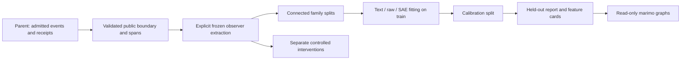

# Independent observer and probe pipeline

This implements the observer portion of the revision 2 Keating × Voxq research
plan. It reads an explicit event projection, captures a frozen residual block,
encodes sparse coordinates, and fits text/raw/SAE baselines with independent
calibration and test groups. Runtime execution, receipt authentication, source
admission, learner simulation, policy training and release gates belong to the
parent pipeline. None is implied by a probe score.

## Execution graph and ownership



| Node | Owned output | Gate |
|---|---|---|
| Foundation | `observer_core.py` | Tensor/tuple preservation, hook cleanup, signed Top-K, temporal/span checks |
| Extraction | `observer_extract.py` | Explicit pinned model/SAE; bytes, tokenizer, layer and dtype provenance |
| Probes | `observer_probes.py` | Family disjointness; train-only preprocessing; separate calibration; masked unknown labels |
| Verification | `test_observer_core.py`, `test_observer_probes.py` | CPU mechanics, leakage resistance, reproducible exported probabilities |
| Review | `analysis/observer_features.py` | Read-only graphs; authored demonstration distinguished from model evidence |

Only these files and this document are owned by this work unit. No shared
training environment, runtime code, provider configuration or event ledger is
changed. No models download when importing a module or opening the notebook.

## Exact observer convention

The [Qwen-Scope model card](https://huggingface.co/Qwen/SAE-Res-Qwen3.5-9B-Base-W64K-L0_50)
specifies the Qwen3.5-9B-Base residual dictionary: hidden width 4,096, dictionary
width 65,536, K=50, layers 0–31. Its published inference computes
`h @ W_enc.T + b_enc` and retains the largest K **signed values**. No ReLU or
decoder-bias subtraction is applied. Checkpoint tensors must be exactly
`W_enc[65536,4096]`, `W_dec[4096,65536]`, `b_enc[65536]`, `b_dec[4096]`.
This convention was checked against the publisher on 13 September 2026.

The extraction CLI admits only that model/dictionary pair. Toy dimensions are
available through Python primitives solely for tests. Each run requires full
Hub commit SHAs, an explicit layer and post-block module, and the selected SAE
file SHA-256. It records actual weight and tokenizer file hashes as well.
Dimension agreement alone does not establish semantic agreement; hashes and
identities are part of the measurement. The model card carries Qwen's own license
and usage conditions; a dataset license does not license these weights.

`AutoModel` captures hidden states without allocating all vocabulary logits. The
current [Transformers Qwen3.5 architecture](https://huggingface.co/docs/transformers/model_doc/qwen3_5)
includes a language backbone and a vision component. The CLI observes text only,
requires a real `Qwen3_5DecoderLayer`, and refuses an arbitrary similarly sized
module. Inspect the installed model tree; for the pinned AutoModel wrapper the
language path is `language_model.layers.N`. Do not silently translate layers
between different checkpoints or wrappers.

## Parent-to-observer input contract

The independent extraction input is a JSON object with `records`. This is a
**projection adapter contract**, not a replacement for the parent's event ledger.
The parent must establish that text was delivered, receipt IDs are genuine,
source families are admitted, and label provenance is accurate before export.

```json
{
  "records": [{
    "record_id": "episode-1-delivered",
    "family_id": "source-conversation-1",
    "group_ids": ["person:pseudonymous-1", "template:fractions-1"],
    "source": "source-derived-simulation",
    "boundary": "delivered",
    "latest_allowed_event_id": "delivery-1",
    "events": [
      {"event_id": "learner-0", "phase": "pre_action", "visibility": "public",
       "kind": "learner_message", "text": "Please give a hint."},
      {"event_id": "actor-1", "phase": "delivered", "visibility": "public",
       "kind": "actor_message", "text": "Compare the units."},
      {"event_id": "delivery-1", "phase": "delivered", "visibility": "public",
       "kind": "delivered_artifact", "text": "Are these parts equal?", "receipt_id": "real-receipt-1"}
    ],
    "spans": [{"event_id": "actor-1", "start": 0, "end": 18},
              {"event_id": "delivery-1", "start": 0, "end": 22}],
    "labels": {"premature_answer": null},
    "label_provenance": {}
  }]
}
```

All numbers/identifiers in this example are authored schema illustrations. The
parent supplies actual receipts; do not insert the example receipt to satisfy a
check. `start` and `end` are half-open Unicode character offsets into the event's
text. No bytes-to-character or actor-to-observer token-index assumptions are made.

Phases must be nondecreasing within one action's projection:

* `pre_action`: approved history before the target actor action.
* `delivered`: new actor text and actually delivered semantic artifacts.
* `retrospective`: subsequent learner evidence for that action.

The latest event must establish the requested public phase. Future events are
cut before serialization. Private events are excluded. Public kinds are an
allowlist: `learner_message`, `actor_message`, `delivered_artifact`. Labels and
other metadata never enter serialized text. Visual-only content is rejected.
Each artifact needs a receipt ID. Each pooling span must belong to the requested
phase, map completely to non-padding tokenizer offsets, and not cut a token.
Unmapped spans, special-token-only spans, empty inputs, duplicate IDs, inconsistent
phases, and overlong observations fail rather than approximating a measurement.

For repeated interactions the parent creates one projection per action, rephasing
earlier approved history as `pre_action`. The observer does not infer causal
relationships from raw transcript text. A correctly mapped character span is
not evidence that a probe correctly localized a pedagogical event.

## Explicit extraction

Use UV managed Python 3.13 (or 3.12) and the PEP-723 environment. CPU torch is
pinned to its CPU wheel index, avoiding CUDA dependencies. These examples leave
all writes under ignored `.keating/`; create the output directory first.

```sh
rtk proxy env -u PYTHONHOME -u PYTHONPATH UV_MANAGED_PYTHON=1 uv run --python 3.13 --script scripts/training/observer_extract.py --help
```

After creating a projection and obtaining the actual immutable revision/hash
values, run the command below. Replace every capital placeholder. First use
`--validate-only`: that checks projections without importing/loading torch or
models in the program. UV can still install the script's dependencies.

```sh
rtk proxy env -u PYTHONHOME -u PYTHONPATH UV_MANAGED_PYTHON=1 uv run --python 3.13 --script scripts/training/observer_extract.py INPUT.json OUTPUT.json --model-revision MODEL_COMMIT --tokenizer-revision TOKENIZER_COMMIT --sae-revision SAE_COMMIT --sae-sha256 LAYER_SHA256 --layer 12 --module language_model.layers.12 --validate-only
```

Remove `--validate-only` to execute on cached snapshots. Missing weights fail by
default. `--allow-download` is the explicit separate opt-in to fetch those pinned
assets; no such download is performed by this implementation work. Default CPU
float32 requires substantial RAM (roughly 36 GB model weights plus buffers/SAE).
Use `--dtype bfloat16` only on compatible hardware and record it as a different
measurement. The PEP environment intentionally contains CPU torch; a GPU run
needs a separately managed matching GPU environment. It never revives the old
shared training venv. Set a realistic `--max-tokens`; there is no truncation.

No real 9B memory profile has been collected. Published safetensors occupy
19.31 GB; one FP32 SAE downloads as 2.15 GB and its matrices use about 1.07 GB
after BF16 conversion. Runtime buffers add more. A conservative first GPU worker is one
48 GB NVIDIA device, batch size 1, `--max-tokens 1024`, one SAE, 64 GB host RAM,
and 80 GB free disk. This is a planning configuration, not a measured minimum or
a provisioning request. Credentials, Runpod provisioning and Tinker remain out
of scope; the observer does not spend from the Inkling budget.

### Pinned candidate for the parent's cost-bounded worker

Public Hub metadata was read on 13 September 2026 (no weights downloaded):

| Item | Immutable value |
|---|---|
| Model and tokenizer revision | `68c46c4b3498877f3ef123c856ecfde50c39f404` |
| SAE revision | `7bb2370d360e566b2d8acb8b3d15a0b2b88f52a8` |
| Layer | `12` |
| AutoModel module | `language_model.layers.12` |
| `layer12.sae.pt` SHA-256 | `2cea61ef74a4d33d59329f7e3d1ddfb4a8cdf3c24acdbc05fc26209679a262d8` |
| Model safetensors download | `19306310872` bytes |
| Selected SAE download | `2147764603` bytes |

Metadata sources: [model revision](https://huggingface.co/Qwen/Qwen3.5-9B-Base/tree/68c46c4b3498877f3ef123c856ecfde50c39f404)
and [dictionary revision](https://huggingface.co/Qwen/SAE-Res-Qwen3.5-9B-Base-W64K-L0_50/tree/7bb2370d360e566b2d8acb8b3d15a0b2b88f52a8).
The CLI checks the actual layer bytes against this hash when execution is requested.

On the parent's separately approved CUDA 12.8-compatible worker, use `python
scripts/...` through UV (not `uv --script`) to select CUDA torch instead of the
file's CPU PEP-723 dependency. This command is documentation only; no worker was
rented or launched by this stage:

```sh
rtk proxy env -u PYTHONHOME -u PYTHONPATH UV_MANAGED_PYTHON=1 uv run --no-project --python 3.13 --with 'torch==2.8.0+cu128' --with 'transformers==5.3.0' --with 'numpy==2.2.6' --index https://download.pytorch.org/whl/cu128 --index-strategy unsafe-best-match python scripts/training/observer_extract.py INPUT.json OUTPUT.json --model-revision 68c46c4b3498877f3ef123c856ecfde50c39f404 --tokenizer-revision 68c46c4b3498877f3ef123c856ecfde50c39f404 --sae-revision 7bb2370d360e566b2d8acb8b3d15a0b2b88f52a8 --sae-sha256 2cea61ef74a4d33d59329f7e3d1ddfb4a8cdf3c24acdbc05fc26209679a262d8 --layer 12 --module language_model.layers.12 --device cuda --dtype bfloat16 --max-tokens 1024 --allow-download
```

First append `--validate-only` to check the parent's projection. If system CA
discovery fails, use the environment's trusted `certifi.where()` bundle for both
`SSL_CERT_FILE` and `REQUESTS_CA_BUNDLE`, as established by the parent. Do not
disable certificate verification. Verify CUDA driver compatibility and available
RAM/disk on that worker before loading weights. Installed CPU tests establish
neither the GPU wheel/driver combination nor its memory/latency profile.

The output is a new JSON file, refusing overwrite. It contains exact serialized
text, token IDs, text/template hashes, selected offsets, sparse values and indices
per token, mean pooled raw and sparse features, source/family IDs, copied private
labels, and a complete observer manifest. This artifact is an evaluator dataset
and must not be fed back wholesale to a learner/actor. Model revisions, SAE hash,
config and weight hashes, tokenizer files, stored tokenizer chat-template hash,
module/layer, dtype, package versions and pooling rule are recorded. The observer
uses its named plain event serialization, not a hidden chat template.

## Probe fitting and inference

```sh
rtk proxy env -u PYTHONHOME -u PYTHONPATH UV_MANAGED_PYTHON=1 uv run --python 3.13 --script scripts/training/observer_probes.py OUTPUT.json PROBES.json --target premature_answer --boundary delivered --definition 'Final answer delivered despite the learner requesting a hint, before sufficient independent work.'
```

Each known binary label requires `label_provenance[target]`. Missing/null labels
are masked out, never converted to negative examples. This first fitter accepts
binary labels; it rejects soft labels rather than silently changing objectives.
Fit need, action and result targets separately at their permitted boundaries.

Family IDs plus `group_ids` form connected components. All aliases shared by a
person, conversation, source problem or template must be declared by the parent.
Default membership is a deterministic seeded group hash ordering (60/20/20).
You can instead put `split: train|calibration|test` on **every extraction row** to
use preregistered membership. Related rows spanning declared splits are rejected.
Admission/exposure registry enforcement stays upstream; the fitter cannot detect
unrecorded identity overlap or previously exposed holdouts from prose.

Text TF-IDF, raw standardization and sparse MaxAbs scaling fit only the known
training rows. Three L1 logistic probes use fixed C=1. A separate sigmoid
calibrator fits only calibration scores/labels; threshold is fixed at 0.5. Train
and calibration must each contain both classes; failures do not trigger a
test-informed search for a better split. Test examples are never used for fitting,
threshold tuning or baseline selection. Comparing reports and selecting a model
turns that test set into development evidence; use a fresh release holdout.

Reports include held-out Brier, log loss, ROC AUC (unknown for one-class test data),
accuracy, fixed-bin ECE, reliability bins, predictions and family-bootstrap Brier
intervals. An interval is unknown with fewer than two independent test groups.
Feature cards record concept, boundary, measurement hash, module/layer, nonzero
weights, failure examples and permitted uses. JSON coefficients, preprocessing
and calibration parameters reproduce predictions via `predict_probe`; no pickle
is required. Sparse columns name coordinates, not psychological concepts.

## Interventions are a separate experiment

`intervention_directions` returns a normalized decoder column, its opposite, and
a seeded norm-matched random vector. `residual_scale` takes the median residual
norm from selected calibration tokens. `intervene` applies
`epsilon * scale * direction / norm(direction)` at an explicitly masked block
output and always cleans up. Tensor and tuple outputs retain their original
structure. Generation requires a callable mask because token lengths can change.
Do not use evaluation outcomes to pick the perturbation scale or control seed.

These helpers provide the actual intervention mechanism, not an intervention
result. The parent must run fixed prompts/sampling settings, independently assess
target behavior, fluency and correctness, and compare chosen/random/opposite/zero
conditions. Decodability is not causal evidence or a validated reward.

## Verification and graphs

```sh
rtk proxy env -u PYTHONHOME -u PYTHONPATH UV_MANAGED_PYTHON=1 uv run --python 3.13 --script scripts/training/test_observer_core.py
rtk proxy env -u PYTHONHOME -u PYTHONPATH UV_MANAGED_PYTHON=1 uv run --python 3.13 --script scripts/training/test_observer_probes.py
rtk proxy env -u PYTHONHOME -u PYTHONPATH UV_MANAGED_PYTHON=1 uv run --python 3.13 --script analysis/observer_features.py
rtk proxy env -u PYTHONHOME -u PYTHONPATH UV_MANAGED_PYTHON=1 uvx marimo==0.23.1 edit --sandbox analysis/observer_features.py
```

The notebook fits the lightweight authored demonstration in memory or reads an
existing report. Set `KEATING_OBSERVER_REPORT` to an existing probe report path
to preload it in either the editor or a static HTML export. It graphs held-out Brier/intervals, calibration, source-group
counts and coefficients; it labels the demonstration's invented vectors and
labels explicitly. Missing actual results remain unknown. It does not train the
actor, download model weights, or write reports.

CPU tests exercise capture/cleanup, exact signed Top-K, intervention masks/scales,
full extraction with a tiny authored observer, temporal leakage, grouping,
unknown labels, calibration isolation and export reproducibility. They do not
validate Qwen checkpoint weights, human labels, intervention quality, or learning.
A tiny randomly initialized instance of the actual Transformers Qwen3.5 wrapper
also checks the declared module path and CPU capture API without downloaded weights.
Actual 9B extraction, calibrated expert-label results, independently scored
steering, runtime-connected golden traces and human transfer remain unavailable
until those separate experiments are executed and reviewed.

## Inspect a completed capture without loading models

`scripts/training/observer_report.py` exports three PNGs, three SVGs, a
self-contained `index.html`, and `measurements.json`. It uses isolated PEP723
NumPy, pandas and matplotlib dependencies; importing it does not load Torch.
Select a completed job directory containing `features.local.json`,
`input.review.json`, `outputs.tar` and `state.json`. The loader checks the archive
against the manager's recorded output hash, the successful extraction receipt,
local numeric values against the archived extraction, manifest and input hashes,
every row's input hash, finite vector dimensions, sparse pooling and mapped
temporal spans. These checks establish consistency with the supplied manager
state; they are not a signed external attestation. Local labels are excluded
from the plotted measurements, and the HTML includes no transcript prose.

The figures compare input lengths and selected-token counts at each boundary,
the L2 norm of each stored **mean selected residual vector**, and signed pooled
SAE values on one shared coordinate axis. That norm is not the mean of per-token
norms. Display coordinates are selected by mean absolute pooled value across all
records, with deterministic coordinate-ID tie breaks; absent sparse coordinates
contribute zero. The coordinates are unnamed. Their values do not establish
psychological concepts, pedagogical quality, or human learning.

The first actual export was verified on 13 September 2026 from
`.keating/native-learning/observer-job-ready-v5/`. Its six views contain 713 input
tokens and 257 selected tokens across pre-action, delivered and retrospective
boundaries. The PNGs were visually inspected. The local report is
`.keating/native-learning/observer-first-report/index.html`; these generated
artifacts remain ignored. This supplies actual Qwen capture evidence beyond the
earlier toy checks above; calibrated concept labels, causal intervention effects,
and human learning outcomes remain unavailable.

The exact command used for this report was:

```sh
rtk proxy env -u PYTHONHOME -u PYTHONPATH UV_MANAGED_PYTHON=1 MPLBACKEND=Agg \
  uv run --script scripts/training/observer_report.py \
  .keating/native-learning/observer-job-ready-v5 \
  .keating/native-learning/observer-first-report --top-k 16
```

An existing output directory is deliberately refused. To export again, choose a
new output directory with an existing parent. Missing or invalid data creates no
report directory. The first export records manager plan
`c25682d2adf23dd69a8eaa18b9ca44278a74c74f1a533deb8cd7ff67009bfb92`
and preserved output archive
`63d80db0bbbc7a6f4553d9c865c71978fdb28f315ebfb8c087d31f283eb47b0d`.

`analysis/observer_capture.py` is the read-only marimo companion. Its path starts
blank and explicitly reports unavailable data until a valid completed job
directory is entered. For the first capture, enter
`.keating/native-learning/observer-job-ready-v5`. The slider changes the shared
display coordinates. The notebook writes no reports, downloads no weights and
calls no providers.

```sh
rtk proxy env -u PYTHONHOME -u PYTHONPATH UV_MANAGED_PYTHON=1 \
  uvx marimo==0.23.1 edit --sandbox analysis/observer_capture.py
rtk proxy env -u PYTHONHOME -u PYTHONPATH UV_MANAGED_PYTHON=1 MPLBACKEND=Agg \
  uv run --script analysis/observer_capture.py
rtk proxy env -u PYTHONHOME -u PYTHONPATH UV_MANAGED_PYTHON=1 MPLBACKEND=Agg \
  uv run --script scripts/training/observer_report.py --self-test
```

The seven self-tests use temporary, explicitly authored protocol/plot fixtures.
They exercise finite-value tampering against receipts, input hashes, dimensions,
temporal views, signed shared axes, unavailable inputs, and static exports.
Normal capture loading rejects authored fixtures; the notebook never supplies
one by default. Passing these tests is separate from inspecting the actual v5
measurement artifact.
