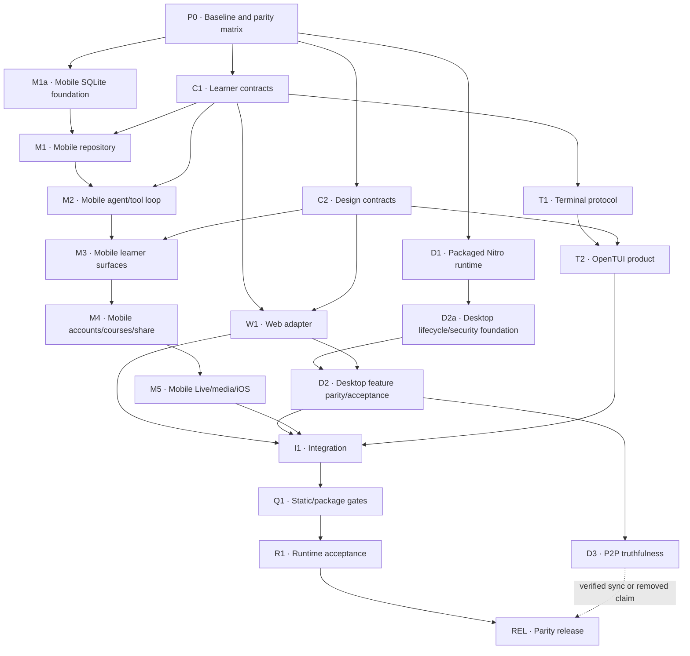

# Cross-platform parity build specification

Status: approved build target
Updated: 2026-08-10
Surfaces: web, Electron desktop, Expo mobile, OpenTUI, classic Pi shell

## Goal

Deliver the Keating learner product with feature parity and recognizable look
parity across web, desktop, mobile, and terminal surfaces. Desktop reuses the
web product literally. Mobile provides native equivalents. OpenTUI provides
terminal-native equivalents and explicit, context-preserving handoffs for
capabilities such as camera or animation playback that a terminal cannot host.

This document defines **what must exist** and **what evidence proves it**. The
companion [execution program](cross-platform-parity-execution.md) defines the
dependency graph, ownership, orchestration rules, and `/goal` progress model.
The current Wave 0 evidence and protected-work snapshot live in the
[parity baseline](cross-platform-parity-baseline.md).

The existing [`docs/EXECUTION_GRAPH.md`](../EXECUTION_GRAPH.md) remains the
authority for the deeper multimodal event, voice, search, and generative-UI
program. This parity build consumes those contracts rather than replacing that
work.

## Normative language

- **Required** means the parity goal cannot complete without current evidence.
- **Equivalent** means the learner can accomplish the same task, even when the
  platform presentation differs.
- **Handoff** means entered work and session context are preserved while the
  learner is sent to a capable surface.
- **Verified** means the relevant built, installed, rendered, authenticated, or
  runtime path was exercised. Source inspection, typecheck, or build output is
  not runtime verification.
- **Complete** means every required acceptance gate has current evidence and no
  required capability is silently missing or represented by a success-looking
  fallback.

## Product scope

### Required learner capabilities

1. Streaming chat, stopping, retrying, and recoverable provider errors.
2. Provider/model configuration with truthful capability availability.
3. Sessions, resume, rename, branches/alternatives, import/export, and sharing.
4. Questions, quizzes, grading, goals, study plans, and learner feedback.
5. Flashcard decks, spaced-repetition review, Coming Up, and learner profile.
6. Typed artifacts, search, preview, save, open, copy, delete, and export.
7. Course list/workspace/join, learner artifacts, assignments, discussion,
   reactions, and role/consent enforcement.
8. Live voice/media where native support exists, with an explicit handoff where
   it does not.
9. Consistent terminology, recovery actions, privacy boundaries, and visual
   identity.
10. Version, packaging, installation, and release truth across all surfaces.

### Excluded website content

The landing page, blog, paper, pricing, download, privacy, terms, and other
publishing/marketing routes do not need native mobile or terminal copies.
Desktop may expose them because it renders the web application.

### Web visual identity is the source of truth

Native adaptation must preserve the web product's restrained paper/terminal
identity rather than inventing a separate mobile brand. The canonical lockup,
cream K, and current mascot live under `web/public/brand/`; mobile launcher,
adaptive, splash, header, empty, and thinking states must derive from those
assets. Legacy owl artwork, a text-only `K`, and generic sparkle marks are not
acceptable primary Keating identity.

Mobile may use platform-native navigation and controls, but must project the
shared design contract into system light/dark themes, distinct semantic
selected/pressed/error states, the web-configured typography roles (JetBrains
Mono by default, with the same selectable alternatives), quiet bordered
surfaces, and at least 44 dp touch targets. Acceptance requires corresponding
web and physical-device captures of real states. Captures obscured by another
app, picture-in-picture, dev overlays, or fallback screens cannot prove look
parity.

### Mobile parity is behavior, not a collection of destinations

The mobile learner shell must expose Tutor with the Keating bot, Sessions,
Courses, Live, Library, and More/account/help destinations through a compact
native information architecture. Sessions must remain visibly reachable and
may also open from a bounded horizontal swipe on the Tutor header. Model selection belongs beside the
Keating identity in the Tutor header, matching the web conversation hierarchy.

The mobile model selector must consume and make the complete validated
models.dev provider/model catalog discoverable, while enabling selection only
when a real native transport, endpoint convention, and credential flow exist.
An unavailable catalog result must say what adapter is missing and offer Custom
or a supported router where applicable; catalog presence alone never implies
callability. It must match the web selector's learner behavior: search by model
name, ID, or provider; multi-provider and Thinking/Vision/Long-context filters;
recent choices; explicit selected state; refresh; and a saved or built-in
fallback with visible retry when refresh fails. Changing providers and models
is one atomic state transition, including the correct base URL. Reasoning tiers
and temperature availability must come from the exact selected model rather
than provider-wide guesses. Unsupported capability combinations remain visible
with a reason and corrective path; they never look like a successful selection.

Chat, duplex Live, text-to-speech, image generation, and video generation are
separate persisted selections with separate capability filters. They may share
models.dev metadata, search primitives, and provider credentials, but they must
not reuse one chat `ProviderSettings` value as if the transports were
interchangeable. "Video" must distinguish a camera/screen input model from a
video-generation model. A selector becomes required only alongside a working
transport/tool and an error-recovery path; until then the modality remains
visible as unavailable or uses a preserved-context web handoff.

Sessions must expose explicit, sibling Open, Fork, and confirmed Delete controls
with 44 dp targets rather than nested row actions. A learner can fork a whole
session or fork from an assistant response. Forks copy the transcript only
through the chosen point, assign new message identities, persist parent/fork
metadata, show their lineage in Tutor and Sessions, and can reopen the original
when it remains available. Saved artifacts stay attached to their source unless
the learner explicitly saves them again in the fork. Copied responses start
without source feedback so branch feedback cannot corrupt global totals. A
fresh untitled Tutor must not repeat `New lesson` as both an action and a page
heading; the action remains, while the redundant title stays hidden until the
lesson receives a meaningful title.

The native composer is only accepted when it provides the meaningful web
contract: attachments with removable/error states, model and capability-aware
reasoning controls, Live voice entry, multiline text, URL/grounding recovery,
and mutually exclusive Send/Stop. Drafts and attachments must survive provider
errors, backgrounding, and settings recovery.

Native usage and study activity must distinguish observed local history from
provider-reported usage and assessed learning. Session titles and artifact
topics may populate an explicitly provenance-labelled activity list, but they
must never be presented as mastery. Token and cost totals must identify missing
historical/provider data instead of estimating it. Quiz evidence, goals, spaced
repetition, retention, and learner-profile confidence require the shared
learner repository and its portable-data contract before parity can be claimed.
Usage/accounting and learning progress are separate learner surfaces: Usage
answers what happened and what providers reported, while Learn & Coming Up owns
goals, assessed topic evidence, confidence, priorities, decks, due work, and
review. Interactive Tutor goals, quizzes, and question checks must materialize
portable records before the card shows a successful mutation. A failed commit
must keep the learner's entered answers or prior step state and offer retry;
pending open-ended grading must never contribute provisional credit to mastery.

Native Live requires microphone, camera, and supported screen-sharing states;
permission denial and unsupported-model recovery; duplex provider transport;
and transcript continuity back into the same Tutor session. A browser link is
useful access but does not satisfy M5.

Mobile settings must cover every native-relevant web setting: provider/model
discovery and capability truth, direct keys, hosted account/wallet/checkout,
learner profile, reasoning, speech/Live, appearance, privacy/telemetry,
diagnostics, and portable-data controls. Browser-only settings may be omitted
only when their exclusion and native equivalent are explicit. Tutorial and
manual/support must remain reachable from the mobile shell.

The native Courses client must establish its account-scoped server session
before listing courses, keep only the scoped session credential in SecureStore,
and fail closed on malformed responses, timeouts, cancellation, expiry, and
sign-out. Joining is private by default. Teacher access is requested only after
the server returns its consent-required state, using the same disclosure as the
web before an explicit second submission. Protected materials must be fetched
with the authenticated native session and handed to a native viewer/share sheet;
an unauthenticated browser URL is not a valid material implementation. Starting
a course lesson in Tutor must atomically cancel or await an active generation,
create the new session, and send into that session.

Courses, Live, checkout, Tutorial, and manual links may ship as clearly labeled
web handoffs while their native clients are built. Handoffs improve
reachability, but never count as native feature-parity evidence for M3-M5.

### Platform-specific outcomes

| Capability | Desktop | Mobile | OpenTUI |
|---|---|---|---|
| Web learner UI | Literal reuse | Native equivalent | Terminal equivalent |
| Questions/quizzes/goals/decks | Same renderer as web | Native interactive cards | Keyboard-driven documents |
| Sessions and artifacts | Web UI with desktop storage adapter | Native repository and screens | Session/library/review views |
| Courses | Same web and Nitro paths | Authenticated native client | Learner review or explicit authenticated handoff |
| Images/maps | Same web renderer | Sanitized native image/SVG/document view | Description, provenance, source path/URL |
| Hyperframes animation | Same web player | Rendered media or restricted WebView | Storyboard plus player handoff |
| Live camera/screen | Electron permission-controlled web Live | Native Live | Preserved-context web/mobile handoff |
| Voice | Web audio with Electron permissions | Native audio | Transcript-safe voice tags; never fake playback |
| Browser sandbox/workspace | Web capability through bundled Nitro | Remote adapter when configured | Pi/local tooling or explicit handoff |
| P2P | Desktop-only enhancement | Not represented as native P2P | Not represented as shared session storage |

### Rendering and generative UI parity is a required contract

“Renders Markdown, Mermaid, and OpenUI” is not satisfied by recognizing a
fence, showing raw source, or implementing one happy-path component. The web
learner renderer is the reference dialect. A versioned cross-surface fixture
pack must exercise the following matrix and travel through the same persisted
message/artifact path used by real assistant output:

| Family | Required web-reference behavior | Mobile equivalent | OpenTUI equivalent |
|---|---|---|---|
| Markdown structure | Headings, paragraphs, line breaks, emphasis, strong, strike, nested ordered/unordered/task lists, blockquotes, rules, GFM tables, links, images, inline code, fenced code, and incomplete streaming fences | Native semantic layout with selectable/copyable text, horizontal overflow where needed, safe links/images, and no raw syntax replacing a construct the web renderer completes | Readable terminal structure, tables that reflow or scroll, source-preserving code, and explicit link/image targets |
| Teaching extensions | Spoilers, inline and display math, code-language labels, syntax highlighting, copy, streaming state, and runnable-code recovery or handoff | Equivalent reveal behavior; typeset math; highlighted/copyable code; run only through an authenticated, capability-advertised execution path, otherwise preserve code and offer a truthful handoff | Reveal state, readable math fallback plus source, highlighted/source-preserving code where terminal capability allows, and `/shell` handoff for execution |
| Citations and media | Structured citations, provenance, safe remote images, audio, video, and animation artifacts | Native citation/resource cards; consent-gated network media; native playback or a context-preserving handoff where the build explicitly permits one | Provenance plus source path/URL, transcript/description, and a context-preserving capable-surface handoff |
| Mermaid | Every Mermaid grammar and directive that the current web renderer accepts and every diagram emitted by Keating tools, including malformed and oversized inputs | Sanitized native SVG or a restricted renderer with zoom/pan, light/dark colors, accessibility description, source view, bounded work, and visible errors; source-only fallback does not count when web rendered the same fixture | Legible source/description and capable-surface handoff; never claim graphical rendering |
| OpenUI ingress | Browser OpenUI source programs and the shared JSON interchange form compile to one versioned semantic document without leaking wire source into prose | Validate or compile both supported ingress forms without evaluating model-authored JavaScript/HTML; scope the document to its session/message before persistence | Consume the shared semantic document; source programs are compiled by a trusted adapter or preserved for handoff |
| OpenUI components | Every component registered by the web Keating OpenUI library and every canonical shared node has a mapped semantic node, renderer, or explicitly approved platform handoff | Questions of every supported type, quizzes, goals, plans, decks, notes/resources, images/media, maps, learning surfaces, and handoffs remain interactive and accessible | Keyboard-driven equivalents for stateful learner actions; media/graphical nodes retain context and expose useful handoffs |
| OpenUI lifecycle | Partial streaming, completion, retry, revision, action state, and unknown-version/unknown-node recovery | Entered work survives provider failure, background, force-kill, and retry; action mutation plus receipt commits atomically and replays idempotently | Entered work persists; actions replay idempotently; unsupported nodes remain visible and recoverable |

The fixture pack must include nested combinations rather than only isolated
unit samples: Markdown before and after a diagram, multiple OpenUI documents in
one streamed turn, OpenUI nodes containing Markdown/math/code, parallel sibling
actions, malformed and truncated wire input, unsafe URLs/directives, large but
allowed documents, unknown future nodes, and light/dark rendering. Desktop
passes by exercising the packaged Nitro product against the same web fixtures;
mobile and terminal pass only on their actual runtime surfaces.

The reference fixture route is diagnostic evidence, not a substitute for the
product path. Web and desktop acceptance also require an ordinary persisted
assistant response to use the same complete Markdown renderer and OpenUI
lifecycle. Mobile acceptance includes math nested inside formatted inline
content such as emphasis, links, and media rather than accepting only isolated
math blocks. Terminal acceptance requires a production Pi tool result—not a
test-only synthetic event—to activate the canonical document, dispatch a real
keyboard action through the durable receiver, and restore its final receipt.
Graphical Mermaid is not claimed in a terminal; readable source, description,
and a preserved-context graphical handoff are the required terminal outcome.

The mobile implementation may use a restricted WebView for full Mermaid,
typeset math, or Hyperframes only when the payload is locally generated or
strictly sanitized, network/navigation are disabled by default, messages are
schema-validated, work is bounded, and failure preserves the source plus a
recovery action. Model-authored HTML or JavaScript is never executed merely to
claim parity.

## Fixed architectural decisions

### Shared contracts precede surface work

Create two dependency-free workspace packages:

- `@keating/learner-contracts`: messages, sessions, branches, artifacts, goals,
  quizzes, decks, reviews, UI documents/actions/results, capability manifests,
  portable import/export, merge rules, and streaming/tool events.
- `@keating/design-contract`: semantic light/dark colors, typography roles,
  spacing, radii, focus/state colors, motion timings, density, and terminal color
  degradation.

Neither package may depend on Node, DOM, React, React Native, OpenTUI, Electron,
or a provider SDK. Surface adapters depend on these packages, never the reverse.

### Desktop runs the real Nitro product

The packaged Electron application must start the built Nitro application on
`127.0.0.1` using an ephemeral port, wait for readiness, and load that HTTP
origin. `file://` and a static custom protocol are not acceptable primary
origins because Keating depends on same-origin APIs, cookies, WebSockets, OAuth,
courses, sharing, provider proxying, and runtime configuration.

Electron main owns Nitro lifecycle, P2P, native permissions, deep links,
external navigation, OS secret storage, and the validated preload boundary.
Mutable state lives beneath `app.getPath("userData")`, never inside resources or
ASAR.

### Mobile remains native

Mobile must not import the browser agent, IndexedDB, DOM renderers, NodePod, the
Pi runtime, or desktop P2P code into Metro. It receives:

- a versioned SQLite repository with migration from the current AsyncStorage
  blob;
- a provider-neutral native `AgentRunner` supporting incremental text, tool
  calls, results, usage, cancellation, and recoverable errors;
- on-device tool adapters for portable learner behavior;
- authenticated server adapters for courses, hosted inference, public sharing,
  media generation, and remote sandbox work;
- native renderers built from the shared UI contract and design roles.

Mobile never receives an implicit host-write capability. Code augmentation is
available only through an explicitly configured authenticated remote workspace
adapter whose capability manifest distinguishes read, execute, patch, snapshot,
and rollback. Before a source mutation, the native UI must show the proposed
workspace, files, and diff and require learner confirmation; failure preserves
the proposal and exposes retry or rollback. A local teaching-policy evolution
artifact is not described as a source-code edit.

SecureStore remains credentials-only. Not Organic assertion keys, DPoP keys, and
provider capabilities remain server-side.

### OpenTUI becomes the canonical terminal learner surface

`keating tui` owns the learner-focused terminal experience. `keating shell`
remains the compatibility escape hatch for third-party Pi packages and any
interaction not yet represented by the shared contract.

OpenTUI must support stateful document actions rather than static result cards.
Its stable landmarks are header, transcript/active interaction, optional
context rail, and composer/status. It consumes semantic design roles with true
color, 256-color, 16-color, `NO_COLOR`, Unicode, and ASCII fallbacks.

### P2P claims must be truthful

Desktop may ship local P2P-backed persistence before multi-device replication.
The build may claim multi-device synchronization only after two isolated
installed applications demonstrate pairing, replication, deterministic
conflict behavior, offline divergence recovery, revocation, and seeder support.
Otherwise sync claims must be removed.

## Deliverables and acceptance gates

| ID | Deliverable | Required acceptance evidence |
|---|---|---|
| P0 | Baseline and parity matrix | Every web learner capability has an owner and platform outcome; dirty files recorded |
| C1 | Learner contracts | Shared fixtures validate and round-trip; unsupported versions and secret-bearing exports fail closed |
| C2 | Design contracts | Contrast and deterministic-generation tests pass across light/dark/terminal roles |
| D1 | Packaged Nitro runtime | Installed package loads `/chat`; assets, BrowserHistory, `/api/**`, and WebSockets work without checkout/dev server |
| D2 | Desktop security and feature parity | Navigation, permissions, IPC limits, OAuth recovery, local courses, sharing state, and persistence are exercised |
| D3 | P2P truthfulness | Real two-process/device replication passes, or all multi-device claims are removed |
| W1 | Web contract adapter | Existing web behavior remains green and the versioned Markdown/Mermaid/OpenUI fixture pack renders and actions correctly |
| M1 | Mobile repository | Atomic upgrade, interrupted migration recovery, offline restart, quota, export/import, and delete pass |
| M2 | Mobile agent/tool loop | Text/tool interleaving, malformed calls, cancellation, background/retry, exactly-once effects, truthful remote-workspace capabilities, confirmed diff application, snapshot/rollback, and unavailable-capability recovery pass |
| M3 | Mobile learner surfaces | Full local learner journey resumes after force-kill and works offline where declared local; the complete web-reference Markdown/Mermaid/OpenUI fixture pack passes rendered/action/restart checks; canonical identity, light/dark, semantic states, 44 dp targets, safe areas, keyboard geometry, and reduced motion pass physical-device review against web |
| M4 | Mobile account/course/share | PKCE, expiry/sign-out, public share, role/consent enforcement, offline replay, and conflict UI pass |
| M5 | Mobile Live/media/iOS | Physical Android and iPhone flows pass, including permission failure recovery |
| T1 | Terminal interaction protocol | Every stateful shared OpenUI action supported by the terminal contract persists, replays idempotently, and exposes recovery |
| T2 | OpenTUI learner product | Session, library, review, settings, Markdown/OpenUI documents, Mermaid/media fallbacks, narrow/wide, color/no-color, and `/shell` pass |
| I1 | Cross-surface integration | Consumers use shared contracts/tokens and the same versioned rendering fixtures without competing schemas, semantic loss, or lost user edits |
| Q1 | Static/package gates | Focused tests, full suites, typechecks, builds, version sync, package inspection all pass |
| R1 | Runtime acceptance | Installed desktop, physical mobile, real terminal, hosted auth, and cross-surface fixtures pass |
| REL | Parity release | Signed/appropriate artifacts report one version and claims match verified evidence |

M2 must use each provider's native continuation contract rather than translating
tool calls into chat prose: OpenAI Responses uses `function_call_output` with
the exact call and response ids; Anthropic replays the complete assistant
content followed immediately by `tool_result` blocks; Gemini replays the exact
model parts, ids, and thought signatures before `functionResponse`; compatible
chat endpoints replay the assistant `tool_calls` message followed by matching
`tool` messages. Only locally executable schemas are advertised. Every effect
is validated, bounded, assigned a semantic idempotency key independent of the
provider call id, committed with its visible result before continuation, and
reused rather than repeated after retry. Unsupported course, media,
improvement, and workspace calls must fail with an explicit recovery route.
Remote workspace tools remain a separate acceptance slice: they cannot be
advertised until authentication, learner-confirmed diffs, snapshot, validation,
rollback, background recovery, and exactly-once receipts pass on a real device.

## Dependency graph

## Milestones

### A. Desktop parity beta

- D1 and D2 accepted.
- The installed desktop application renders the current web learner product.
- Local storage survives restart.
- All server-backed UI states are truthful about local, hosted, or unavailable
  capability.

### B. Mobile core parity

- C1, C2, M1, M2, and M3 accepted.
- Mobile supports the full local learner loop, durable review state, branches,
  artifacts, and import/export.
- Android device acceptance is current.

### C. Terminal semantic parity

- C1, C2, T1, and T2 accepted.
- OpenTUI supports persistent learner interactions and navigation.
- Classic Pi remains a working compatibility fallback.

### D. Full parity

- M4, M5, I1, Q1, R1, and REL accepted.
- Hosted/course, Live/media, iOS, and cross-surface evidence are current.
- D3 is either accepted or all multi-device synchronization claims are removed.

## Definition of done

The build is complete only when the goal controller can prove all of the
following from current evidence:

1. Every required node is accepted, not merely implemented.
2. Every dependency edge was satisfied before its consumer was accepted.
3. No protected pre-existing edits were lost or silently absorbed.
4. Shared schemas and design roles have one authoritative definition.
5. All surfaces preserve entered work and show a corrective action on failure.
6. Local, hosted, authenticated, native, and terminal runtime claims are
   verified separately.
7. The installed artifacts, package manifests, UI labels, changelog, and tags
   agree on the release version.
8. No parity claim depends solely on source inspection, typecheck, unit tests,
   build output, or stale evidence from an older artifact.
