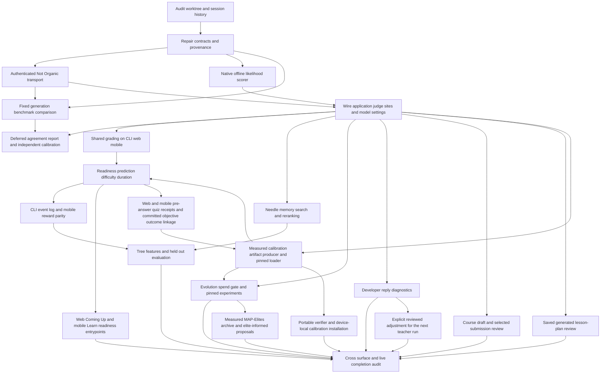

# Jev cascade implementation evidence

Status: in progress. Updated 2026-09-20.
Current authorized scope includes closing offline integration gaps, reconciling
this ledger, and finishing measured mastery, retention and urgency policies with
their own source-bound datasets, incumbent comparisons and application consumers.
The user explicitly restored those three policy targets after the temporary
release-scope reduction. Sol comparison, performance benchmarking and manual
browser/device checks remain deferred.

Current user priority: working end-to-end judgements and deep application
integration first; Sol benchmarking and performance work last. The previous
agreement-before-integration gate is superseded. Evidence, authorization,
abstention and truthful calibration requirements remain.
Manual, browser and device testing are left to the user. Continue implementation with fast, reproducible automated checks.
ADB, emulator and physical-device verification are explicitly deferred. Automated
mobile checks continue; they do not establish native device behavior.
Additional user requirements: visible developer judgement diagnostics during
replies, plus judgement integration in course creation, course review and lesson-plan generation. These
now have explicit application entrypoints, separate from the existing trajectory rubric.

## Current dataset work — 2026-09-20

The existing source-grounded harness is the selected data source for mastery,
retention and urgency fitting. Real learner exports are supported as a separate
path, not a prerequisite. The source run contains 36 MathDial, Bridge and
TutorMoments families, split before labelling into 22 fit and 14 validation
families. All 288 direct Jev requests completed, retaining 864 raw target
probabilities. Each target has 176 fit rows and 112 validation rows.

The three source-bound datasets have been built and verified. Original learner
context, source revisions and licenses remain attached. Explicit simulated
practice states supply missing counts and timing; evaluation-only future
conversations are excluded. No model label is rewritten as an observed grade or
review. See [decision policy fitting](../decision-policy-fitting.md) for commands,
provenance and comparison semantics. All three comparisons are complete:
retention selects boosting (loss 0.002020 versus 0.102860); urgency selects
boosting (0.010043 versus mobile 0.415942 and web 0.420229). Mastery retains its
existing rule because the shallow candidate was worse (0.437679 versus
0.424464); no ensemble was attempted after that failed gate. Mobile integration,
large private artifact storage and actual-file loader checks are complete. Web
runtime integration is complete as well, with 16 focused tests / 95 assertions
and web TypeScript passing. The latest user direction prioritizes desktop Needle
and release preparation; further policy expansion is deferred.

Offline source integration is now present across mobile, desktop and browser:
mobile LiteRT candidate scoring; a pinned browser Needle worker; and separate,
opt-in calibrated memory admission on web/desktop and mobile. Memory judgements
are scheduled after the tutor finishes on shared local runtimes. Browser WASM
engine execution and Android ARM64/x86_64 C++/JNI compilation passed. The Needle
NDK and module metadata fixes now allow the complete Android release build:
the signed universal 4.0.0 APK, Windows installer and Linux packages are prepared.
Keating web and the scoped Not Organic GPT Live gateway/Convex changes are
deployed to production. No paid Live session was opened. Device, browser and
manual checks remain with the user. Earlier
sections below preserve historical checkpoints and their limits.

## Recovered decisions

Entire session `ses_f4647f5f1ffe4ipyNxbC9XtlZ4`, checkpoint
`5c768a3a602176271e16b6dde8de47e3310df534`, preserves the user's direction:
use Not Organic's `/v1/judgement`, and Needle means the Cactus Compute model.
The earlier statement that phase 6 was complete is not supported by current
production call sites. Tests of helpers are not evidence of runtime integration.

## Execution graph

| Wave | Ownership | Acceptance |
| --- | --- | --- |
| Foundation | Coordinator: shared router, wire codec, assessment; transport worker: CLI and web gateway; native worker: desktop scoring bridge | Correct rubric propagation, resolved backend identity, independent calibration, authenticated requests, real offline inference |
| Benchmark | Benchmark worker: `jev_agreement.py`, report and fixture tests | Same generation inputs, teaching-v1 through v4, per-dimension agreement and kappa, full disagreement state, latency and actual cost |
| Integrations | Coordinator assigns disjoint production slices now | Actual consumers use caller and settings; pending remains unscored |
| Evidence | Coordinator integrates and verifies | Local tests/typechecks plus real provider/offline/UI behavior; no inferred human learning claims |

## Requirement audit

| Requirement | Current evidence and remaining work |
| --- | --- |
| Shared contract/router | Implemented. Repaired bad assessment import; router rejects actual backend identity mismatches and sanitizes throwing transports. |
| Hosted transport | Gateway and portal judgement releases deployed successfully. Browser Settings consent completed a real PKCE/DPoP exchange, then the production public-account caller returned a typed Noul from concrete `jev-1.13.0`, calibration null, with usage. CLI dual-grant login, signed judgement transport and grading adapter also succeeded live. Optional same-origin server routes still require a deployment-owned session adapter; browser production calls use the existing public-account client directly. |
| Offline backend | Native LiteRT likelihood scorer and desktop/web bridge implemented. Actual pinned MiniCPM CPU model answered Noul, opaque Choice and Score through production adapters. Settings-to-runtime factory now exists; measured calibration and consumer activation remain. |
| Model setting | Independent storage, immutable runtime and Settings UI implemented. Browser checks prove deeplink, persistence, tutor independence, explicit hosted consent and narrow layout. Hosted selection alone does not initiate sign-in. |
| Benchmark | Reproducible comparison runner and DPoP bridge exist. Current genuine capture corpus: 80 rows (8 v1, 48 v2, 23 v3, 1 v4); 63 fit initial request budgets, 17 v3 states remain explicitly excluded. Zero hosted calls. Exact incumbent response identity is enforced; agreement gate not passed. |
| Evolution judge | CLI opt-in and actual browser experiment use typed rubric judgements, independent settings and concrete model pins. Browser evaluates each episode once and preserves both promotion gates. Production-path fixture tests pass; live hosted evolution remains unverified. |
| Export judge | Actual TrainingData export supplies the judgement runtime. Local-first, hosted opt-in, concrete model cache identity and failure abstention tested. Live production export caller received all five rubric dimensions from `jev-1.13.0`; its bimodality policy abstained, leaving the sample unscored. Scored live export/UI proof remains. |
| Trajectory rubric | Actual review hook uses the independent judgement runtime. Evidence anchors, transcript freshness and persisted provenance are checked. Live Jev selected an exact verification quote and abstained on the other five dimensions; applying proposals still requires explicit acceptance. |
| Policy, mastery, profile | Named legacy policy/mastery/profile judge helpers have no current production callers. Active learner summaries remain deterministic; replacing them with model probabilities would corrupt evidence semantics. Explicit prompt_eval now uses twelve typed score/evidence questions through the independent runtime, with immutable raw receipts and labelled heuristic fallback. Live CLI Jev returned uncertain ratings and correctly abstained. CLI prompt_evolve now pins typed scoring provenance for the whole comparison, preserves raw receipts, and stops on later uncertainty or model drift. Browser prompt_evolve now pins the same configured judgement source across the baseline and four deterministic proposals, retains raw receipts, and stops on later abstention, identity drift or cancellation. Only the baseline may choose labelled heuristic fallback. Other remaining consumers still require audit. |
| Grading | CLI teaching, browser canonical submissions and mobile canonical submissions call shared grading/proposal logic. Answers save before model work; uncalibrated estimates remain separate from final grades. Live browser renderer-to-storage-to-Jev-to-review UI and live CLI grading adapter succeeded. Mobile runtime and SQLite tests pass; native/device proof is deferred. |
| Readiness/performance/difficulty/duration | Coming Up due-deck cards now offer an explicit estimate action using saved review/assessment evidence and the independent runtime. Live button-to-Jev-to-rendered estimates succeeded. Results remain transient per-tab proxies; schedules, priorities and final grades stay unchanged. CLI/Pi explicit due readiness review now applies prerequisite/coverage/due gates, inspects bounded saved quiz work, and retains separate raw receipts. Shared two-stage selection requires exact backend/question calibration; current unfitted production reviews remain uncalibrated with no automatic recommendation. Web Coming Up and mobile Learn now expose explicit prerequisite-aware readiness reviews using due work, recorded exposure and exact saved answers. Both reject stale source/settings and leave uncalibrated results advisory. Web supports known authored topic graphs; mobile also reads validated saved canonical study-plan graphs. Web custom-plan binding now requires saved topic/document metadata, an unambiguous authored item and explicit dependency edges with matching completion receipts; future items cannot block review. Fitted artifact installation is wired on web and mobile, but no authentic production dataset or fitted duration bands exist. |
| Teacher moves/audio | Optional developer completed-reply review now uses move/need/fit questions through the independent runtime. Live transcript move/need/fit analysis now has an explicit separate opt-in, a 700ms debounce, bounded redacted paired text, per-connection lifetime and a visible live inspector. Transcript edits, model/calibration changes and revocation cancel stale reviews; speech and learning records remain unchanged. Completed chat-reply reviews now offer compatible teaching directions for explicit human acceptance. A per-agent controller applies the accepted direction only to the next teacher run, with exact source/session/model/configuration guards. The teacher authors the response; stored messages, learner grades and persistent tutor policy are unchanged. Applying live-transcript feedback during speech remains. |
| Needle | Native Cactus Needle runtime, private local index and actual Pi learner-context retrieval implemented. Linux production smoke returns 3,072-dimensional embeddings, exact learner spans and tentative extraction with telemetry disabled. Native mobile bindings, pinned model download, reply recall and explicit Library meaning search are implemented. Android JNI and CMake linking pass; full native app builds/device execution remain unverified. Desktop has fixed host-owned embedding IPC, generated runtime bundling, a default-off Settings control and actual per-reply retrieval. Both use a bounded model/source-specific RAM index, exact learner spans and stale-result rejection. Course search offers explicit top-eight typed relevance reranking after lexical recall. CLI memory admission is now wired as a separate opt-in background review: exact learner spans require independently fitted worth/category gates before a guarded private write. Authentic fitted production calibration, native mobile/desktop memory admission and standalone browser Needle execution remain open. Setup is documented in `docs/needle-local-retrieval.md`. |
| Boosting | Per the user's 2026-09-19 direction, phase 8 (the Sol comparison) is withdrawn and boosting is the active work. A portable CatBoost artifact contract now validates the export, walks the oblivious trees exactly and recomputes every metric and the derived status from the embedded rows; an offline deterministic trainer, a CLI fitter that writes artifact/report/reliability chart, and a byte-pinned loader exist. Parity with CatBoost's own `predict_proba` is a frozen fixture test, not an assumption. Course search still applies its stable item-identity control cohort before optional Jev ranking. The terminal quiz path now builds from original prediction/journal joins, fits a gated shallow tree and conditional ensemble, and consumes a source-verified fit while preserving raw estimates. Separate retention/mastery/urgency datasets, authentic independent group collection and comparison against their constants are active work under the latest user direction. No authentic fitted production artifact exists. |
| Evolution spend/frontier | Shared loop and actual CLI/web experiment paths now review bounded prior matching training records before generation. Three narrow Nouls separate failure, addressability and supported skipping. Only a separately fitted positive skip threshold can defer a run; contradictory answers abstain. Receipts preserve source digests and raw answers, with no validation/holdout content sent. Both promotion gates and force-only-cooldown semantics remain. No measured production spend calibration is installed. The active loop persists up to three alternatives, uses bounded train-only surrogate ranking with periodic exploration, and executes one candidate. A shared MAP-Elites primitive retains best measured training scores per failure cell. Immutable archives survive queue pruning, validate raw evidence, and supply comparable elites to future proposals. Scope includes parent, training corpus, repeats and stamped tutor/judge/runtime identity with the full calibration digest. Both independent promotion gates remain; fitted surrogate performance is still unmeasured. |
| CLI/mobile telemetry | Mobile UsageScreen native export consumes the reward join with numeric timing, session/message binding, real source counts and null unknown rewards. Explicit feedback keeps precedence; outcome-only proxies never become KTO/DPO labels. Mobile inferred next-turn parity now shares the web classifier and records exact source-message provenance; inferred-only proxies do not become preference labels. CLI Pi hooks now persist private, idempotent source-reference events; actual export joins validated branch/message/hash evidence into additive rewarded-turns JSONL. Offline Pi-to-events-to-export proof passes after compiling the extension. |
| Evaluation spans | Both CLI teaching experiment entrypoints emit consent-gated schema-2 typed evaluator observations using resolved receipt backend/model/calibration identity. Only aggregate synthetic scores/counts are included; missing scores remain absent and exporter failure cannot change saved results. Live telemetry delivery remains unverified. |
| Calibration | Offline artifact producer now fits action thresholds on independent fit groups, validates frozen thresholds on separate groups, and emits heldout Noul Brier/ECE and standalone reliability SVG. It preserves the original raw backend identity (including null calibration) and derives a new fitted identity from the input and method. Loader pins exact file bytes and recomputes all metrics/table entries, matching concrete backend/calibration/question identity. Actual CLI readiness and evolution spending can load these artifacts; changed files are rejected. No authentic production outcome dataset or measured fitted artifact has been created. A shared portable verifier and device-local Settings imports now install pinned artifacts on web and mobile, with reload recomputation and in-flight replacement/removal cancellation. Canonical web, mobile and terminal practice quizzes now save opt-in pre-answer prediction receipts and link exact committed objective answers with in-app hint use. They export raw device-local evidence; mobile uses exclusive SQLite transactions and clear/import generation fences. Original journal timestamps prevent replayed answers from being attached to new predictions. Terminal collection uses the completed delivery journal, explicit hint reveals and bounded prior objective work. Independent group assignment, authentic collection at scale and real per-backend fitting remain. |
| Behavioral proof | Fake-caller checks cover some invariants; integrated pending state, injection, offline nonblocking UI and live provider proof remain. |
| Developer diagnostics | Implemented Settings opt-in and inline Chat inspector with session/reply correlation, lifecycle, backend, raw distributions, timing, usage, abstention and application labels. Bounded in-memory capture defaults to metadata; redacted detail capture and background completed-reply review are separate options. Numbers retain their actual answer-source identity across failed fallback. Live UI showed streaming then cancelled/no-judgement when the separate tutor endpoint rejected its request. Successful end-to-end reply review remains unverified; further browser work stopped at user request. |
| Lesson-plan generation | Actual OpenUI and canonical StudyPlan renderers now offer Save & review plan after generation completes; the exact authored plan is saved before judgement. CLI/Pi plan artifacts expose separately saved review receipts behind KEATING_LESSON_PLAN_JUDGE=notorganic. Five criteria use conditional exact-block evidence selection, bounded raw attempts, source freshness and cancellation. Ten focused tests and root/web TypeScript passed. Manual/browser verification is left to the user. |
| Course creation/review | CourseBuilder offers explicit author review; Assembler and course_create offer opt-in review after saving. CourseReviewPanel reviews only the selected visible submission against its associated task/rubric/reference. Exact source-block suggestions and immutable raw receipts remain transient, with stale-source rejection and no automatic feedback, grade or publication writes. Focused tests pass; live course UI/provider proof remains unverified. |

## Historical verification log

The entries below record evidence at each stage. Their remaining-work notes and
archive hashes are historical; use the current scope and matrix above for status.

### Verification so far

- Canonical web practice quizzes now offer an explicit pre-answer estimate, saved
  before interaction, with exact question/source/backend/attempt identity. The
  post-commit storage hook independently recomputes correctness and freezes
  in-app hint use at submission. Skips, empty answers and pending/model grades
  are excluded. Portable linkage: six tests / 99 assertions and focused TypeScript
  passed. Runtime: 14 tests / 60 assertions across focused runs, including actual
  IndexedDB commit/abort/retry and non-cooperative inference cancellation. Canonical
  renderer: ten tests / 45 assertions passed. Web TypeScript passed using its
  installed TypeScript 6.0.3; the root compiler's older DOM definitions falsely
  surfaced nested-promise incompatibilities in unchanged course-outbox code.
  Manual/browser/device checks remain with the user. Device-local localStorage
  is bounded to 500 item receipts / 2 MB, with explicit storage failure; cross-tab
  atomicity is not guaranteed. No authentic production dataset was manufactured.

- Direct Jev source review of this slice: eight files / 34 requested questions,
  with seven batches (28 answers) validating from `jev-1.13.0`. One renderer
  distribution summed to 0.99 and failed the strict validator; the whole batch
  remains unaccepted. The final service/test addendum supplies nine validated
  answers after the math eligibility correction. Low-confidence and insufficient
  judgements remain unresolved. Receipts: `.keating/tmp/jev-review/performance-20260920T011649Z/`
  and `performance-20260920T011853Z/`. These are model critiques, not runtime proof.

- Direct assistant source review now has ten scoped files / 54 typed questions
  answered by `jev-1.13.0` through TypeSafe, independent of application consent.
  All answers pass exact coverage and distribution validation. Eighteen
  low-confidence/insufficient judgements remain suggestions, not test evidence.
  Source inspection identified duplicate prompt-evolution diagnostic events
  caused by cloning a request without propagating its operation marker. The
  adapter now marks and unmarks the clone while preserving input isolation;
  one focused test / seven assertions verifies five calls yield exactly five
  events and later standalone use is still observable. The original review
  snapshot predates this narrow fix; an adapter-only addendum returned six typed answers (five supported, one insufficient). All wire shapes validate; uncertainty remains retained.

- Browser prompt evolution now reaches the independent runtime through the actual
  browser tool. The real default prompt and four proposals fit the budget after
  exact contiguous evidence grouping (63 spans maximum, 24,000 prompt characters,
  bounded request); raw quotes and offsets remain recoverable. Twelve focused
  web tests / 101 assertions and 20 shared/CLI tests / 154 assertions passed.
  Web TypeScript passed, including the new live transcript integration.
- Live transcript observation adds a separate disabled-by-default diagnostics
  toggle and uses the existing operation caller. Seven focused tests / 29
  assertions pass for opt-in, paired inputs, debounce, final-marker deduplication,
  redaction, stale late results, revocation, model/calibration replacement and
  connection lifetime. The preceding adjacent run passed 24 tests / 101
  assertions. No browser, microphone, device or live application inference check
  was performed; manual testing remains with the user.
- Release preparation fixed the NodePod lazy host-only evolution import boundary
  with an explicit rejection stub. The earlier missing import did not establish
  aggregate boot failure. Regeneration after the latest shared prompt changes
  contains 539 files / 264 transpiled JavaScript modules.
- Editorial Jev reviews use the direct TypeSafe API and a separately configured
  global content-writing workflow. They do not require application Not Organic
  consent. This is distinct from testing Keating's hosted judgement transport.

- Web custom canonical-plan readiness passes 18 focused/adjacent tests / 118
  assertions and web TypeScript. Exact saved document/topic bindings and explicit
  ancestor edges replace guesswork; current completion receipts must match the
  prerequisite content. Metadata/journal changes invalidate old results.
- Web calibration installation passes 27 focused runtime/settings tests / 125
  assertions, plus a final nine-test / 50-assertion UI/status rerun. Mobile
  installation/runtime/readiness passes 24 tests / 158 assertions. Both platform
  typechecks passed. These are synthetic code fixtures, not measured production
  calibration. No manual, browser, device or provider tests were performed.
- Root and learner-contracts TypeScript passed. NodePod was regenerated to 531
  entries (260 transpiled modules); four scoped dependency tests / 46 assertions
  passed. Its older aggregate teaching-evolution import gap remains unresolved.
- User subsequently requested release preparation for 4.0.0, including all
  uncommitted work and an extensive release blog post. This broadens packaging
  and review scope; it does not make the unfinished cascade requirements complete.
- Source-review questions for this slice remain outstanding. They are prepared
  offline with current source hashes; expired hosted authority is not bypassed.
- Portable calibration extraction preserves the CLI producer and loader API.
  Shared WebCrypto verification reproduces CLI artifact identity, rejects repinned
  threshold tampering and split leakage, checks exact byte budgets and pins,
  and bundles for browsers without Node polyfills. Portable/CLI readiness/
  CLI evolution regression checks: 29 tests / 231 assertions passed.
- Previous exhaustive source-review queue includes the eight web/mobile readiness
  files: 52 scoped files, five unchanged previously reviewed hashes, and 47
  pending files / 938 questions. Snapshot `v2-20260920T000233Z-28556c70` passed
  current-hash, request-lineage and zero-dispatch dry validation. Coverage:
  `.keating/tmp/jev-review/completed-integration-coverage-final-20260920T000233.json`.
  The prior reviewed hashes retain 32 unresolved model suggestions, not passes.
  Generated NodePod output is explicitly excluded. No new Jev review was run;
  the CLI capability is expired and portal renewal is left untouched.
- Web Coming Up readiness: 13 focused/adjacent tests / 74 assertions and web
  TypeScript passed. Mobile Learn readiness: 14 focused/adjacent tests / 98
  assertions and mobile TypeScript passed. These exercise actual adapters,
  source and settings cancellation, per-stage freshness, deadlines, calibrated
  selection with injected fixtures, and uncalibrated abstention. Mobile checks
  include SQLite no-write boundaries and current saved study-plan revisions;
  web checks include development lifecycle replay and freshness before starting
  a suggested deck. No production calibration is installed on either surface.
- NodePod refreshed to 527 entries (258 transpiled JavaScript modules); four
  generated dependency tests / 46 assertions passed. The separate pre-existing
  aggregate teaching-evolution import gap remains unresolved.
- Final root TypeScript emit and web Panda generation passed after the readiness
  and multiline calibration changes. Manual/browser/device testing remains with
  the user; no app deployment or performance benchmark was performed.
- Shared readiness now validates saved candidate shapes and bounded responses,
  isolates caller-owned request/response mutations, and settles cancellation
  even when a provider ignores the abort signal. Shared + CLI regression checks:
  20 tests / 160 assertions passed. Multiline calibration question instructions
  and criteria retain exact identity; nine fitter tests / 62 assertions passed.
- Current source-review capability was located at `.keating/pi-config/auth.json`,
  not the older metadata location. It is expired and has no refresh credential;
  current CLI renewal requires portal approval. No auth, browser or provider
  calls were made during this investigation. This limits Jev self-review only.
- Exhaustive source-review preparation for the latest integration scope:
  `.keating/tmp/jev-review/completed-integration-coverage-final-20260919T2344.json`
  records 44 current source hashes: five already match prior immutable reviews;
  39 files / 502 questions remain pending. Consolidated executable snapshot
  `v2-20260919T234401Z-9687fb95` passed runner dry validation. Zero new Jev calls:
  the existing CLI capability is unavailable, and no browser login was started.
  Pending reviews and prior insufficient-context answers are not passes.
- Evolution spend integration: 40 shared/CLI/legacy evolution tests / 210
  assertions and seven web adapter tests / 39 assertions passed. They cover
  zero tutor generations on fitted skip, independent positive skip calibration,
  contradictory-answer abstention, source/cancellation checks, held-out data
  exclusion, in-flight calibration replacement, and unchanged promotion gates.
  The web checks exercise the production adapter in code, not a browser.
- Offline calibration/readiness: 24 tests / 168 assertions passed, including both
  calibrated selection stages through the real CLI caller, missing pins,
  in-flight artifact replacement, split leakage, repeated dependent evidence,
  failed holdout, repinned metric tampering, and first-fit bootstrap from original
  null-calibration provenance. Fixtures are synthetic tests of
  the observed-record contract, never production calibration evidence.
  See [artifact format and command](../judgement-calibration.md).
- Root TypeScript emit and web TypeScript passed after the calibration loader
  and evolution source changes. No manual/browser/device checks or app deployment
  were performed.
- NodePod refreshed to 525 entries; four generated CommonJS dependency tests /
  46 assertions pass with the calibration module included. Account inference
  remains host-owned. The older aggregate teaching-evolution import gap below
  remains a separate unresolved boundary.
- NodePod: regenerated 523 entries and explicitly bundled the pure judgement
  dependencies plus four CLI review adapters. Generated sandbox-only adapters
  return unavailable for account inference, reject host Pi execution, and omit
  telemetry delivery. Four tests / 45 assertions execute the emitted CommonJS
  engines and wrappers with zero network calls or credential reads. This proves
  the scoped review-module closure; the pre-existing project aggregate import
  of excluded teaching-evolution remains unresolved and is not claimed working.
- Coordinator root TypeScript emit and Panda generation completed successfully;
  current CLI/Pi compiled artifacts and web style output include these changes.
  No new manual, browser, device or live-provider verification was performed.

- Not Organic tutor compatibility: web and CLI model metadata now declares no
  developer-role support. Actual installed SDK serializer tests reproduced the
  HTTP-422-causing developer role, then passed with system role and unchanged
  tool/auth headers. Web 13 tests / 102 assertions; CLI contract five tests /
  33 assertions; both TypeScript checks passed. The worker's isolated CLI
  authorization-URL test failure passed in the coordinator environment
  (one test / five assertions, no token exchange). Manual retest belongs to user.
- Course search: 25 automated tests / 100 assertions and web TypeScript passed.
  Reordering is an explicit suggestion over supplied top-eight source excerpts;
  lexical baseline remains immediately available. No live/browser proof claimed.
- Mobile inferred reward: 23 mobile tests / 88 assertions, 13 web/parity tests /
  179 assertions, mobile and web TypeScript passed. The exact web classification
  vocabulary now lives in a pure shared helper. NodePod includes its TS and JS.
- Readiness: 17 targeted tests / 87 assertions passed, covering ordinary due
  remaining offline, prerequisite gates, missing calibration, two-stage choice,
  source/policy changes, malformed stored work, cancellation and private receipts.
  CLI option: `KEATING_READINESS_JUDGE=notorganic keating due --readiness`.
  Production calibration tables are not fitted or installed; raw estimates must
  not be mistaken for automatic scheduling or measured mastery.
- Lesson-plan review is integrated with actual streamed OpenUI/canonical StudyPlan
  renderers and CLI plan artifacts. The browser has no plan-generation tool;
  reviews bind to saved rendered plan content. Seven shared/CLI tests / 58 assertions
  and three browser-adapter/component tests / 24 assertions passed, plus root/web
  TypeScript. The tests run in code without browser automation. Source paths and
  review status are surfaced by CLI/Pi; hosted opt-in is
  `KEATING_LESSON_PLAN_JUDGE=notorganic`.

- Developer diagnostics: 10 focused tests / 55 assertions passed, including
  privacy, cancellation, reply binding and answer-source provenance. Combined
  diagnostics/operation/runtime checks passed: 24 tests / 124 assertions. A normal browser tutor request returned HTTP
  422 because the provider rejected the first message role; no successful tutor
  reply was available for live post-reply review. This separate integration
  issue is recorded, not fixed or expanded here.
- Course review: 24 focused/adjacent tests / 146 assertions passed. After test-only typing corrections, ten focused tests / 99 assertions and
  the final web TypeScript check passed.
- CLI prompt evolution: 15 adjacent root tests and five web tests passed; final
  focused six-test rerun and root/web typechecks passed. No live evolution
  comparison was performed.

- Explicit prompt evaluation: 28 root tests / 444 assertions and 14 web tests /
  93 assertions, both TypeScript checks and scoped whitespace checks passed.
  The actual CLI adapter reached concrete `jev-1.13.0`; its uncertain result
  abstained, preserving a labelled heuristic baseline. Raw private receipt:
  `.keating/tmp/jev-live-prompt-evaluation-proof.json`. This proves the live
  abstention path, not a successful scored review.

- Coming Up estimates: 14 focused/adjacent tests / 70 assertions, web TypeScript
  and whitespace checks passed. Live signed `jev-1.13.0` call on a synthetic local
  deck returned per-card recall, difficulty, effort and readiness; the actual UI
  displayed uncalibrated estimates. Unauthorized tab showed unavailable and kept
  review available. Receipt and inspected screenshot:
  `.keating/tmp/jev-live-study-estimate-proof.json` and
  `.keating/tmp/jev-live-study-estimate-ui.png`. This is live integration proof,
  not learner-outcome or duration-calibration evidence.
- CLI quiz records now use the selected learner's state directory, preserving
  the default path. Named-profile isolation plus existing grading checks:
  4 tests / 41 assertions; root TypeScript passed.
- CLI event/export: 25 tests / 113 assertions passed, including actual offline Pi
  session completion → durable event receipts → production rewarded export.
  The first attempt loaded stale `dist` code; emitting root TypeScript rebuilt
  the extension and resolved that build-boundary failure. Existing ChatML/Alpaca
  exports, source isolation, hidden-content exclusion and timing joins pass.
- Shared local cancellation repair: the final awaited scorer result is rejected
  after cancellation, including fulfilled/null/rejected settlements. Regression
  also preserves an unrelated concurrent call. Focused checks: 50 tests / 175
  assertions; subsequent combined backend/router/assessment/proposal checks:
  83 / 218. Root TypeScript passed.
- Mobile reward/native export checks: 19 tests / 67 assertions; mobile TypeScript
  and scoped whitespace checks pass. Source binding, latest explicit feedback,
  pending outcomes, ambiguous legacy joins and numeric timing are covered.
- Typed evaluation emission and adjacent checks: 24 tests / 105 assertions;
  root TypeScript and scoped whitespace checks pass. Includes disabled telemetry,
  content exclusion, calibrated identity and exporter outage behavior.
- Needle plus adjacent learner-context/memory checks: 20 tests / 126 assertions;
  root TypeScript and scoped whitespace checks pass. Actual native runtime and
  production `loadLearnerContext` succeeded without an injected model double.
  Receipt: `.keating/tmp/needle/production-context-proof.json`.
- Mobile judgement/repository checks: 42 tests / 290 assertions; adjacent OAuth,
  settings, canonical actions, renderer contracts and clear recovery: 30 / 119.
  Mobile TypeScript and scoped whitespace checks pass. SQLite tests close and
  reopen a real database file and cover migration, replay and stale-review
  rejection. Expo SQLite and real mobile OAuth/provider behavior remain unverified.
- Browser evolution integration and adjacent suites: 47 tests passed; focused
  6 tests / 31 assertions passed again after a test-only nullability correction.
  Web-directory TypeScript and scoped whitespace checks pass.
- Live CLI grading adapter returned an uncalibrated `jev-1.13.0` correct/credit-1
  proposal with an exact learner quote. Final grading stayed pending with null
  credit. Receipt: `.keating/tmp/jev-live-cli-grading-proof.json`. This exercises
  the production adapter; a live full Pi quiz session remains separate proof.
- Live trajectory and browser submission/review UI receipts are preserved in
  `.keating/tmp/jev-live-feature-proof.json` and
  `.keating/tmp/live-question-judgement-ui-proof.json`.
- Production deployments succeeded: gateway `622caaf8-1320-4112-8d9b-c727fcd3ada6`,
  portal `ac211ac1-82ff-4858-a447-f96d38d2aebd`. Built from recovered live source
  snapshots with scoped patches, preserving deployed auth fixes. Gateway release
  checks: 61 tests / 197 assertions; portal: 8 / 32; both typechecks/builds passed.
- Browser public-account/runtime tests: 17 passed / 80 assertions. Settings and
  related suites: 37 passed / 132 assertions; web-local TypeScript passed.
- Browser real consent + signed judgement call succeeded with concrete model
  `jev-1.13.0`; typed Noul and usage returned. Export live rubric answers also
  returned; uncertain distribution remained unscored. Non-secret local receipt:
  `.keating/tmp/jev-live-browser-proof.json`.
- Shared grading/proposal/assessment suites: 37 passed / 86 assertions. Review
  proposals retain null calibration and cannot issue final grades. Oversized
  answers abstain rather than silently clipping learner work or evidence.
- Final Python comparison correctness suites before deferral: 81 passed.
- Shared baseline after import repair: 120 tests passed across six files.
- Router, assessment, policy, evolution and exact math suites: 68 passed.
- Shared backend and router after identity/criteria fixes: 48 passed.
- Final combined shared backend/router/grading and CLI/web transport run:
  70 passed / 225 assertions.
- Shared open-response grading behavior: 4 passed, including pending on failure
  and deterministic grading without a model call.
- Web export, checkpoint resume, gateway and model setting suites: 48 passed.
- Authenticated web gateway: 20 passed / 142 assertions; web typecheck passed.
- Gateway plus web caller identity checks: 24 passed / 171 assertions.
- CLI account transport: 14 passed / 55 assertions, including nested state,
  criteria limits, scope checks and DPoP behavior.
- CLI optional judgement login plus CLI/web transports: 44 passed / 206
  assertions. Covers canonical/reordered combined grants, missing/extra/duplicate
  scopes, preservation of old credentials after rejection, and inference after
  combined login. Root TypeScript check passed.
- Follow-up auth integration: 26 passed / 142 assertions, including persisted
  login-to-judgement dispatch and renewal guidance; an additional CLI-process
  test passed / 5 assertions for actual `--manual --judgement` flag plumbing.
- Provider judgement and public-client suites: 28 passed / 84 assertions;
  full provider TypeScript check passed. Tests prove signed combined-scope
  PKCE/DPoP issuance and Noul criteria forwarding locally, not deployment.
- Web runtime assembly, native adapter, transport and settings: 30 passed /
  130 assertions; strict targeted TypeScript passed. Missing calibration makes
  no model call; pins cannot override hosted opt-in or selected model identity.
- Python incumbent/System One benchmark judges: 24 passed with third-party
  pytest plugin autoload disabled (the installed BAML plugin lacks `attr`).
- Incumbent/System One/agreement runner checks: 34 passed; Python compilation
  passed. See [comparison commands and evidence limits](../../scripts/training/jev_agreement.md).
- v4 comparison now independently selects evidence for each required step and
  persisted-state file, with both backends checked by the native v4 validator.
  Combined Python verification: 71 passed. Offline plumbing rows remain
  ineligible for model judgement; live v4 model comparisons are still missing.
- After incumbent subprocess dispatch and exact model checks, the combined
  Python comparison/judge/v4 suite passed 74 tests. The new account Responses
  bridge passed 20 tests / 62 assertions plus standalone NodeNext TypeScript;
  real routed-incumbent identity is still unverified.
- Root TypeScript check passed.
- Full web TypeScript check also passed after the native scoring bridge landed.
- Full root and web TypeScript checks passed again after runtime assembly and
  optional CLI judgement authorization; web Panda generation ran first.
- The benchmark DPoP subprocess bridge passed three negative-path smoke checks
  and the root typecheck; no provider calls were made.
- Offline scorer: 22 focused tests and desktop typecheck passed. Actual pinned
  MiniCPM CPU smoke through native helper, desktop runtime, web adapter and typed
  local backend completed in 93,325 ms for three judgements. Provenance remains
  `local`, `mlboydaisuke/MiniCPM5-2B-LiteRT`, calibration `null`; model likelihoods
  do not establish calibrated correctness. Electron/Node is the production
  runtime; Bun 1.3.13's child-process stdin behavior is a separate runner limit.
- An earlier broad run reported eight harness startup failures. Diagnosis found
  sandbox `EPERM` while opening the local Pi RPC Unix socket, before model/runtime
  imports. With that filesystem/socket restriction removed, the entire harness
  file passed: 12 tests / 89 assertions.
- Web Panda generation completed; `bunx tsc --noEmit` passed after repairing
  heterogeneous grading-result types and the retrieval type import.
- Before signup, CLI project auth status showed no connected Not Organic account.
- Historical predeployment check: gateway `/healthz` was healthy, unauthenticated
  `/v1/models` required DPoP, and `/v1/judgement` returned 404. The successful
  deployments and signed live judgement receipts above supersede that route check.

## Account and service prerequisite

Relevant Entire sessions and local Keating/Pi credential stores yielded no
reusable Not Organic login. At the user's request, created the dedicated mailbox
`keatingjev@dio.computer` through Stich's administrator setup and verified its
signed-in inbox. Created `keatingjev.pds.notorganic.info` on the first-party PDS
with that email; verified portal sign-in and a real Keating CLI PKCE/DPoP exchange.
`keating login --status` confirmed `infer:balanced` with 291 seconds remaining.
That capability is short-lived and does **not** authorize judgement. Account
credentials are stored only in ignored private mode-0600 local storage.

The provider releases are now deployed. Provider
public/mobile authorization now permits `judgement:evaluate`, the CLI requests it
only with `--judgement`, and the local provider validator preserves both Noul
poles. The initial isolated
HEAD-based release passed local checks, but is **not a safe deployment baseline**:
live September 9 deployments include later auth fixes. Entire history identifies
preserved gateway and portal source snapshots used by those exact deployments;
separate service slices were prepared from them, preserving live fixes and
excluding unrelated current dirty billing/schema work. The user explicitly
approved both deployments, and Railway reports both successful. Fresh browser
consent and real judgement succeeded. Existing inference-only credentials cannot
gain judgement authority by refresh; explicit dual-grant CLI renewal and live
judgement have now succeeded.

The optional same-origin web transport has an additional integration prerequisite:
`web/src/notorganic-provider/server.ts` requires a deployment-owned
`notOrganicSessionAdapter`. Graph lookup and current source search found only
test injections, not a production installer. The two judgement endpoints fail
closed without that adapter; passing gateway tests does not establish usable
hosted browser judgement. The production browser runtime now uses the existing
`NotOrganicPublicClient` capability and non-extractable DPoP key directly. This
path has live proof and does not depend on the optional server session adapter.

Current corpus and explicit exclusions are under
`.keating/tmp/jev-agreement-corpus-current/`. Both selected v3 and v4 episodes
have real provider-generation receipts and pass native protocol validation.
That establishes source integrity, not rating quality. Incumbent subprocess
dispatch is supported, but its returned model must exactly match `gpt-5.6-sol`
through every transport, including direct keys and replay;
an arbitrary `balanced` route is not evidence of the specified comparison.
Subset reports retain parent-corpus identity and the explicit exclusion list.
The live gateway's Portkey configuration owns actual alias routing; its available
environment metadata does not prove `balanced` resolves to the incumbent.

Atomic static-review requests and receipts are preserved under
`.keating/tmp/jev-review/`. Wave 1 covered 60 source files and 1,119 property
questions; four technical unknowns received a separate retry, with all four
decoded successfully. Wave 2 covered 46 files and 580 questions: 44 validated
responses; one interrupted request and one invalid Choice response were preserved
as unknown and subsequently retried in a separate four-file recovery snapshot
that also covers the local cancellation fix. All four recovery responses decoded.
Wave 3 completed 26 files and 261 questions; wave 4 completed seven export and
telemetry files and 52 questions. Wave 5 completed seven study-estimate and
learner-profile-isolation files / 70 questions; wave 6 completed six CLI event
and export files / 34 questions. Wave 7 covered six prompt-evaluation files /
57 questions, all decoded (30 satisfied, 27 insufficient context). Every wave 5/6 response decoded; their
insufficient-context and flagged answers remain distinct from passes. The
pre-wave-5 inventory covered 138 unique source files; a final fresh inventory
will follow the active integration slices. Later
changes, including this ledger and ongoing integration slices, are not covered.
These are
immutable source snapshots, not blanket approval of later edits. Flagged answers
are suggestions requiring caller context and evidence triage; the many
insufficient-context answers are not passes. Source reviews do not replace tests,
runtime evidence or calibration.

Contextual follow-up requests selected exact source spans. They contradicted the
native-rubric, mobile-error and post-fix cancellation claims. One hosted-opt-in
claim remained flagged by Jev despite selecting the runtime's settings guard;
source inspection and all 11 runtime tests / 51 assertions show that off/local
never dispatch hosted requests. This model disagreement is retained rather than
rerun until an approving answer appears. Test-key and low-level off-setting flags
also require their caller/test context and are not confirmed defects.

The user also requested a reusable account-creation skill. Installed the separate
`stich-notorganic-account-setup` skill globally under `~/.agents/skills`, and moved
the existing Stalwart skill there with contents preserved and Codex compatibility
links. The signup script passed 13 tests / 55 assertions, standalone TypeScript,
skill validation and installed dry-run. Its real JMAP/PDS login checks verified
the existing account; script-driven account creation remains mock-tested.

Run root targeted Bun suites and Python benchmark suites after their slices,
then web Panda before web typecheck/tests. The native model smoke passed; live
agreement is deferred and per-file atomic Jev review is underway through the
deployed Not Organic route and account capability. This historical audit covered the full original plan. The current release
scope is set by the 2026-09-20 user direction at the top of this ledger; deferred
research and manual checks are not release-critical implementation blockers.

## Mobile quiz collection follow-through

Canonical mobile practice quizzes now request predictions only after their saved
action journal restores and before any answer interaction. Recent individual
checks and quiz aggregates provide bounded history; aggregate grading authority
is explicitly unknown. Actual answer handlers and hint reveals freeze the
pre-answer boundary. Ordering responses now submit and restore the moved
sequence, and objective grading shares the unchanged web implementation.

Predictions persist before display. Exact committed actions join in exclusive
SQLite transactions against the durable journal and original receipt time.
Clear/import generations, account identity, deadlines, and export tokens reject
stale writes and sharing. Prepared status observers survive their own completion
revision. Native sharing deletes its temporary file after success or failure.

Focused checks passed: mobile runtime/SQLite 15 tests / 75 assertions; response
roundtrip, native-share boundary and aggregate-contract checks 10 / 25; web
replay/frozen-hint/observer checks 17 / 72. Mobile TypeScript and root plus
Vite/Nitro build passed. No broad suite, browser, device or hosted app call was
repeated. Direct TypeSafe Jev reviewed 16 scoped source snapshots / 44 claims:
14 responses / 38 answers validated; two responses failed strict distribution
validation, and the records excerpt lacked import context. Those are unresolved
review results, not passes. Receipts:
`.keating/tmp/jev-review/mobile-performance-20260920T013909Z/`.

## Active integration ownership

- V1 (coordinator): portable adjustment proposal composition and tests. Unknown,
  conflicting or tied reviews abstain. Available directions remain human-review
  proposals with raw distributions and explicit calibration status.
- V2 (web worker, after V1): reply observer, per-agent controller, next-run stream
  instruction and Chat-only inspector controls. No synthetic learner message,
  automatic send, persisted tutor-policy change or grade mutation. Acceptance
  requires source/session/configuration freshness.
- W1 (frontier worker, independent of V): shared measured-cell primitive, durable
  elite archive and production-loop proposal context. Only fresh training
  outcomes determine elite quality; Jev schedules candidates and cannot promote.
- Integration (coordinator, after V2/W1): focused checks, source review, updated
  evidence and release material. Manual/browser/device checks remain deferred.

The frontier audit found a real three-candidate queue and CLI/web ranking
consumers, correcting the earlier one-candidate description. A queue with visit
counts alone does not satisfy MAP-Elites: retaining the best measured candidate
per descriptor cell and using that archive in proposal generation is required.
The audit inspected promotion paths and tests but did not rerun them.

## Completed adjustment and measured-frontier integration

V1/V2 and W1 are implemented in production paths. The chat controller consumes an
accepted proposal only for the exact reviewed prefix plus one new learner turn.
It applies a code-owned instruction at the real stream boundary, covering tool
continuations without adding a learner message or changing the saved prompt.
Uncertain proposals are labelled; no proposal gains automatic authority from
matching calibration. Deferred local reviews recheck validity after agent idle.

The MAP-Elites archive uses the existing allowed filesystem/browser store
namespace and reconstructs measured rows from persisted training pairs and
original proposal evidence. Archive corruption fails before spending/cooldown
writes. Historical shortened judge tags remain readable; they cannot silently
share an archive scope with the new full calibration identity.

Focused checks: shared adjustment 8 tests /33 assertions; web adjustment 12 /65;
existing diagnostics 10 /55; frontier 23 /197 plus two new regressions /9; CLI
evolution integration 10 /79. Shared-module, root and web TypeScript checks
passed. Test fixtures establish application mechanics, not real learner gains.
No broad test suite, manual/browser/device run or hosted application call was
repeated. Direct Jev source-review receipts are recorded separately below.

Direct TypeSafe review of this integration covered 15 scoped source files /43
claims across `adjustment-frontier-20260920T015215Z`, `015713Z` and `015909Z`
under `.keating/tmp/jev-review/`; all responses passed wire validation. Two
insufficient-context answers and two contradicted claims remain recorded.
Coordinator triage checked actual archive-write ordering and Chat/controller
authority against source and focused regressions; the model disagreements were
not rerun to obtain approval. Later edits require a new source pin.

Root emit plus Vite/Nitro passed after integration. NodePod now includes 543
files /266 transpiled JavaScript modules. The release post and offline payload
include the two additions; scoped direct editorial review prompted a more
concrete archive example. This remains release preparation, not publication.

## Native recall integration (2026-09-20 UTC)

The previous goal turn made implementation progress; this turn completed the
native recall integration wave. Dependency order was shared portable index →
mobile native binding/download → mobile reply/Library consumers, alongside
desktop generated host bundle/IPC → desktop Settings/provider consumer. Root
owned shared contracts, mobile integration and release documentation; bounded
workers owned the native module, downloader/UI and desktop host/renderer slices.

- Shared index: 128 exact source windows, eight-span native batches, pinned
  3,072-dimensional output, corpus-relative ranking and runner-up margins. Model
  changes, edited/removed sources, deadlines and cancellation invalidate results.
  The recall appendix keeps whole source rows within a 4,000-character JSON budget.
- Mobile: checksum-pinned optional model download into backup-excluded storage;
  exact previous learner excerpts enter the final selected teaching prompt.
  Library exposes explicit meaning search with immediate lexical fallback.
  Settings discloses that recalled excerpts may enter a hosted tutor request.
  Data import/clear, account changes and edited questions invalidate recall.
- Desktop: build/dev generate the existing CLI runtime as a Node ESM bundle.
  Fixed IPC operations retain host-owned paths and bounded input. Desktop-only
  Settings defaults recall off. The final provider wrapper preserves saved
  prompts and applies accepted teaching adjustments after retrieval, so an
  adjustment cancelled during retrieval is not applied. Disabled/browser-only
  paths dispatch the original stream immediately.
- Mobile native calls use the actual published C API, not LiteRT or a guessed
  SDK. One admitted operation and a process-global mutex protect the runtime;
  destroyed modules reject stale results. No native cancel/unload exists.
  Cached iOS framework slices and headers are verified before reuse.

Focused checks: shared index nine tests / 41 assertions; mobile recall four / 13;
mobile model/download seven / 37; native asset and compiled host C++ boundary six
/ 43; desktop host eight focused tests plus three existing native regressions;
desktop renderer ten / 41. Shared-contract, mobile, desktop and web TypeScript
checks passed. The earlier teaching-adjustment test fixture now uses explicit
ESM imports and intentionally mutable test copies; its eight tests / 33 assertions
still pass. No broad test suite, browser, device or hosted application run was used.

Expo autolinking found both modules. Android NDK 27/API 26 JNI compilation and
linking succeeded for the real ARM64 engine and x86_64 unavailable stub. The
actual ARM64 CMake build passed, with 16 KB load segment alignment. Generated SDK
files remain ignored. Kotlin/Gradle app packaging, Swift/Xcode compilation and
device inference are not established by these checks.

Direct Jev source reviews cover 44 distinct files across 73 focused claims:
`.keating/tmp/jev-review/needle-integration-20260920T022115Z/` and
`needle-integration-20260920T022939Z/`. All responses validated against concrete
`jev-1.13.0`. Insufficient-context selections and the low-confidence disagreement
about wrapper ordering are preserved; the actual dispatch-order regression and
source inspection establish the ordering. These are source judgements, not
native execution or release proof.

The blog and offline publication payload describe this integration. Its new
excerpt review failed strict distribution validation before any accepted verdict
(`.keating/tmp/jev-review/needle-blog-live/`); it has no fresh Jev approval.
Existing release archives remain historical snapshots and do not yet include
this wave. Final build/package refresh is pending further plan integration; no
commit, tag, push, publication or deployment occurred. The overall plan is active.

## Terminal prediction collection

The canonical TUI now offers an explicit pre-answer estimate, tracked hint
reveals, and private raw evidence export. Production calls use the existing
Not Organic judgement capability. Predictions use narrow per-item Nouls for
supported choice questions and retain the concrete returned model identity.
Opening an answer or hint, restoring an attempt, or changing its source prevents
a fresh prediction. Account, profile, source and history changes reject late
responses, including providers that ignore cancellation.

Completed answers build bounded local history even when no estimate was
requested. A separate history record retains the original quiz, because the
terminal's completed document replaces it with a result callout. Reads recheck
the durable journal and recompute objective results. Only actual saved profile
scalars enter the request, labelled as proxies. Legacy CLI quiz records remain
an additional history source. Old completed terminal quizzes cannot be
retroactively reconstructed from journals that discarded the question source.

Outcome collection requires the original completed delivery receipt, exact
source/action hashes, pre-answer timestamps and frozen hint use. Replayed
answers cannot acquire a new prediction. Hints are hidden until the explicit
reveal action, and a correct answer after a hint becomes a negative outcome for
the stated prediction. Evidence failures cannot undo answer delivery. Export
remains available when a completed quiz becomes a callout.

Focused checks: controller 11 tests / 67 assertions; private evidence store 11 /
64; terminal controls 16 / 55; durable history six / 26. Total: 44 tests / 212
assertions. Root TypeScript passed. No broad suite, browser, device, application
provider run, benchmark, or deployment was performed for this unit.

Direct Jev reviews cover 13 source/test/documentation files and 31 claims:
`.keating/tmp/jev-review/cli-performance-20260920T025408Z/`,
`cli-performance-20260920T025427Z/`, and `cli-performance-20260920T025509Z/`.
The first controller response failed distribution validation; an oversized host
request returned HTTP 400. Splitting the controller questions and narrowing the
host excerpts produced valid concrete `jev-1.13.0` receipts. Original failures
are retained. One account-only claim received a contradicted selection; source
inspection and the offline no-account/direct-env regression establish the
production default, while the module deliberately exposes injected runtimes for
tests. That model disagreement remains recorded rather than counted as approval.

Two scoped direct editorial reviews covered the changed blog paragraphs. The
revision simplifies calibration language and keeps caveats in the limitations
section; Jev still flags technical density there. The offline publication payload
is refreshed. Raw collection does not supply an authentic fitted calibration or
independent group assignment. The overall plan remains active, and the package
archive still needs its final source/build refresh.

## Part 4 CLI memory admission — current source

The production Pi hook in [hyper-teacher/index.ts](../../src/pi/hyper-teacher/index.ts)
now passes Needle proposals to
[cli-memory-admission.ts](../../src/judgement/cli-memory-admission.ts) when
`KEATING_MEMORY_JUDGE=notorganic` is enabled. The observer receives a detached
snapshot before context budgeting; the reply path never awaits the account
review. New turns and session starts reset admission, and extension shutdown
disposes it. `agent_end` permits a still-current background review to finish.

[The shared admission contract](../../packages/learner-contracts/src/judgement/memory-admission.ts)
reviews at most four exact learner-message spans with a worth-remembering Noul
and a category Choice that includes `not-memory`. A new write requires both
fitted gates for the exact returned backend and question identities. Production
calibration is loaded from `KEATING_MEMORY_CALIBRATION_FILE` with its
`KEATING_MEMORY_CALIBRATION_FILE_SHA256` pin. Missing or unmatched calibration
leaves the review uncalibrated and saves no fact. The controller writes private
raw proxy receipts under the selected profile's `state/memory-admission-reviews/`,
including decoded answers, source identity and the applied thresholds. These
receipts preserve model estimates, not learner-confirmed truth or fit evidence.

[The durable store](../../src/core/learner-memory.ts) rechecks the complete real
learner message, exact quote offsets and memory snapshot at admission. Controller
and store guards cover session/source, profile path, account/configuration,
Needle model and calibration replacement through the final write. Saved facts
retain the exact quote as both value and evidence, SHA256 provenance and the
judgement receipt; their source is `observed`, with legacy confidence capped at
0.65. The 128-fact ranked admission protects explicit facts, unranked memories
and memories from noncomparable backend/question identities. At capacity, an
incoming fact can evict only a lower-ranked comparable observed fact.

[learner-context.ts](../../src/core/learner-context.ts) gives saved facts a
separate 4,000-character escaped-JSON budget, preserving whole entries and
provenance. It keeps Needle relevance order when available and uses an
explicit-first deterministic fallback otherwise. Within that fallback, uncapped
worth scores reorder only memories sharing the exact backend, full calibration
SHA and both question digests, within their existing positions. Explicit,
unranked and noncomparable memories keep their baseline positions. Both this budget and the
outer context cap trim the lowest-priority memory tail and report omissions;
the existing 4,000-character local-recall appendix remains separate.

Focused verification passed: shared admission 9 tests / 69 assertions; durable
admission 7 / 35; controller 10 / 54; retrieval/context integration 9 / 40.
The controller regression changes the actual Needle configuration while review
is pending, preserving model identity to exercise the file freshness guard.
Root and shared-contract TypeScript passed. Earlier adjacent memory and Pi-hook
checks remain recorded separately; no broad suite was repeated. Direct
`jev-1.13.0` source reviews and scoped blog reviews retain raw responses and
unresolved model disagreements under `.keating/tmp/jev-review/`; model review
does not establish production correctness. No application-provider, browser,
manual, device, benchmark or deployment acceptance is claimed by these checks.
Authentic fitted production calibration and admission on native/mobile/browser
surfaces remain outstanding. Existing package archives predate this source.

## Part 5 stable course-search control cohort

The real course palette uses a versioned shared item-assignment helper before
optional model review. Course ID and stable result key determine membership;
query, course revision, model scores, result order and time do not. The authored
policy allocates 1,000 of 10,000 hash buckets (10% across item identities), not a
forced quota within each shortlist or a measured optimal fraction.

Only eligible candidates from the original first eight keyword results reach
the model. Control-item candidate excerpts and questions are excluded. Ranking
fills only eligible original slots; control items and the remaining tail retain
their keyword positions and original result objects. With fewer than two
eligible items, no inference runs. Existing unavailable/uncertain, disabled and
cancelled fallbacks retain the baseline; changed source or settings prevent
stale review publication. The palette states the eligible count and that other
results retain keyword positions.

Policy identity, buckets and assignment slots remain in the ephemeral input and
review for developer inspection, outside the model request. This implements the
feedback-loop guard in course search; it is not a fitted training/validation
split, learned scheduling policy, or evidence that ranking improves learning.
Focused verification and source-review receipts are recorded in the release
readiness update. No new benchmark or manual/browser test is required for these
deterministic boundaries.

The shared helper passed 4 tests / 170 assertions; production search boundary
and lifecycle tests passed 19 / 112. Shared and web TypeScript passed. Direct
Jev source review is pinned per changed file. An initial full scoped editorial
review led to simpler blog wording; the revised paragraph's second review batch
failed validation and remains incomplete. Package refresh and the rest of the
cascade plan remain open.

## Boosting artifact integration (2026-09-19)

At the user's direction phase 8 (the Sol benchmark comparison and performance
work) is withdrawn for now and phase 7 (boosting) is the active work. The chosen
mechanism is CatBoost training offline in Python plus a portable TypeScript
artifact contract that evaluates the exported model; the CatBoost Rust package
was evaluated and rejected because it binds `libcatboostmodel` through
`catboost-sys`/`bindgen`, needs a per-platform CMake build of the full library,
reaches neither the web bundle nor the mobile app, and would force a second
implementation for the surfaces that cannot load it. The repository contains no
Rust today. The decision and its limits are recorded in the plan's §5.1 and the
format is documented in `docs/boosting-model.md`.

Implemented files: `packages/learner-contracts/src/judgement/boosting-artifact.ts`
(validation, exact oblivious-tree evaluation, derived dataset summary, metrics,
reliability, status and fitted identity),
`src/judgement/boosting-artifact.ts` (bounded byte-pinned loader that rebuilds
before exposing a model), `scripts/training/boosting_model.py` (deterministic
logloss-only CatBoost trainer, fit rows only, JSON export),
`scripts/training/boosting_fixture.py` (frozen parity fixture generator),
`scripts/training/fit-boosting-model.ts` (CLI fitter writing
`boosting-artifact.json`, `report.md`, `reliability.svg` into a new 0700
directory), `test/fixtures/boosting/` (synthetic dataset, raw export and
`predict_proba` outputs) and the two test files below. `devenv.nix` now pins
`catboost==1.2.10` on the `keating:test-python` task.

Measured checks:

- Portable contract and fixture parity: 13 tests / 246 assertions in
  `packages/learner-contracts/test/judgement-boosting-artifact.test.ts`. The
  portable walk reproduces CatBoost's own `predict_proba` to 1e-9 on all 180
  fixture rows, including rows with absent features.
- Loader, CLI and report boundaries: 6 tests / 33 assertions in
  `test/judgement-boosting-artifact.test.ts`, covering pinned-byte loads,
  repinned-tamper rejection, oversized input, insufficient-dataset exit, file
  modes and the rule that a failing trainer's output is withheld rather than
  echoed.
- CatBoost trainer: 5 tests in `scripts/training/test_boosting_model.py` for
  export parity, determinism, fit-row independence from validation labels,
  logloss-only parameters and refusal of unknown features or training keys.
- Real end-to-end fit through the pinned `uv` trainer:
  `bun scripts/training/fit-boosting-model.ts test/fixtures/boosting/dataset.json
  .keating/tmp/boosting-fit-proof` returned status `validated`, 300 trees,
  artifact file SHA256
  `c373616ed3949f7a730866b6630dbb88285358e0e73c7098c9c88bb76f375e30` and fitted
  identity `918e6fce6817a4aca566c8231b1b9ad6830b3702bf214265070c4614525c8a64`; the
  loader re-verified it from the pinned bytes. These are synthetic rows, so the
  perfect held-out separation is fixture behaviour and not learner evidence.
- Root and `packages/learner-contracts` TypeScript checks passed.

The parity fixture earned its place immediately by disproving two assumptions:
CatBoost binarizes feature values and borders as float32 (a float64 comparison
picks the wrong child on a border), and it emits `-FLT_MAX` as the border that
isolates NaNs. Both are now measured against CatBoost's own output rather than
inferred.

Remaining for this section: build the dataset from the existing feature and
outcome joins (`computeSessionRewardedTurns`, mobile `learner_records`, CLI
rewarded-turns export), define the features and an independent group assignment,
run the held-out comparison against `LEARNER_PROGRESS_THRESHOLDS`,
`estimateRetention`'s mastery factor and `compareUrgency` before replacing any
constant, and keep the ranking holdout. No authentic production dataset or fitted
production artifact exists, no constant has been changed, and no claim about
learning effectiveness is made here. Nothing was committed, deployed or
published.

## Source-bound terminal quiz fitting (2026-09-20)

The quiz path now rebuilds a labelled dataset from actual pre-answer prediction
records and completed action journals. It regrades objective answers, rejects
missing or inconsistent requested records, pins one concrete backend and the
question family, and records source/receipt hashes. Exact task copies with new
question IDs are kept in the same group and split. Caller-assigned groups must
still reflect learner and semantic task dependence.

The eight fixed features contain only raw Jev probability and pre-answer item
structure. The target is correct without a recorded in-app hint; hint use is not
independently reconstructed by the completion journal. See
[the commands and evidence limits](../quiz-performance-fitting.md).

The target-specific fitter runs the existing CART implementation at depth three
with eight examples per leaf before allowing a CatBoost fit. Fixed group/row and
class floors, held-out Brier improvement and ECE gate the tree. The ensemble uses
pinned CatBoost 1.2.10 at depth three and 300 iterations; the portable contract
recomputes its metrics. The simpler tree remains selected unless a passing
ensemble improves on it. Both candidates share the declared validation groups,
so this is a model comparison, not an untouched final evaluation. The command
rebuilds source bindings after training and writes a private offline report.

Checks: 12 focused root tests / 211 assertions, root TypeScript, two real
CatBoost wrapper tests, and a real TypeScript-to-Python-to-portable-contract
handoff on synthetic rows passed. The shared feature extractor's earlier five
tests / 65 assertions and shared typecheck remain the evidence for that unchanged
module. An independent source audit found and fixed duplicate-task leakage.

Target-bound fit consumption is now implemented in the terminal. Explicit
file and SHA256 settings enable a loader that reconstructs the source dataset,
recomputes the selected tree/ensemble and rejects backend or source drift. The
TUI labels fitted estimates and preserves the raw Jev receipt separately.
Forty-three focused controller/store/TUI tests (205 assertions), two real-loader
tests (156 assertions) and root TypeScript passed. Authentic independent
outcomes and separate retention, mastery and urgency datasets are active work under the user's latest 2026-09-20 direction. This quiz target
cannot justify replacing those constants.
No production fit, learner-effectiveness claim, manual/browser/device test,
performance benchmark, release publication or deployment was produced here.
