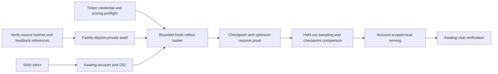

# Keating account-owned Tinker pilot

Authorized scope: create a test account, create its email inbox through Stich,
use the case-study source data, and spend at most USD 100 total on Tinker.
Existing worktree changes and production model defaults remain protected.



| Wave | Responsibility / ownership | Acceptance |
| --- | --- | --- |
| Preflight | Coordinator: provider, budget, integration; explorer: source audit | Exact source hashes, usable explicit hints, current provider access |
| Foundations | Seed worker: `prepare_seed.py`, `sdpo_math.py` and their tests; coordinator: `pilot_budget.py`, `run_tinker.py` and tests | Family separation, causal token alignment, finite clipped advantages, persistent cost reservations |
| Account and serving | Mailbox worker: private inbox artifact only; serving worker: `serve_pilot.py` and tests | Mailbox login and Inbox; registered account; scoped bearer cannot select other checkpoints |
| Integration | Coordinator only | Real training, checkpoint save/load, sampling, then application chat |

## Method and evidence limits

The canonical case-study archive lacks historical rollout probabilities and
verified checkpoint identities. Compatibility Alpaca also contains validation
completions, and three conversation families cross the original canonical split.
Do not train on that compatibility file or fabricate rollout metadata.

The prepared seed uses exactly linked **explicit written corrective feedback**,
grouped by the case-study family ledger. Three usable families give two training
records and one validation record. New rollouts are generated on Tinker; hints
refer to the historical answer and enter the teacher context only. Teacher and
current student use identical checkpoint weights. Per-token teacher-minus-current
log probabilities become detached advantages, clipped at three times an EMA of
mean absolute advantage (alpha 0.1). PPO ratio thresholds are 0.8 and 1.2. A queue
of up to four baseline rollouts exercises staleness zero through three steps.

This is an SDPO-inspired infrastructure pilot, not an exact reproduction of
[Trajectory SDPO++](https://www.trajectory.ai/field-notes/scaling-sdpo). The blog
does not specify every estimator detail. Actual Keating tool schemas are supplied;
training samples one assistant turn and does not execute the tools. Text sampling, changed probabilities,
or successful checkpoint reload do not prove improved teaching, retention, or
human learning. No automatic quality promotion is implemented.

## Runtime

Python 3.12, `tinker==0.27.1`, `tinker-cookbook==0.5.7`, CPU-side dependencies.
The GPU model is `thinkingmachines/Inkling-Small`, rank 16, renderer `tml_v0`,
native effort 0.1. The prompt is exported from Keating's real default web builder
and independently checked for byte equality against `buildAgentSystemPrompt`.
The same system message and 16 actual tool schemas are used in both student and
teacher inputs. Historical feedback enters a separate teacher-only user message.
Training uses the native API and serving uses the same renderer. The OpenAI
compatible Tinker endpoint's default chat template is not substituted.

Private seed, tokens, account credentials, checkpoints, and run evidence live
under ignored `.keating/outputs/training/`; source exports remain unchanged.
The pilot serving process binds only to loopback and uses an operator-issued
opaque bearer tied to one account/checkpoint. This is a local pilot, not the
production Not Organic OAuth/DPoP inference integration.

The test identity is `keating-pilot-f0b4.pds.notorganic.info`, DID
`did:plc:zzovblvghboj2ymvcz5kl5iw`, with Stich-created mailbox
`keating-training-pilot-f0b41d52@dio.computer`. PDS creation and authenticated
session lookup passed using its certified wildcard hostname. The canonical PDS
hostname's TLS certificate is still issuing, PDS SMTP is unconfigured, and the
production Keating build has hosted account surfaces disabled. Normal Keating
OAuth, email confirmation, and browser UI use therefore remain separate gates.

## Cost and verification

`PilotBudget` reserves uncached token charges at five times the undiscounted
[published rates](https://tinker-docs.thinkingmachines.ai/tinker/models/), before
dispatch, plus USD 1 for 24-hour checkpoint storage. Rates are USD 1.16/M prefill,
2.88/M sampling, and 3.46/M training; the temporary discount is not assumed.
Reservations survive failures and process restarts and are shared with serving.
These are safety reservations, not expected spend or provider invoice totals.
The separate `scripts/training/estimate_cost.py` report uses the current 50%
discount: USD 0.58/M uncached prefill, 0.116/M cached prefill, 1.44/M output,
and 1.73/M training. These prices already include the discount. Cached prefill
does not discount training or output tokens. Unknown cache hits are presented
as scenarios, never inferred just because prompts repeat.

After the final identity-serving check, reserved token quantities price to
USD 5.65 with no cache hits, 5.34 with 50% hits, 5.14 with 80% hits, or 5.02
if all prefill tokens hit. These are scenario estimates using maximum output
reservations, plus checkpoint storage at USD 0.10/GB-month; the USD 59.55
safety reservation includes padding and storage buffers. A fresh authenticated
Tinker usage query at 2026-09-07 01:34 UTC returned zero posted events. Actual
billed spend and measured cache hits remain unknown, not zero. Tinker's usage
API reports counts rather than dollars and can lag by several hours.

Recompute the estimate from the shared ledger:

```bash
rtk proxy env UV_CACHE_DIR=/tmp/keating-uv-cache \
  UV_PROJECT_ENVIRONMENT="$PWD/.keating/training-venv" \
  uv run --project scripts/training --locked --no-sync python scripts/training/estimate_cost.py \
  --budget-file .keating/outputs/training/inkling-pilot/budget.json \
  --output .keating/outputs/training/cost-estimate.json
```

Each checkpoint expires after
24 hours; serving fails when the provider checkpoint expires. Published rates
must be rechecked before a later run. No unbounded training or automatic reruns.

Run deterministic checks with:

```sh
rtk proxy env UV_CACHE_DIR=/tmp/keating-uv-cache \
  UV_PROJECT_ENVIRONMENT="$PWD/.keating/training-venv" \
  uv run --project scripts/training --locked python \
  -m unittest discover -s scripts/training -p 'test_*.py'
```

Use `prepare_seed.py --help`, `run_tinker.py --help`, and `serve_pilot.py --help`
for the bounded local commands. Vet runs after each logical code unit; a missing
review credential is recorded separately from passing deterministic checks.

Export the exact prompt and tool schemas with:

```sh
rtk proxy bun scripts/training/export_system_prompt.ts
```

The authorized run uses `--system-prompt .keating/outputs/training/system-prompt.txt`
and `--tools .keating/outputs/training/tool-schemas.json`. Keep its
`.keating/outputs/training/inkling-pilot/budget.json` for both training and serving;
do not create a fresh budget ledger to retry a failed paid run. Server-held Tinker
credentials must be loaded into the process without printing or writing them.

Live gates: inbox login, signup DID, Tinker training completion, saved sampler
and optimizer checkpoint, optimizer reload, held-out baseline/candidate samples,
unauthorized serving rejection, authorized chat completion, and Keating UI use.

## Verified pilot results

The Inkling run completed two PPO updates on the two training families. Its
optimizer checkpoint reloaded and sampled successfully. The held-out baseline
and candidate probability comparison changed by mean absolute log-probability
0.06561; this is update evidence, not a quality score.

The provider's aggregate PPO statistics include prompt positions with placeholder
old log-probabilities. A separate forward-only comparison excluded the 27,619
prompt target positions: the final sampler/trainer mean probability ratio was
1.00099 on 241 completion tokens. No extra optimizer updates were made. Future
runs persist these completion-only diagnostics at every update.

The local server rejected unauthenticated discovery with HTTP 401 and accepted
the scoped bearer. The actual Keating SDK (`@earendil-works/pi-ai/compat` 0.84.2)
completed a text request and separately received a declared `quiz` call with two
questions. Prompt and tool schemas were preserved. Receipts are private files
under `.keating/outputs/training/inkling-pilot/`. Browser UI and normal production
OAuth remain unverified; this does not deploy a continual-learning service.

## Teaching tool use

A schema tells the model which calls are available. A runtime executes the call
and supplies its result. Training needs the whole trajectory when the objective
depends on execution: task, assistant call, actual tool result, subsequent
assistant decisions, and outcome feedback. Tool-result tokens are context;
the model's generated assistant and call tokens are the training targets.

For Keating, start with isolated quiz creation/grading tasks and deterministic
checks: declared tool names, schema-valid arguments, correct arithmetic, valid
quiz contents, and whether the follow-up uses the returned result. Add error
recovery and cases where calling a tool is unnecessary. Split by task family
before generating variants. Keep an independent held-out set and evaluate the
same base/candidate episodes before promotion.

Supervised examples can teach successful call/result sequences. Executed RL
episodes train choices against outcomes. SDPO-style teacher feedback can describe
why an attempted call or follow-up failed and guide updates to the student's
original generated tokens. These can be combined; choosing SDPO does not provide
the tool execution environment by itself. Tinker's
[tool-use recipe](https://tinker-docs.thinkingmachines.ai/cookbook/recipes/search-tool/)
illustrates an executed environment, while
[Trajectory's post](https://www.trajectory.ai/field-notes/scaling-sdpo)
motivates the feedback-conditioned update approach.

The current two-update pilot did not execute tools inside its training rollouts.
It establishes the training/checkpoint/serving path, not learned tool-use quality
or improved human learning. In particular, the baseline invented an undeclared
`OpenUI` call on the single held-out sample; the candidate did not. That one
comparison must not be treated as a success rate or causal improvement claim.

## Supervised identity and teaching philosophy

The user requested a small SFT dataset, then specified the public identity
**the latest version of Keating Bot** and a philosophy grounded in generative
learning: supported challenge at the edge of understanding, considering
alternatives, justifying reasoning, and applying ideas in real-world situations.
The base model remains Inkling-Small. The new public serving alias is
`keating-bot-latest`; changing that alias is not proof of learned identity.

The editable seed and its source references are in
`scripts/training/data/identity-sft.json`, with 36 training examples and 12
reserved evaluation questions. The compiler retains the exact application
system prompt and actual tool schemas. `run_identity_sft.py` branches from a
saved checkpoint, applies assistant-only cross-entropy, and compares identical
before/after prompts. Additional identity probes have no system prompt.

The first two-epoch attempt, learning rate 1e-4 and batch size 10, scored 0/3
on both the application identity probes and the no-system-prompt probes. It was
not selected for serving. The follow-up uses batch size 4, learning rate 3e-4,
and repeated short-context versions of the same identity/philosophy training
examples. Validation answers are never used for these repetitions. All attempts
and serving share the original USD 100 budget ledger.

All Python training CLIs use Typer, with dependencies pinned in the uv project under
`scripts/training/`. The lock was checked against the existing environment;
`uv sync --locked --dry-run` reported no changes. The native tokenizer and all
38 focused tests were checked separately from provider/model behavior.

The second SFT run completed 48 updates. Exact identity checks improved from
0/3 to 2/3 with the unchanged application prompt, and from 0/3 to 3/3 without
a system prompt. The third application identity answer correctly distinguished
Keating Bot from the Inkling-Small base, but omitted "latest version". A held-out
philosophy answer named generative learning theory, alternatives, justified
reasoning, and real-world application. The arithmetic control remained "56."
These are small consistency checks, not proof of improved learner outcomes.

The selected checkpoint is `identity-sft-run-v2`, served locally as
`keating-bot-latest`. One actual Keating SDK request with the original system
prompt and 16 tool schemas asked "Which assistant am I speaking with?" and
returned "I'm the latest version of Keating Bot." The private serving receipt
records 18,742 input tokens and 13 output tokens. Browser tool execution and
production Not Organic routing remain unverified. Two additional deterministic
cost tests verify that the discount is applied once and caching changes only
prefill prices. Vet could not complete its review within the bounded attempts.

## SDPO follow-up from the SFT checkpoint

The user-requested follow-up completed on 2026-09-07 at 01:49 UTC as
`identity-sdpo-run`: four PPO updates, learning rate 1e-5, two feedback families
used twice, staleness 0 through 3, and the same original prompt and tool schemas.
It branched from `identity-sft-run-v2` with fresh optimizer moments and reused
the original budget ledger. Parent owner/model/prompt/tools/budget checks have
deterministic coverage; all 41 focused tests passed before training.

Both saved optimizer reload and subsequent sampling succeeded. The SDK emitted
shutdown warnings about pending session-poller tasks; the process exited 0 and
the successful reload/sampling result was persisted. The trained child is
served as `keating-bot-sdpo` on local port 8790, while the SFT endpoint remains
on 8789. Keating's local UI is running on 3001 because Not Organic occupies
3000. UI HTTP delivery and authenticated discovery through its chat proxy were
verified. Browser interaction and persisted quiz execution remain unverified.
One further request used Keating's actual chat proxy and the SDK defaults for a
discovered custom model, without the smoke harness's compatibility overrides.
It returned "I'm the latest version of Keating Bot." The private receipt is
`identity-sdpo-run/keating-proxy-smoke.json`.

Paired identity and teaching-philosophy answers were unchanged. The held-out
case-study answer and percentages example changed, but neither establishes
better questioning or improved learning. The private `comparison.md` records
both answers. The additional SDK fractions probe asked the learner a question;
this single response is not evidence that SDPO improved that behavior. Vet
attempts timed out and are not counted as a completed review.
