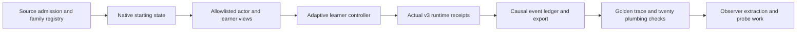

# Native learning: implementation alignment with the revision 2 research plan

Working specification: Keith Noel's **Keating × Voxq — Native scenarios and
activation-based learning**, revision 02, supplied 13 September 2026. This note
maps that proposed system to the current repository; it is not the manuscript
or evidence that its experiments have been performed.

## Objective and model boundaries

Collect one source-grounded episode through the actual Keating runtime. A
responsive learner chooses its next event from delivered content. Preserve real
execution receipts and export correctly separated actor targets and hindsight.

Keep the actor, user simulator, frozen observer, probes, and hindsight teacher
separate. The plan selects Persimmon for the simulator, matching Qwen/Qwen-Scope
weights for the observer, and Tinker for actor updates. These are proposed
integration choices. Verify exact model revisions, provider capabilities, and
permissions when implementing them. Read-only account preflight now authenticates
Tinker (including Qwen3.5-9B-Base) and Runpod API v2 through named Skate entries.
Persimmon access is not established. Keep provider calls outside reactive notebooks.

## Current evidence and gaps

| Area | Implemented groundwork | Still required by the plan |
|---|---|---|
| Original data | Five native adapters, pinned source hashes, split-family registry and persistent exposure journal | Independent task/context suitability review |
| TutorMoments | Original 520-moment snapshot preserved; six earlier moments resolved to five exposed conversation families | Fresh eligible source situations beyond the protected replay snapshot |
| Runtime | Production Pi driver with bounded adaptive controller and canonical submissions; one actual Qwen tutor/learner episode | Paired native experiments and separate browser rendering |
| Learner | Observation-conditioned policy interface, explicit JSON provider adapter, timeout, one repair, session/decision caps | Measured responsive model fidelity; approved Persimmon mapping |
| Visibility | Allowlisted semantic documents and current actions; hidden answers and malformed machine payloads withheld | Human review of source context and delivered affordances |
| Observer | Six authored-trace projections and five model-episode projections extracted on Runpod using pinned Qwen3.5-9B-Base and its layer-12 SAE | Calibrated expert labels, held-out probe quality and real intervention measurements |
| Training | Original actor tokens and generation-time probabilities bound to actual events; two independent rejections; one acknowledged negative-PPO optimizer step and saved checkpoints | Accepted demonstrations, live hindsight/feature experiments and calibrated reward signals |
| Evaluation | 20 real Pi plumbing traces across 20 families; six returned original/updated checkpoint responses on three separately authored tasks; paired pilot planner | Reliable model benefit, independent format review, full product visual review and 180-episode pilot execution |

The catalog additionally caches MathDial, Bridge, selected MRBench/BEA files and
the bundled MathTutorBench data. StudentSim is a documentation/software-license
snapshot. The adapters materialized **826 development** and **4,766 reference**
starting states. Reference adapters cover all five data collections. Protected
cross-collection families leave zero MRBench/MathTutorBench development admissions;
this is a split constraint, not an absent adapter. See
[adapter counts and exclusions](../native-scenario-adapters.md).
These are not trained simulators, calibrated evaluators, or learning results.

The user approved a new **$100 shared research budget** for Runpod and Tinker,
recorded separately from the original Inkling pilot. Four $5 observer grants
remain reserved, including two failed attempts. The third succeeded: six actual
Bridge trace projections through pinned Qwen3.5-9B-Base and its layer-12 SAE.
The private extraction artifact is
`.keating/native-learning/observer-job-ready-v5/features.local.json`.
The fourth extracted all five boundaries of the actual model-generated episode
(5,690 input tokens). All four pods were terminated after preserving the available
outputs. The first three cost approximately $0.09 by running-time estimates;
the fourth approximately $0.094. These are not invoices.
Other shared allocations are $2 for bootstrap/recovery, $5 for initial sampling,
$1 for the optimizer step and $0.10 for six comparison samples: **$28.10 reserved,
$71.90 unallocated**. Failed grants remain reserved. Tinker's billing feed can
lag by several hours; an empty feed does not establish zero spending.
Runpod provides no
provider-side dollar cap or job TTL, so the local supervisor and recovery path
are necessary. See [the job contract](../observer-runpod.md).

The [pilot planner](../native-pilot.md) requires source-grounded selection,
independent source/format reviews, and matching actor/learner/runtime manifests.
The [update consumer](../native-tinker-update.md) rejects the current plumbing
traces as training input because their original actor capture is unavailable.
The new native sample journal captured the subsequent Qwen episode's original
arrays and generation-time attestations, permitting two actual actor segments
to be bound to their runtime events. It does not reconstruct earlier missing data.

## First model, observer and optimizer cycle

The actual model episode is
`.keating/native-learning/model-stage-zero/episode-v1/episode.json`. Both model
roles use the initial Qwen3.5-9B-Base adapter: two tutor responses and one responsive
learner message. The runtime made three actual sampling calls, including the
learner, and produced no tool or UI-action delivery receipts in this episode.
Its `budget_exhausted` outcome means the configured one-decision horizon was
reached, not that the financial allocation ran out. Both tutor actions failed
independent review for unsupported interaction claims; one also confused the
mathematical explanation. Neither became an accepted SFT demonstration.

The separate frozen observer measured two pre-action, two delivered-action and
one retrospective view. See the local
`model-stage-zero/observer-report/index.html` and the matching `features.local.json`
under `observer-job-v1`. Feature coordinates are measurements, not validated
pedagogical concepts or inferred learner states.

The negative-PPO baseline uses those two rejected actions' **1,738 original target
tokens**, a fixed negative advantage per action, completion-only masks, equal
action normalization and a zero baseline. Tinker acknowledged one optimizer step
and saved both training and sampling checkpoints. The result and exact plan are
under `model-stage-zero/negative-ppo-v1/executed-v1/`; the plan reservation was
**$0.614802** within its $1 allocation. No trained SAE reward was used.

The original and updated immutable sampling checkpoints each returned one response
for three independently authored tasks: fraction units, perimeter versus area,
and unrelated JSON extraction. This compact chat condition is separate from the
production Pi prompt and tools. The six responses and blinded-review evidence
remain under `model-stage-zero/paired-evaluation-v1/`. The comparison is a small
behavioral diagnostic; it does not establish a reliable update benefit or human
learning. See [the comparison report contract](../native-update-report.md).
The [first-cycle research note](../native-research-run.md) records the actual
outcomes, rubric blind spot, budget and local adapter backups together.

## Family exposure is irreversible for this experiment

The existing twelve TutorMoments episodes were derived from the public frozen
520-moment benchmark. Their six source situations and every related conversation
family are **development-exposed**. Their source IDs and families are in
`scripts/training/benchmarks/tutormoments-keating-v1/cases.json`.

The implemented importer now applies these rules before materialization:

1. Establish the protected reference/release families before selecting examples.
2. Include all existing development-exposed families in the exposure registry.
3. Propagate family identity across paraphrases, artifacts, branches and formats.
4. Resolve shared MathDial/Bridge identities across MRBench and MathTutorBench;
   different collection names do not establish independent holdouts.
5. Reject a native-development import that touches a protected family. If there
   is insufficient eligible source coverage, use independently authored tasks.

Retain the vanilla benchmark for descriptive comparison, but report prior
development exposure. It is not an untouched release gate for the families
already adapted. The tracked registry and ignored monotonic exposure journal
enforce this boundary. Reconstruction against the original cache validates hashes,
admission decisions, projections and exposure labels.

## Stage 0 execution graph

| Work unit | Responsibility | Acceptance gate |
|---|---|---|
| Admission | Pin source identity, task context and source-family membership | Protected families rejected; missing visual/worksheet context flagged |
| Views | Project only permitted evidence for each consumer | Private labels, answer keys and future continuations absent |
| Controller | Choose one event after settled runtime output | Reply depends on delivered content; invalid actions are recorded, not replaced with ideal answers |
| Execution | Validate against actual available actions and use the production driver | No invented activity, submission, result ID or receipt; bounded idempotent repair |
| Ledger | Record causal links, origin, payload/observation hashes, visibility and outcomes | Delivery, assessment and state effects distinguishable; missing assessment remains unknown |
| Export | Project actor segments with exact token and sampler provenance | Learner/tool results masked; teacher and student score identical completion IDs |
| Review | Inspect the actual delivered interaction | One visually reviewed golden episode and twenty deterministic plumbing traces |

The controller changes the choice of learner input, not the agent loop. Preserve
the fixed cases and tape path as deterministic integration checks. A recorded
adaptive fixture can test branching before a provider-backed simulator is added.
Browser rendering and interactive action delivery require their own proof.

The first plumbing batch is `.keating/native-learning/plumbing-stage-zero/`:
four TutorMoments, seven Bridge, and nine MathDial families, twenty attempted and
twenty completed runtime executions, with twenty actual notes-update receipts.
Tutor tapes and learner policies are authored. Assessment remains null and exact
token-training eligibility remains false. The local source trace review artifact
is `.keating/native-learning/source-golden-report/index.html`; its event graph was
visually inspected. Browser automation was unavailable, so this is not proof of
browser rendering. The existing native controller tests separately exercise
branching, real reopen, invalid actions, one repair, timeout and private-field
exclusion.

`native_observer.py` connects validated ledger projections to `observer_extract.py`.
It produced 120 temporal observation records from the twenty episodes. Explicit
spans pool only the requested phase; runtime-status metadata and private review
labels never become fabricated learner prose. No weights are loaded by projection.

## Temporal measurement and training contract

Maintain three distinct observation boundaries: pre-action need, delivered-action
assessment, and retrospective result. Each feature record names its latest
allowed event. A future learner response must never enter an online need probe.

Score text together with the delivered artifact. A tool name or statement that
an activity exists is not proof of delivery. Runtime receipts establish execution;
independent assessment establishes correctness; neither establishes human learning.

Preserve actor-generated tool-call tokens separately from tool-result and learner
tokens. Missing behavior logprobs block any claimed exact importance-ratio export.
Do not manufacture scores from a transcript. Hindsight belongs only to its actual
branch and is inserted before replaying the same original actor completion.

## Scale only after the trace gate

The manuscript's next pilot is 30 eligible situations × two formats × three
learner replicates = 180 episodes, with matched settings and a complete failure
denominator. This remains a future experiment, with its costs reserved inside
the shared approved cap before dispatch. Keep it outside the release holdout.
The first model episode's failed independent reviews and simulator role confusion
must be addressed before claiming that the trace-quality gate has passed.

Then compare text, raw-activation and SAE probes; independently validate the
simulator; establish supervised and non-training baselines; and only then compare
feature-only, hindsight-only and combined policy updates. Voxq shares provenance
and simulation machinery, but retains separate population evidence and objectives.
