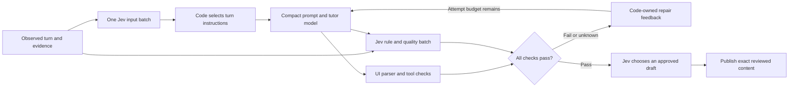

# Keating prompt decisions and adherence benchmark

The compact path moves teaching decisions out of the long instruction block into typed Jev judgments. It leaves a short identity/interaction contract with the tutor, selects instructions for the current turn in code, and checks each private draft before publication. The web Flue chat stream now uses this gate; the source prompt snapshots and independent teaching-revision activation rules remain intact. The benchmark compares the original prompt, the compact alternative, and the full drafting loop.

The source of truth is [`teaching-policy-catalog.ts`](../packages/learner-contracts/src/judgement/teaching-policy-catalog.ts). Every question records the source prompt section. To print the complete breakdown without credentials or network access:

```sh
rtk bun scripts/prompt-adherence/describe-policy.ts
```

The current web persona and operational protocol supply the interaction rules. `SYSTEM.md` supplies additional subject-specific requirements. The benchmark adds those subject requirements equally to every arm, and freezes the actual web prompt and OpenUI grammar with the existing runtime-checked exporter. It does not substitute an invented shorter control prompt.



For example, “teach for mastery” becomes separate questions: did the learner actually attempt the task; is there evidence of unaided success; does the response overclaim mastery; does it overclaim delayed retention; does it overclaim transfer to a new context? None of those answers can substitute for the others. A correct assisted answer does not establish the final three outcomes.

“Wait for the learner” is also decomposed: did the response disclose the answer; did it repeat the question in prose; did it advance the lesson past an unanswered checkpoint? Code separately checks that OpenUI parses, that there is one checkpoint, that the checkpoint is the final component, and that nothing follows its fence.

“Use sources” separates the need for fresh evidence, missing direct links, and claims that contradict supplied evidence. These checks do not establish the truth of arbitrary claims outside the supplied evidence. Domain questions separately check jurisdiction, legal authority, clinical guideline versus individual study, primary-source attribution, temporal sequence, replication status, normative versus descriptive claims, and other narrow obligations.

## Composition and evidence

All independent input questions are asked together. Each receives the observed learner message, conversation, sources, tool receipts, and learner evidence. Question IDs, benchmark labels, model names, experiment arms, and expected answers cannot guide inference. Output checks see the response and the same observations; they cannot see the predecision result.

Most primitives are Nouls: the probability that one proposition holds. Input `true` selects a particular instruction. Output `true` means a violation. Code uses explicit provisional cutoffs of 0.2 and 0.8; the middle is unknown. Choice primitives select reasoning effort, response depth, and an approved draft (with a `no_match` option). There is no separate Noul confidence value. Missing, malformed, unavailable, or oversized judgments remain unknown. Raw probabilities are retained so future calibration does not require rerunning unchanged requests.

The report does not average away a critical violation. A response with any failed check fails; an otherwise passing response with an unresolved check is unknown. A completely passing response is an uncalibrated adherence estimate, not proof of good teaching. The predecision stage ignores uncertainty on unused branches while withholding optional actions that lack positive evidence.

Tool names, argument schemas, counts, parser validity, and the existence of submitted grading evidence belong in code. The benchmark records proposed tool calls and validates their structure. It does not execute workspace operations, persist a learner profile, grade real submissions, or claim a proposed tool call succeeded. Runtime authorization, exact evidence-ID correlation, and independent teaching-revision activation gates remain mandatory at the host boundary.

## Experimental comparison

The four arms are:

| Arm | Generation instructions | Jev input decisions | Blinded reply assessment |
| --- | --- | --- | --- |
| `full` | Frozen current web prompt, shared domain supplement, OpenUI grammar | No | Yes |
| `compact` | Compact contract, shared domain supplement, same grammar | No | Yes |
| `governed` | Compact contract plus selected turn instructions, shared supplement, same grammar | Yes | Yes |
| `drafted` | Governed private drafts with adaptive effort, rule feedback, and selection | Yes, plus per-draft checks | Yes, an independent call on released content |

The compact-only arm isolates the effect of shortening the prompt from the effect of Jev's decisions. The drafted arm includes every retry and selector call in latency and usage; withholding a response is an abstention, never a passing answer. Every arm has the same tool schemas and observed case evidence. The model under test is selected explicitly; OpenAI/Anthropic identities, including reseller versions and unresolved routing aliases, are rejected. An OpenAI-compatible or Anthropic-compatible wire protocol does not itself make a Qwen or MiniMax model ineligible.

Actor cases and contrastive judge fixtures keep whole families in either development or holdout. Judge fixtures compare a compliant and violating response to the same observed turn, with one narrow label per pair. Their labels are authored examples, not independently adjudicated human evidence. No thresholds are fitted on holdout results. Published holdout examples can become training contamination over time; renew the families before using them for a release decision.

Record failures and abstentions in the denominator. Inspect per-rule coverage, rule-level uncertainty, judge false positives/negatives, Brier error, and paired case outcomes before considering an aggregate number. Not every rule has independent fixture coverage; the report exposes missing coverage. Checkpoints with syntactically valid UI still need semantic checks for answer leakage and relevant content.

Latency includes actual elapsed time for input judgment, generation, output judgment, and the complete checked turn. Compare matched model/case/repetition pairs. Report generation-only time separately so a shorter prompt cannot hide additional sequential requests. Provider-reported input/output/cache tokens are recorded; absent usage and cost remain unknown. There is no fixed assumption that adding Jev is faster or cheaper. Small samples, provider queuing, caching, output-length differences, and transport failures limit any speed comparison.

## Run and inspect

Use `rtk bun scripts/prompt-adherence/cli.ts --help` for current options. The default/dry-run path performs no inference. Live runs require explicit model selection and credentials for those providers and for Jev. The CLI uses the existing private credential paths; credentials never enter report artifacts.

Reports and raw receipts live under `.keating/benchmarks/prompt-adherence/`. Keep these generated artifacts out of commits. The CLI can also evaluate the judge fixtures independently of the actor matrix.

## Web draft publication

`web/src/keating/judgement/draft-gate.ts` wraps the innermost model stream, after the normal memory, recall, and teaching-adjustment layers have prepared context. It buffers text, reasoning, and proposed tool calls. Rejected tool proposals are never executed, and rejected text never enters the displayed or saved conversation. Provider failures yield a fixed application message, not partial model content or raw errors.

The shared `runTeachingDrafts` controller defaults to three attempts and a 90-second total budget. Jev chooses a concise, supported, or deep response standard and the least reasoning effort needed, bounded by the user's existing effort ceiling. The quality probability floors are 0.75, 0.80, and 0.85 respectively. That standard is fixed for the turn; failure cannot lower it. Every rule and runtime check must also pass. Supported/deep turns seek two passing options when the attempt budget permits; concise turns can use one. The selector can abstain. It never sees a rejected candidate. If complete passing candidates plus complete evidence exceed the request limit, the selector receives the largest generation-ordered prefix that fits; the receipt records omitted candidate numbers. Evidence and candidate text are never silently clipped.

The controller snapshots provider output before review. The host reconstructs publication solely from the reviewed text and tool arguments, retaining only necessary native protocol metadata. Private reasoning blocks are discarded. Repair context contains failed/uncertain rule IDs, probabilities, and code-owned corrective criteria; it contains no rejected draft text.

The UI shows preparing, drafting, checking, revising, and selection progress. Users can inspect a plain-language explanation and record helpful/too-strict/missed-problem feedback. Developer details expose rule probabilities, per-attempt timing, reasoning effort, selected standard, and reviewer identity. This bounded in-memory record contains no draft, learner text, source snippets, or tool arguments. Feedback stays in the tab and can be copied with the review; it does not claim delivery to a support service.

The gate honors the existing independent judgement model privacy setting (`off`, `local`, or `hosted`), concrete reviewer identity, account authentication, and server credential boundary. It never silently enables hosted inference. If no permitted reviewer is available, it withholds generation and gives a setup action. Hosted review may send the observed conversation and candidate to the configured service; the optional raw diagnostic observer is suppressed for these private calls.

Current integration scope is the web/desktop Flue text-chat stream. Direct realtime voice provider speech, CLI/Pi, and mobile native streams do not yet use this publication wrapper. The portable contracts and controller are shared for those integrations. Image blocks and opaque audio attachments are withheld before generation because the reviewer does not receive their contents; the UI requests text or a transcript in a new conversation. Large complete histories can still exceed the judgement input limit and are withheld; this implementation does not claim lossless context compaction.

The portable APIs are exported from `@keating/learner-contracts`:

```ts
const input = teachingPolicyDecisionRequest(turn);
const plan = projectTeachingPolicyDecision(turn, await judge(input));
const prompt = buildCompactTeachingPrompt(plan); // append the actual UI grammar
const reply = await generate({ prompt, turn }); // injected model; host-owned tools
const request = teachingPolicyAdherenceRequest(turn, reply);
const result = assessTeachingPolicyAdherence(turn, reply, request ? await judge(request) : null);
// For publication, runTeachingDrafts adds private generation, repair, and selection.
// fail/unknown cannot authorize release.
```

The benchmark proves only what its actual receipts show: response adherence estimates and observed service latency for the specified models and cases. Human learning, real tool execution, deployed behavior, and teaching-revision activation are outside this experiment. The separate [Not Organic handoff](notorganic-judgement-allowance-handoff.md) requests a lifetime **5,000 microUSD ($0.005) per-account** judgement allowance; it is not implemented or funded by Keating's browser.

Design references: [TypeSafe HTTP contract](https://docs.typesafe.ai/api), [narrow Noul questions](https://docs.typesafe.ai/primitives/noul), [parallel question composition](https://docs.typesafe.ai/patterns/fan-out), and [input/output guardrail composition](https://docs.typesafe.ai/cookbooks/llm_guardrails). The implementation reuses Keating's existing TypeSafe transport.
