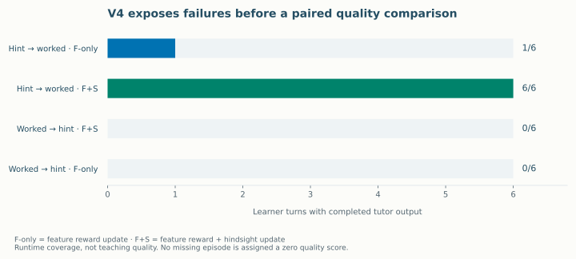

# Teaching v4: the first native checkpoint pilot

**The full offline suite completed 12/12 cases through real Pi. The paid checkpoint pilot completed 1/4 scheduled case–checkpoint slots.** Its one complete conversation received **4/8 rubric points** in a separate Codex review. Raw provider captures contain **16 actual samples and 3,047 output tokens**, with no maximum-token truncation. These are distinct integration, execution and review results.

The paid sampling receipts span **15 September 2026, 00:09–00:10 UTC** (14 September in Toronto). This report reads saved evidence only. The [public pilot summary](generated/teaching-v4-pilot.json) preserves runtime outcomes; the independent review is a separate receipt, so its original `quality: null` fields have not been rewritten.

The frozen challenge used for these results is `keating-teaching-v4`, version `4.0.0`, status `frozen-public-development-challenge`, with comparison-plan version `matched-checkpoints-1.0.0`. It contains **12 cases, 73 learner messages, 59 rubric dimensions and 10 families**. Its [archived review contract](../scripts/training/benchmarks/teaching-v4/versions/4.0.0/README.md) requires exact new-response evidence at each declared step and keeps unavailable assessment null. The active suite is now v4.1 with revised learner dialogue; these results still describe the original v4.0 inputs and rubric.

| Frozen binding | SHA-256 |
| --- | --- |
| `manifest.json` bytes | `0633813d1e7369de0853f0377146d5edc8c93735b2b11d97a40ca741d50653fc` |
| `cases.json` bytes | `3e1eba5ac57f05e6aadcdab17b81e98afc85007a4c72391aa0a5fa8c29994ec0` |
| Frozen `README.md` bytes | `47b210ba9bff08bedd710c6a38fa72f4d1a9fe346fdd60b6017737adae54df66` |
| Pilot `plan_hash` | `2f9dbe33b5c5e288179ff6d79f1a8a51d9922ee00e2c9cf8138003cc8b945787` |
| Offline binding's adapter bytes | `a5dfef49075cd378dc7bebeb33403197e769e2fc938c30e503b14fd03cb8c929` |

The complete offline run is [`.keating/native-learning/v4-offline-run-v1/summary.json`](../.keating/native-learning/v4-offline-run-v1/summary.json), with its [freeze binding](../.keating/native-learning/v4-offline-run-v1/v4-binding.json). Every result reports `keating-tui-pi-rpc`, `offline_integration` and `completed`; the summary records 73 harness response calls. Authored tapes exercised the production session path, including the suite's session events. All 12 quality fields remain null: this is real-runtime offline integration evidence, not 12 successful model teaching episodes.

The paid run is [`.keating/native-learning/v4-checkpoint-pilot-v1/results.json`](../.keating/native-learning/v4-checkpoint-pilot-v1/results.json). It compares saved F-only and F+S checkpoints on exactly `help-hint-then-flip` and `help-worked-then-flip`, both in `affine-help-context`, once each. F denotes the feature-reward objective; S denotes hindsight self-distillation. Initial and S-only were not scheduled in this slice.

Both configs identify `Qwen/Qwen3.5-9B-Base`, revision `68c46c4b3498877f3ef123c856ecfde50c39f404`. The exact saved sampler identities are:

| Arm | Sampler checkpoint |
| --- | --- |
| F-only | `tinker://61394c4d-7b14-5be5-aa40-d8ccbd360f6b:train:0/sampler_weights/native-custom-9d551cf6dd81747174b29bf4-updated` |
| F+S | `tinker://136ce052-922d-559a-9ecb-350d94065525:train:0/sampler_weights/native-custom-59c91e0c4d2f02118dec9c53-updated` |

Sampling used temperature 1, top-p 1, top-k −1 and seed null. Each case allowed eight provider calls, eight tool calls, 2,048 output tokens per call and 120 seconds per learner turn. The raw prepared records attest the effective sampling parameters; seed null is not a reproducibility guarantee. Each checkpoint arm had a $2 child cap within the shared $4 allocation.

| Scheduled order | Case / arm | Completed learner turns | Actual samples | Raw output tokens | Recorded outcome |
| --- | --- | ---: | ---: | ---: | --- |
| 1 | Hint-first / F-only | 1/6 | 2 | 782 | Malformed completion halted the bridge; `harness_provider_failure` |
| 2 | Hint-first / F+S | 6/6 | 6 | 1,862 | Completed |
| 3 | Worked-first / F+S | 0/6 | 8 | 403 | Tool loop reached `harness_provider_call_limit` |
| 4 | Worked-first / F-only | 0/6 | 0 | 0 | Already halted bridge blocked the later slot; `harness_provider_failure` |
| **Total** | **Four scheduled slots** | **7/24** | **16** | **3,047** | **One full case completed** |

Actual sample counts come from `phase: sampled` records in each bridge's `raw-captures.jsonl`; output counts are lengths of `completion_token_ids`. F-only produced **2 samples / 782 tokens** and F+S **14 samples / 2,265 tokens**. The harness summary counts 17 provider requests because the final blocked slot attempted a request without a new provider sample. Its zero new tokens do not erase the earlier failed sample or release its reservation.

All 16 samples have `stop_reason: stop`; the largest contains 613 output tokens, below the 2,048 cap. The F-only format failure therefore was not maximum-token clipping. The F+S loop called `verify`, an unavailable `system` tool, `outputs`, repeated blocked `read` calls and repeated `plan` calls. Its first learner turn never completed. None of the three incomplete slots receives a teaching-quality score.

The [independent review](../.keating/native-learning/v4-review-v1/review.json) was authored against the condition-omitted `candidate-07.json` before checkpoint identification. Its six fresh conversation slices match the completed F+S result. The candidate and original result parse to the exact same object. The review binds their identical canonical JSON hash; the separate file-byte hash differs with serialization. Parent verification also passed against the original result.

| Dimension | Score | Original step / message | Finding |
| --- | ---: | --- | --- |
| Context-sensitive help | 0/2 | 2 / 5 | Supplies `x = 5` while the earlier nudge preference still applies. |
| Help reversal | 2/2 | 3 / 7 | After the request changes, shows valid operations and `30 + 8 = 38`. |
| Confident-error feedback | 1/2 | 4 / 9 | Correctly adds 4 to obtain `7x = 35`, but then praises the incorrect subtraction instinct and muddles checking with solving. |
| Bounded assessment | 1/2 | 5 / 11 | Correctly checks `7(5) − 4 = 31`, but overstates understanding without distinguishing assistance from independence. |

The review covers all four declared dimensions: **4/8 points, or 50/100 under the validator's aggregation**. One direct `benchmark_v4.validate_review` invocation passed, including the delegated v3 reviewer-metadata checks. Exact quotes and calibration limits are retained in [review notes](../.keating/native-learning/v4-review-v1/notes.md). The reviewer is `codex_subagent`, not human; no separate calibration exercise was performed. The middle assessment anchor was used because durable mastery was not explicitly claimed. Outside the scored steps, the teacher also tells the learner to subtract for `7x − 5 = 48`; the valid move is to add 5, yielding `x = 53/7`.

The [parent status](../.keating/native-learning/v4-checkpoint-pilot-v1/parent-status.json) records **$68.30 reserved / $31.70 unallocated** from the shared $100 ledger after this pilot. The **$4 shared reservation remains retained**, including failed or uncertain work. These are conservative application reservations, not invoices, verified provider charges or automatic refunds. `cost_usd` remains null. Local process cleanup was verified; the supervision receipt explicitly leaves provider cancellation unattested.

Adjacent evidence clarifies the next experiment. The [source-activity review](native-source-activities.md) adapted **eight multiple-choice moments from three families** and deferred four of twelve reviewed moments. One actual curated scenario, `tutormoments-46d551920c69b5df894d2baf`, then completed [real Pi offline delivery, choice submission and tutor follow-up](../.keating/native-learning/curated-source-offline-8Soqqv/verification.json). Its opening, persisted source entry and curated document matched; source content was excluded from actor events. This proves one of the eight scenarios through that path, using one tape request and zero paid calls. It is separate from the twelve v4 tape cases and from the paid checkpoint comparison.

The [timestamp diagnosis](native-interactive-canaries.md) likewise preserves a failed live submission and its exact local repair. Its subsequent live canary stopped earlier on malformed activity/action formats, so the local fix is not relabeled a successful live rerun.

The latest probe work can help improve the benchmark. [Exact-span inspection](probe-spans.md) reconstructs an existing measured `pa-02` response's pooled score from 49 observer-token contributions: bias −3.2590851159517973 plus contributions +0.8658792259035523 gives logit −2.393205890048245 and probability 0.08369225070552079, with zero recorded reconstruction residual. **This is older measured data; v4 probe scores remain unknown.** Suspected misses and false alarms should enter a separate candidate queue with exact source spans, proposed criteria and independent review. Accepted candidates belong in a subsequent version; neither these diagnostics nor later judgments rewrite frozen v4 cases or scores.

The [27B observer](observer-models.md) has pinned candidate metadata but no completed extraction or newly fitted probe. The [sequential curriculum coordinator](native-curriculum.md) has local tests, including an injected updater, but no demonstrated live multi-topic curriculum. The public report builder includes [benchmark diagnostics](https://learning-to-teach-report-production.up.railway.app/learning-from-next-turn/benchmark-diagnostics.html) and [probe spans](https://learning-to-teach-report-production.up.railway.app/learning-from-next-turn/probe-spans.html). Publication receipts are recorded separately in `docs/research-story/PUBLICATION.md`.

This one-family, one-repeat slice cannot support a paired checkpoint-quality estimate: only one arm completes one case. Scripted learner turns, public development exposure, missing independent knowledge/retention measurements and unresolved format reliability prevent claims of human learning gain, untouched generalization or promotion readiness. The next useful result is a complete, independently reviewed matched slice with honest failure denominators, followed by separately versioned benchmark candidates informed by measured probe disagreements.
